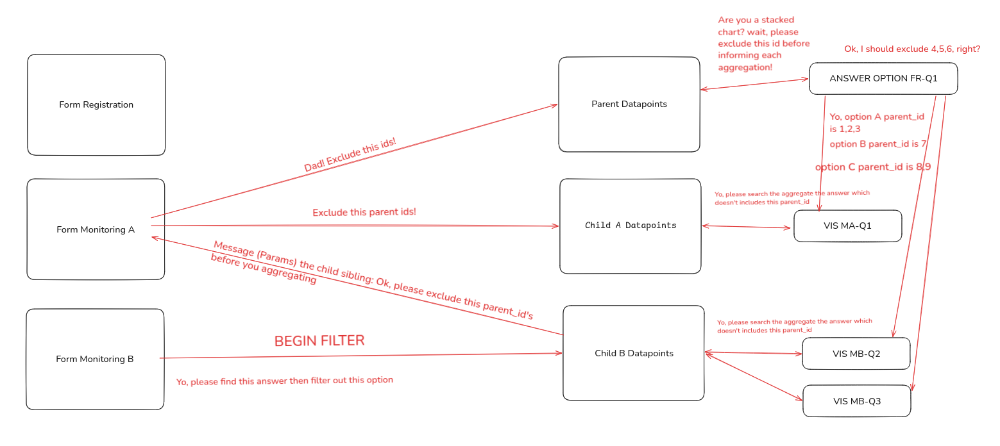
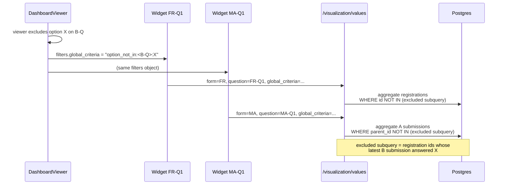

# Feature: Global dashboard question filter

**Task ID**: VIZ-027 (GitHub [#478](https://github.com/akvo/akvo-mis/issues/478))
**Author**: dedenbangkit
**Date**: 2026-09-25
**Status**: Draft

---

## 1. Context & Problem Statement

```
Currently:
- A dashboard's filter bar has two controls, set in `default_filters`:
  date and administration (VIZ-017). Both are applied by every widget.
- A widget can narrow its own data with `config.criteria`, but only on
  questions from its own form or that form's parent (the registration
  form). Any other question is rejected by `ValuesFilterSerializer`:
  "question_id(s) not on form X or its parent".
- Custom per-question filters were left out of VIZ-017 because no
  format existed to save them (`DashboardViewFilters.jsx`, header
  comment).

Goal:
- A viewer picks a question and one or more answer options in the
  dashboard's filter bar and filters those options out. Every widget
  on the dashboard updates, including widgets on other forms
  in the same registration family.
```

### The flow, as sketched



Reading the sketch:

1. The filter starts on a question on **Monitoring form B**: "find this
   answer, then filter out this option".
2. The matching B submissions are traced back to their registration
   datapoints (`parent_id`).
3. Those registration datapoints are excluded **before aggregation**
   from every chart: charts on the registration form (VIS FR-Q1),
   charts on a sibling monitoring form (VIS MA-Q1), and other charts on
   form B itself (VIS MB-Q2, MB-Q3).
4. In the FR-Q1 stacked chart, option A counts registration datapoints
   1, 2, 3, option B counts 7, and option C counts 8, 9. Registration
   datapoints 4, 5, 6 were excluded by the filter and appear nowhere,
   including the "No info" bar.

The sketch shows B *sending* the excluded ids to the other forms. The
code has nothing to send them with: every widget is its own HTTP
request. So each widget's query computes the same exclusion itself
(D-1). The result is the one the sketch describes:



---

## 2. Requirements

### User Acceptance Criteria
- [ ] In the builder, an author can mark one or more option or
      multiple-option questions from the dashboard's form family as
      dashboard filters, next to the date and administration toggles.
- [ ] On the published dashboard, each marked question appears in the
      filter bar as a multi-select of its options.
- [ ] Excluding an option removes every registration datapoint whose
      latest answer to that question is that option, from every widget
      at once.
- [ ] Registration datapoints with no answer to the filter question
      stay on the dashboard.
- [ ] The filter works on public dashboards.

### Technical Acceptance Criteria
- [ ] One request parameter, `global_criteria`, accepted by all four
      data endpoints: `/visualization/values`,
      `/visualization/values/formula`, `/visualization/escalation/:id`,
      and `/maps/geolocation/:id`. A malformed value returns 400.
- [ ] The exclusion runs inside each widget's SQL as a subquery. No list
      of ids is loaded into Python or sent through the browser.
- [ ] Denominators and "No info" counts use the same exclusion as the
      bars they sit next to.
- [ ] Changing the filter sends one request per widget (fewer where
      widgets share a cache key), not one per checkbox click.

---

## 3. Data Model Changes

### New Models

None.

### Modified Models

| Model | Change | Reason |
|-------|--------|--------|
| `Dashboard.default_filters` (JSON) | New key `questions` | Which questions the filter bar offers |

```json
{
  "date": {"enabled": true, "date_question": 812},
  "administration": {"enabled": true},
  "questions": [
    {"question": 1043, "form": 57}
  ]
}
```

`form` is stored so the viewer and the allowlist do not have to look it
up. It is checked against the question at save time (D-6).

The option list shown in the filter bar is **not** stored here. It is
added to the snapshot at publish time (D-7).

### Migration Strategy

No schema migration. `default_filters` is already a JSON field. A
dashboard without `questions` has no question filters, and existing
dashboards show exactly what they showed before.

---

## 4. API Contract

### Endpoints

No new endpoints. One new query parameter on four existing ones:

| Method | URL | Change | Auth |
|--------|-----|--------|------|
| GET | `/api/v1/visualization/values` | `global_criteria` | Existing (dashboard scope) |
| GET | `/api/v1/visualization/values/formula` | `global_criteria` | Existing |
| GET | `/api/v1/visualization/escalation/:form_id` | `global_criteria` | Existing |
| GET | `/api/v1/maps/geolocation/:form_id` | `global_criteria` | Existing |

### Parameter grammar

Uses the existing `type:qid:value` criteria grammar
(`parse_criteria_string`), with one new type:

```
global_criteria=option_not_in:1043:no_water|seasonal
global_criteria=option_not_in:1043:no_water,option_not_in:1102:broken
```

- `option_not_in:<qid>:<v1>|<v2>|...`: exclude registration datapoints
  whose latest answer to `qid` contains any of the values.
- Multiple entries are separated by commas. A registration datapoint
  stays only if it passes every entry, so it is excluded if **any**
  entry excludes it.

### Request/Response Examples

```
GET /api/v1/visualization/values
    ?form_id=12&question_id=301&group_by=option
    &global_criteria=option_not_in:1043:no_water
    &dashboard_slug=water-points

200 — same response shape as today, over fewer registration datapoints.

GET ...&global_criteria=option_not_in:9999:x   (9999 not in the family)
400 {"message": "global_criteria: question 9999 is not in this form family"}
```

---

## 5. Decision Log

### D-1: Each widget computes the exclusion as a subquery; nothing sends ids between widgets

**Options Considered**:
1. Run a lookup query first, then give the resulting list of excluded
   registration ids to every widget's query (the sketch's model).
2. Include the lookup in every widget's SQL as a subquery.

**Decision**: Option 2.

**Rationale**: No backend step builds a whole dashboard's data. Each
widget is a separate request from `useWidgetData`, so option 1 needs
one of these:
- A batch endpoint that returns the whole dashboard. This rewrites
  `useWidgetData` and throws away `useVisualizationRequest`'s cache and
  in-flight request sharing.
- Sending the id list from the browser. On a public dashboard a caller
  could send any ids, and a large list breaks URL length limits.

With option 2, Postgres runs the lookup as a semi-join inside the
query it is already running. The existing criteria helpers
(`narrow_data_ids_by_criteria`, `apply_parent_criteria_to_qs`) load ids
into Python lists. The new code must not copy that pattern.

**Impact**: N widgets run the same subquery N times. If profiling shows
that matters, cache the result on the server, keyed by (dashboard,
`global_criteria`, date filters, administration). This keeps the API
unchanged. Do not build it before profiling.

### D-2: The exclusion always applies to whole registration datapoints, on every widget

**Options Considered**:
1. For a widget on the filter question's own form, reuse the existing
   same-form `criteria` path, which removes only the matching
   submissions. Use registration datapoint exclusion only for widgets
   on other forms.
2. Exclude by registration datapoint on every widget, including widgets
   on the filter question's own form.

**Decision**: Option 2.

**Rationale**: The two options give the same result for widgets set to
the latest submission per registration datapoint. They give different
results for widgets set to all submissions:

| Widget mode | Option 1 | Option 2 |
|---|---|---|
| Latest submission | Same | Same |
| All submissions | Drops only the B submissions that answered X | Drops every B submission from that registration datapoint |

With option 1, a dashboard with both kinds of widget would count
different sets of registration datapoints on different charts. With
option 2 every chart covers the same set of registration datapoints.

**Impact**: One code path for every widget. The table in D-3 has a
single rule.

### D-3: "Row's registration datapoint" is `id` or `parent_id`, depending on the query

Every query is filtered with `NOT IN (excluded registration ids)`. The
only difference between widgets is which column holds the registration
datapoint id:

| Query rows are | Column | Where |
|---|---|---|
| Registration datapoints in latest mode (annotated with `latest_id`) | `id` | `get_base_monitoring_qs`, latest branch |
| Monitoring submissions | `parent_id` | `get_base_monitoring_qs`, other branch, monitoring widget |
| Registration datapoints | `id` | `get_base_monitoring_qs`, other branch, registration widget; map; table; formula |

### D-4: Only the latest answer counts, judged with the dashboard's date filter

**Options Considered**:
1. Exclude a registration datapoint if **any** of its B submissions
   answered X.
2. Exclude it only if its **latest** B submission answered X.

**Decision**: Option 2. "Latest" is picked with the same date filters
the widgets use, via `latest_monitoring_subquery(b_form_id,
date_filters)`.

**Rationale**: Widgets default to `monitoring="latest"`. A registration
datapoint that answered X last year and Y this month is shown in the
MB-Q2 chart under its Y submission. Excluding it because of the X
submission would remove a site the other charts still show as Y.
Picking "latest" inside the same date range as the charts means the
filter judges the submission the charts are showing.

**Impact**: Changing the date range can change which registration
datapoints are excluded. That is intended.

When the filter question is on the registration form, each
registration datapoint has only one answer, so this decision doesn't
apply. See D-8.

### D-5: "Filter out" means `NOT IN`, and unanswered registration datapoints stay

**Options Considered**:
1. `option_not_in`: exclude registration datapoints whose latest answer
   is one of the chosen options.
2. `option_in` on the remaining options: keep only registration
   datapoints whose answer is one of the other options.

**Decision**: Option 1, as the sketch says ("filter out this option").

**Rationale**: The two options differ for registration datapoints that
never answered the question, for example a site with no form B
submissions. Option 1 keeps them, because nothing excluded them.
Option 2 removes them, which the viewer did not ask for.

**Impact**: The subquery returns registration `FormData.id`. That
column is never NULL, so it avoids the SQL rule that `NOT IN` returns
no rows when the subquery contains a NULL. Do **not** return child
`parent_id` from the subquery: a single child row with a NULL parent
would empty every chart.

### D-6: A separate parameter, not merged into each widget's `criteria`

**Rationale**:
- Widget `criteria` accept only the widget's own form and its parent.
  `global_criteria` accepts any form in the family.
- `useWidgetData.js` warns that parameter names differ across the four
  endpoints and that a wrong name is **silently dropped**. One named
  parameter, which every endpoint must accept and must reject when
  malformed, can be covered by one test per widget type.

**Validation** (`ValuesFilterSerializer` and the other three
serializers): every `qid` must be an option or multiple-option question
on the widget form's registration root, or on a monitoring form whose
parent is that root. Anything else returns 400.

**Validation at save time** (`validate_dashboard_payload`): each
`default_filters.questions[]` entry must name an option or
multiple-option question on `root_form` or one of its child forms, and
`form` must equal the question's form. Today `default_filters` is
stored without any validation (`dashboard_builder_views.py:281,320`).
This change adds validation for the `questions` key only.

### D-7: The option list is copied into the snapshot at publish time

**Rationale**: A public viewer can't read form definitions. At publish,
`build_snapshot` (`dashboard_snapshot.py`) adds each filter question's
label and options to `published_config.default_filters.questions[]`.
This matches the existing rule that anything which changes the numbers
on screen waits for Publish.

### D-8: Filters on registration questions match the registration answer only, with no date filter

A filter question on the registration form needs no tracing back to a
registration datapoint: the answer is already on it.

```python
Answers.objects.filter(
    question_id=qid, <OR of options__contains=[v]>,
    data__is_pending=False, data__is_draft=False,
).values("data_id")
```

Charts then apply the same `id` / `parent_id` exclusion as in D-3.

**No "latest" choice.** A registration datapoint has one current
answer per question (per repeat index, see D-9). Edits made through the
data edit endpoint (`v1_data/views.py`) move the old value to
`AnswerHistory` and overwrite the row in `Answers`, so `Answers` always
holds the current value.

**No date filter.** The dashboard's date filter must not be applied to
this subquery. If it were, a registration datapoint created outside the
date range would be missing from the excluded set, and so would wrongly
stay on the dashboard. A registration answer has no visit date to judge
it by.

#### The same question on the registration form and a monitoring form

Monitoring forms can repeat a registration question: the web form
pre-fills a monitoring question from the registration answer when the
two questions have the **same `name`**
(`frontend/src/pages/forms/Forms.jsx`, `fetchInitialMonitoringData`).
A field worker can then change the answer during a visit.

**Checked (2026-09-25): a monitoring submission never writes back to
the registration datapoint's answers.** Every place that writes
`Answers` writes to the submission's own `FormData`:

| Write path | Writes to |
|---|---|
| `SubmitPendingFormSerializer.create` (`v1_data/serializers.py`) | The new submission. From the registration datapoint it copies only `geo` and `administration`, not answers |
| `SubmitUpdateDraftFormSerializer.update` | The draft being updated |
| `SubmitFormSerializer.create` | The new submission |
| Data edit endpoint (`v1_data/views.py`) | The datapoint being edited |
| `v1_data/functions.py`, seeders | The datapoint being created |

The pre-fill also always reads the registration datapoint's own answers
(`/datapoints/<uuid>.json`), not the previous visit's.

So the two answers can differ. A water point registered as "functional"
whose latest visit says "broken":

| Filter "broken" out using | Result |
|---|---|
| The registration question | Site **stays**, while a chart of the monitoring question counts it as broken |
| The same-named monitoring question | Site **excluded**, consistent with the monitoring chart |

**Options Considered**:
1. Filter strictly on the question the author picked.
2. An "effective value": the latest monitoring answer to the
   same-named question, falling back to the registration answer.

**Decision**: Option 1. In addition, the builder warns the author when
they pick a registration question that has a same-named question on a
child form, and offers the monitoring question instead.

**Rationale**: Option 1 is predictable and is the subquery above.
Option 2 requires matching question names across forms inside SQL,
depends on a naming convention nothing enforces, and quietly changes
what "this question" means. Build it only if authors ask for it.

**Impact**: The builder needs the question names of `root_form` and its
child forms. `/manage/dashboards/<pk>/sources` already returns the
family's forms. The warning matches on `Questions.name`.

### D-9: One answer in a repeatable group matching is enough to exclude

`Answers.index` lets one datapoint hold several answers to the same
question, one per repeat of a repeatable group. This applies to
registration and monitoring questions alike.

**Decision**: A registration datapoint is excluded if **any** of its
repeats contains an excluded value. For a monitoring question, only the
repeats in its latest submission count (D-4).

**Rationale**: "Filter out sites with a broken pump" should remove a
site with three pumps of which one is broken. The alternative, which
excludes only when every repeat matches, would keep that site.

**Impact**: None to the query: matching on `data_id` without looking
at `index` already behaves this way. The decision is recorded so
nobody later adds an `index` condition by mistake.

---

## 6. Type/Constant Mappings

| Frontend | Backend | Meaning |
|---|---|---|
| `filters.global_criteria` (string) | `global_criteria` query param | Serialized exclusions |
| `default_filters.questions[]` | same JSON key | Questions offered in the filter bar |
| `"option_not_in"` | new type in `parse_criteria_string` | Exclude registration datapoints whose latest answer contains any value |

---

## 7. Where the change goes

### Backend

**New helpers** in `backend/api/v1/v1_visualization/functions.py`:

```python
def excluded_registrations_subquery(criterion, root_form_id, date_filters):
    """Registration ids whose latest answer to the criterion's
    question contains any excluded value (D-4, D-5).

    Returns a lazy queryset of FormData.id. Never NULL.
    """
    # Registration-form question: match the registration's own answer,
    #   and ignore date_filters (D-8).
    # Monitoring-form question: annotate each registration with
    #   latest_monitoring_subquery(q_form_id, date_filters),
    #   then keep those whose latest_id has a matching answer.
    # Matching reuses the OR-of-`options__contains=[v]` idiom from
    # _criterion_matching_ids: `Answers.options` is a JSONField, so
    # ArrayField lookups such as __overlap don't exist.


def apply_global_exclusions(qs, column, params):
    """qs.exclude(<column>__in=subquery) per criterion (D-3)."""
```

**Apply the exclusion at each place a widget's query is built.**
`get_base_monitoring_qs` covers most widgets. The other entries in this
table build their own queries and would silently skip the filter if
they were left out:

| Location | Widget / purpose | Column |
|---|---|---|
| `functions.py` `get_base_monitoring_qs`, both branches | Every `values_functions.handle_*`, scatter | `id` / `parent_id` (D-3) |
| `values_functions.py` `_total_parents_in_scope` | "No info" count | `id` |
| `values_functions.py` `handle_count_mode`, both percentage totals | KPI / count percentage denominator | `id` |
| `views.py` `GeolocationListView.get` | Map | `id` |
| `views.py` `visualization_values_formula` | Status / formula widgets | `id` or `parent_id` |
| `escalation_functions.py` `handle_escalation` (`parents` query) | Table | `id` |

The two percentage totals in `handle_count_mode` currently ignore even
the administration filter. Apply the global exclusion there, and fix
the administration filter in the same place, as a separate commit.

**Parsing and validation**:
- `parse_criteria_string` in `functions.py`: add `option_not_in`.
  Split its value on `|` as `option_in` already does.
- The four request serializers: a `global_criteria` field plus the
  family check (D-6).

**Public dashboards** (`public_scope.py`):
- `allowlist_from`: add each `default_filters.questions[].question`,
  as it already does for `date.date_question`.
- Each view's `check_ids` call: add
  `*question_ids_in_criteria(request.query_params.get("global_criteria"))`.

**Publishing**: `dashboard_snapshot.build_snapshot` copies each filter
question's label and options into the snapshot (D-7).

### Frontend

| File | Change |
|---|---|
| `pages/dashboards/BuilderInspector.jsx` (dashboard-level panel) | Pick filter questions from the dashboard's form family |
| `components/dashboard/DashboardViewFilters.jsx` | One multi-select per `default_filters.questions[]`. Apply on dropdown close, not per checkbox |
| `pages/dashboards/DashboardViewer.jsx` | Keep the selected exclusions in `filters`. Serialize once with `useMemo` into `filters.global_criteria`, with the values sorted |
| `util/hooks/useWidgetData.js` | Pass `global_criteria` in **every** builder: each `buildRequest` branch, `buildStatusRequest`, `buildValueRequest`, `buildSeriesRequest` |

**Keeping re-renders cheap.** The existing structure already provides:
`DashboardGrid` is wrapped in `React.memo`; the request builders
recompute only when `filters` changes; requests are cached by their
parameters; and a loading widget keeps showing its previous data.

On top of that:
- Only call `setFilters` when the value actually changes. A new object
  with the same content re-runs every builder and re-renders every
  chart.
- Sort the option values before serializing, so `a|b` and `b|a` produce
  the same cache key.
- A filter change must not remount maps. `VizMap`'s remount key stays
  tied to `aggregate` / `map_mode` only.

---

## 8. Compatibility & Migration

### Backward Compatibility
- [x] Existing API consumers unaffected: `global_criteria` is optional.
- [x] Existing dashboards unchanged: no `questions` key means no
      question filters.
- [x] Widget-level `criteria` behave exactly as before.

### Mobile App Impact
- [x] None. Dashboards are web only.

### Seeder/CLI Compatibility
- [x] No seeder changes.

---

## 9. Security Considerations

- [ ] `global_criteria` question ids pass through `check_ids` before
      any query runs, like `criteria` today.
- [ ] A public dashboard can filter only on questions listed in its
      published `default_filters.questions`.
- [ ] The family check (D-6) prevents filtering on another form
      family's questions, which would otherwise expose whether their
      answers exist.
- [ ] The exclusion can only remove rows from a query that is already
      scoped to the tenant, never add rows.

---

## 10. Testing Strategy

**Backend fixture, built from the sketch.** Registration form FR with
FR-Q1 (options A, B, C), and monitoring forms A and B. Registration
datapoints 1–10:

- FR-Q1 answers: A for 1–6, B for 7, C for 8 and 9, no answer for 10.
- Latest B-Q answer is X for 4, 5 and 6.
- Registration datapoint 3 answered X on B-Q in an older submission and
  Y in its latest one.
- Registration datapoint 10 has no form B submissions.

With `global_criteria=option_not_in:<B-Q>:X`:

| Test | Expected |
|---|---|
| FR-Q1 by option | A = 3 (1, 2, 3), B = 1, C = 2 |
| FR-Q1 "No info" | 1 (only 10). 4, 5 and 6 do **not** appear |
| FR-Q1 percentage | Denominator excludes 4, 5 and 6 |
| MA-Q1, latest and all modes | No submissions from 4, 5 or 6 |
| MB-Q2, all-submissions mode | No submission from 4, 5 or 6, including ones that didn't answer X (D-2) |
| Registration datapoint 3 | Kept: only its latest answer counts (D-4) |
| Registration datapoint 10 | Kept: unanswered is not excluded (D-5) |
| Date range excluding the latest B submission for 4 | 4 is judged on its latest submission inside the range (D-4) |
| Extra registration datapoint 11 (separate fixture, so the counts above hold): latest B submission has two repeats of B-Q, only one answering X | 11 is excluded (D-9) |

A second group of tests, with the filter on a registration question
(`global_criteria=option_not_in:<FR-Q1>:C`):

| Test | Expected |
|---|---|
| Every widget | 8 and 9 excluded |
| Date range that excludes the creation date of 8 | 8 is **still** excluded (D-8: no date filter) |
| Registration answer edited from C to A through the data edit endpoint | Datapoint no longer excluded (current `Answers` row only) |
| Monitoring form has a question with the same name as FR-Q1, answered C for site 1 | Site 1 **stays**: only the registration answer counts (D-8) |
| Map, table, formula, scatter | Each excludes 4, 5 and 6 |
| Question from another form family | 400 |
| Public dashboard, question not in `default_filters.questions` | Rejected by `check_ids` |
| Query count | The subquery is part of the widget's single aggregate query, not a separate query that loads ids |

**Frontend:**

| Test | Coverage |
|---|---|
| `useWidgetData` | Table-driven: every widget type's request contains `global_criteria` |
| `DashboardViewFilters` | Renders one multi-select per snapshot question. Emits once on close |
| `BuilderInspector` | Picking a registration question that shares its `name` with a child-form question shows the warning and offers the monitoring question (D-8) |
| `DashboardViewer` | Equal selections produce the same string (sorted values) |

---

## 11. Open Questions

- [ ] Should the filter bar also offer "show only" (`option_in`)? The
      grammar already supports it. The UI in this design offers only
      exclusion.
- [ ] Option values containing `:`, `,` or `|` break the criteria
      grammar. This problem already exists for widget `criteria`. Check
      whether any live form has such values before shipping.
- [ ] Should a filter question be allowed on a form that no widget on
      the dashboard uses? The design allows it: any form in the family.
- [x] ~~Does a monitoring submission write back to the registration
      datapoint's answers?~~ No, checked 2026-09-25 (D-8).
- [ ] Does the mobile app pre-fill monitoring questions the same way
      as the web form (by question `name`)? This only affects how
      common D-8's same-named case is, not the design.
- [ ] Is the same-named question warning (D-8) enough, or do authors
      need the "effective value" option?
- [ ] Does `Answers(question_id, data_id)` have an index that makes the
      subquery a cheap semi-join? Check with `EXPLAIN ANALYZE` on
      production-sized data before deciding on D-1's server cache.

---

## 12. References

- VIZ-001 §4.4: `default_filters` schema
- VIZ-017: dashboard default filters (date, administration)
- VIZ-395: public dashboard filter issues
- VIZ-018: public dashboard visibility and `public_scope` allowlist
- VIZ-015.a: cross-form stacked bar (another request that spans forms)
