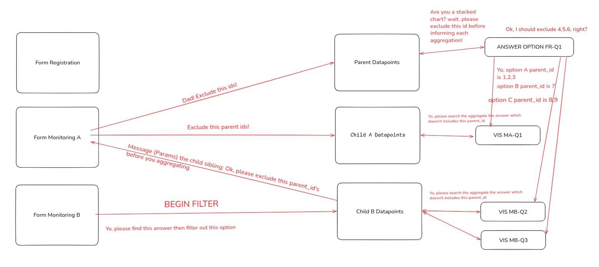
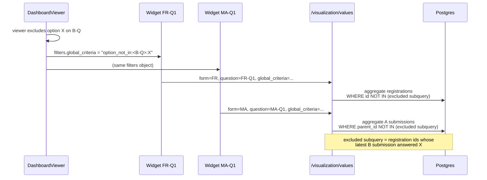
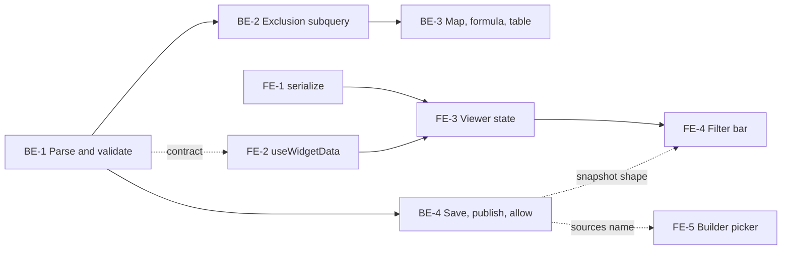

# Feature: Global dashboard question filter

**Task ID**: VIZ-027 (GitHub [#478](https://github.com/akvo/akvo-mis/issues/478))
**Author**: dedenbangkit
**Date**: 2026-09-25
**Revised**: 2026-10-05: checked against the code (findings A1–A7, §13)
and prototyped on local data (§14). D-10 to D-12 added.
2026-10-06: compared with the WAI SDG portal's advanced filter (§15);
"show only" deferred to a later phase (D-13); same-named monitoring
questions read as one (D-14); repeated `global_criteria` parameter and
no `:` in new option values (D-15).
**Status**: Backend implemented 2026-10-06 (GitHub #520); frontend
planned.
**Parts**: [Backend](VIZ-027-backend-global-question-filter.md) · [Frontend](VIZ-027-frontend-global-question-filter.md)

---

## 1. Context & Problem Statement

```
Currently:
- A dashboard's filter bar has two controls, set in `default_filters`:
  date and administration (VIZ-017). Both are applied by every widget.
- A widget can narrow its own data with `config.criteria`, but only on
  questions from its own form or that form's parent (the registration
  form). Any other question is rejected by `ValuesFilterSerializer`:
  "question_id(s) not on form X or its parent".
- Custom per-question filters were left out of VIZ-017 because no
  format existed to save them (`DashboardViewFilters.jsx`, header
  comment).

Goal:
- A viewer picks a question and one or more answer options in the
  dashboard's filter bar and filters those options out. Every widget
  on the dashboard updates, including widgets on other forms
  in the same registration family.
```

### The flow, as sketched



Reading the sketch:

1. The filter starts on a question on **Monitoring form B**: "find this
   answer, then filter out this option".
2. The matching B submissions are traced back to their registration
   datapoints (`parent_id`).
3. Those registration datapoints are excluded **before aggregation**
   from every chart: charts on the registration form (VIS FR-Q1),
   charts on a sibling monitoring form (VIS MA-Q1), and other charts on
   form B itself (VIS MB-Q2, MB-Q3).
4. In the FR-Q1 stacked chart, option A counts registration datapoints
   1, 2, 3, option B counts 7, and option C counts 8, 9. Registration
   datapoints 4, 5, 6 were excluded by the filter and appear nowhere,
   including the "No info" bar.

The sketch shows B *sending* the excluded ids to the other forms. The
code has nothing to send them with: every widget is its own HTTP
request. So each widget's query computes the same exclusion itself
(D-1). The result is the one the sketch describes:


```mermaid
sequenceDiagram
    participant V as DashboardViewer
    participant W1 as Widget FR-Q1
    participant W2 as Widget MA-Q1
    participant API as /visualization/values
    participant DB as Postgres

    V->>V: viewer excludes option X on B-Q
    V->>W1: filters.global_criteria = "option_not_in:<B-Q>:X"
    V->>W2: (same filters object)
    W1->>API: form=FR, question=FR-Q1, global_criteria=...
    API->>DB: aggregate registrations<br/>WHERE id NOT IN (excluded subquery)
    W2->>API: form=MA, question=MA-Q1, global_criteria=...
    API->>DB: aggregate A submissions<br/>WHERE parent_id NOT IN (excluded subquery)
    Note over API,DB: excluded subquery = registration ids whose<br/>latest B submission answered X
```

---

## 2. Requirements

### User Acceptance Criteria
- [ ] In the builder, an author can mark one or more option or
      multiple-option questions from the dashboard's form family as
      dashboard filters, next to the date and administration toggles.
- [ ] On the published dashboard, each marked question appears in the
      filter bar as a multi-select of its options.
- [ ] Excluding an option removes every registration datapoint whose
      latest answer to that question is that option, from every widget
      at once.
- [ ] Registration datapoints with no answer to the filter question
      stay on the dashboard.
- [ ] The filter works on public dashboards.

### Technical Acceptance Criteria
- [ ] One request parameter, `global_criteria`, accepted by all four
      data endpoints: `/visualization/values`,
      `/visualization/values/formula`, `/visualization/escalation/:id`,
      and `/maps/geolocation/:id`. A malformed value returns 400 on all
      four, including the map (D-11).
- [ ] `option_not_in` is accepted only in `global_criteria`. A widget's
      `criteria` rejects it with 400 (D-10).
- [ ] The exclusion runs inside each widget's SQL as a subquery. No list
      of ids is loaded into Python or sent through the browser.
- [ ] Denominators and "No info" counts use the same exclusion as the
      bars they sit next to.
- [ ] Changing the filter sends one request per widget (fewer where
      widgets share a cache key), not one per checkbox click.

---

## 3. Data Model Changes

### New Models

None.

### Modified Models

| Model | Change | Reason |
|-------|--------|--------|
| `Dashboard.default_filters` (JSON) | New key `questions` | Which questions the filter bar offers |

```json
{
  "date": {"enabled": true, "date_question": 812},
  "administration": {"enabled": true},
  "questions": [
    {"question": 1043, "form": 57}
  ]
}
```

`form` is stored so the viewer and the allowlist do not have to look it
up. It is checked against the question at save time (D-6).

The option list shown in the filter bar is **not** stored here. It is
added to the snapshot at publish time (D-7).

### Migration Strategy

No schema migration. `default_filters` is already a JSON field. A
dashboard without `questions` has no question filters, and existing
dashboards show exactly what they showed before.

---

## 4. API Contract

### Endpoints

No new endpoints. One new query parameter on four existing ones:

| Method | URL | Change | Auth |
|--------|-----|--------|------|
| GET | `/api/v1/visualization/values` | `global_criteria` | Existing (dashboard scope) |
| GET | `/api/v1/visualization/values/formula` | `global_criteria` | Existing |
| GET | `/api/v1/visualization/escalation/:form_id` | `global_criteria` | Existing |
| GET | `/api/v1/maps/geolocation/:form_id` | `global_criteria` | Existing |

### Parameter grammar

One **repeated** query parameter, one option value per occurrence
(D-15):

```
global_criteria=option_not_in:1043:no_water
global_criteria=option_not_in:1043:seasonal
global_criteria=option_not_in:1102:broken
```

- Each occurrence is `option_not_in:<qid>:<value>`. The server splits it
  at most twice on `:`, so the value may itself contain `:`, `,` or `|`
  (for example `type_a:_hand_pump` or `yes,_partly`).
- Occurrences with the same `qid` are ORed: a registration datapoint is
  excluded if its latest answer contains **any** of them.
- Different `qid`s are ANDed: a datapoint stays only if it passes every
  question, so it is excluded if **any** question excludes it.
- `option_not_in` is the only type `global_criteria` accepts. Any other
  type, a non-integer qid, a missing or empty value
  (`option_not_in:1043:`), or more than 50 occurrences returns 400. The
  empty-value message is `option_not_in requires a value: '<item>'`.
- Widget `criteria` keep their comma-separated grammar; they are outside
  VIZ-027.

### Request/Response Examples

```
GET /api/v1/visualization/values
    ?form_id=12&question_id=301&group_by=option
    &global_criteria=option_not_in:1043:no_water
    &dashboard_slug=water-points

200 — same response shape as today, over fewer registration datapoints.

GET ...&global_criteria=option_not_in:9999:x   (9999 not in the family)
400 {"message": "global_criteria: question 9999 is not in this form family"}
```

---

## 5. Decision Log

### D-1: Each widget computes the exclusion as a subquery; nothing sends ids between widgets

**Options Considered**:
1. Run a lookup query first, then give the resulting list of excluded
   registration ids to every widget's query (the sketch's model).
2. Include the lookup in every widget's SQL as a subquery.

**Decision**: Option 2.

**Rationale**: No backend step builds a whole dashboard's data. Each
widget is a separate request from `useWidgetData`, so option 1 needs
one of these:
- A batch endpoint that returns the whole dashboard. This rewrites
  `useWidgetData` and throws away `useVisualizationRequest`'s cache and
  in-flight request sharing.
- Sending the id list from the browser. On a public dashboard a caller
  could send any ids, and a large list breaks URL length limits.

With option 2, Postgres runs the lookup as a semi-join inside the
query it is already running. The existing criteria helpers
(`narrow_data_ids_by_criteria`, `apply_parent_criteria_to_qs`) load ids
into Python lists. The new code must not copy that pattern.

**Impact**: N widgets run the same subquery N times. If profiling shows
that matters, cache the result on the server, keyed by (dashboard,
`global_criteria`, date filters, administration). This keeps the API
unchanged. Do not build it before profiling.

### D-2: The exclusion always applies to whole registration datapoints, on every widget

**Options Considered**:
1. For a widget on the filter question's own form, reuse the existing
   same-form `criteria` path, which removes only the matching
   submissions. Use registration datapoint exclusion only for widgets
   on other forms.
2. Exclude by registration datapoint on every widget, including widgets
   on the filter question's own form.

**Decision**: Option 2.

**Rationale**: The two options give the same result for widgets set to
the latest submission per registration datapoint. They give different
results for widgets set to all submissions:

| Widget mode | Option 1 | Option 2 |
|---|---|---|
| Latest submission | Same | Same |
| All submissions | Drops only the B submissions that answered X | Drops every B submission from that registration datapoint |

With option 1, a dashboard with both kinds of widget would count
different sets of registration datapoints on different charts. With
option 2 every chart covers the same set of registration datapoints.

**Impact**: One code path for every widget. The table in D-3 has a
single rule.

**Consequence for "all submissions" charts of the filter question.**
The excluded option can still appear. A site whose *latest* answer is Y
is kept, and in "all submissions" mode its older X submissions are
still counted. Local data (§14): with `non_operational` excluded, the
all-submissions chart of `infrastructure_status` still shows
Non-Operational = 3, all from one kept site. This is intended, but it
reads like a bug, so the user documentation for the filter says so. No
code change.

### D-3: "Row's registration datapoint" is `id` or `parent_id`, depending on the query

Every query is filtered with `NOT IN (excluded registration ids)`. The
only difference between widgets is which column holds the registration
datapoint id:

| Query rows are | Column | Where |
|---|---|---|
| Registration datapoints in latest mode (annotated with `latest_id`) | `id` | `get_base_monitoring_qs`, latest branch |
| Monitoring submissions | `parent_id` | `get_base_monitoring_qs`, other branch, monitoring widget |
| Registration datapoints | `id` | `get_base_monitoring_qs`, other branch, registration widget; map; table; formula |

### D-4: Only the latest answer counts, judged with the dashboard's date filter

**Options Considered**:
1. Exclude a registration datapoint if **any** of its B submissions
   answered X.
2. Exclude it only if its **latest** B submission answered X.

**Decision**: Option 2. "Latest" is picked with the same date filters
the widgets use. D-14 refines it: the latest submission that answered,
across the question's name group, with the date question matched by
name.

**Rationale**: Widgets default to `monitoring="latest"`. A registration
datapoint that answered X last year and Y this month is shown in the
MB-Q2 chart under its Y submission. Excluding it because of the X
submission would remove a site the other charts still show as Y.
Picking "latest" inside the same date range as the charts means the
filter judges the submission the charts are showing.

**Impact**: Changing the date range can change which registration
datapoints are excluded. That is intended. Two cases follow from it,
both seen in local data (§14):

- `to_date` before a site's latest submission: the site is judged on
  its latest submission *inside* the range, which may answer X. The
  site is then excluded although its latest answer overall is Y.
- `from_date` after a site's only X submission: the site has no
  submission in range, so nothing excludes it and it stays (D-5).

**Which date question.** The dashboard sends one `date_question_id` to
every widget (`useWidgetData.js` `dateFilters`), whatever form that
question is on. `latest_monitoring_subquery(b_form_id, date_filters)`
looks for that question's answers on form B submissions. If the date
question is on another form, no B submission matches, and the filter
silently excludes nothing (A5). **Superseded by D-14**: the date
question is matched by `name` on each form of the filter question's
name group, and a form without a same-named question uses the
submission's `created` date. (The builder has no date-question picker
today, only the toggle, so `date_question_id` is usually unset.)

For a filter question on a monitoring form, "latest" is also refined by
D-14: the latest submission **that answered**, across every monitoring
form that has a question with the same `name`.

When the filter question is on the registration form, each
registration datapoint has only one answer, so this decision doesn't
apply. See D-8.

### D-5: "Filter out" means `NOT IN`, and unanswered registration datapoints stay

**Options Considered**:
1. `option_not_in`: exclude registration datapoints whose latest answer
   is one of the chosen options.
2. `option_in` on the remaining options: keep only registration
   datapoints whose answer is one of the other options.

**Decision**: Option 1, as the sketch says ("filter out this option").

**Rationale**: The two options differ for registration datapoints that
never answered the question, for example a site with no form B
submissions. Option 1 keeps them, because nothing excluded them.
Option 2 removes them, which the viewer did not ask for.

**Impact**: The subquery returns registration `FormData.id`. That
column is never NULL, so it avoids the SQL rule that `NOT IN` returns
no rows when the subquery contains a NULL. Do **not** return child
`parent_id` from the subquery: a single child row with a NULL parent
would empty every chart.

### D-6: A separate parameter, not merged into each widget's `criteria`

**Rationale**:
- Widget `criteria` accept only the widget's own form and its parent.
  `global_criteria` accepts any form in the family.
- `useWidgetData.js` warns that parameter names differ across the four
  endpoints and that a wrong name is **silently dropped**. One named
  parameter, which every endpoint must accept and must reject when
  malformed, can be covered by one test per widget type.

**Validation** (in each of the four views, as built): every `qid`
must be an option or multiple-option question on the widget form's
registration root, or on a monitoring form whose parent is that root.
Anything else returns 400. The view reads
`request.query_params.getlist("global_criteria")` after `check_ids`
and after the tenant-scoped form lookup; no serializer declares the
field, because a DRF `ListField` also accepts `global_criteria[0]=…`
and that spelling would skip the public allowlist.

The family check is written once (`parse_global_criteria`) and shared
by the four views.
It takes two `Questions` queries per request (the picked questions,
then their name groups, D-14), whatever the number of values.

**Validation at save time** (`validate_dashboard_payload`): each
`default_filters.questions[]` entry must name an option or
multiple-option question on `root_form` or one of its child forms, and
`form` must equal the question's form. Today `default_filters` is
stored without any validation (`dashboard_builder_views.py:281,320`).
This change adds validation for the `questions` key only.

### D-7: The option list is copied into the snapshot at publish time

**Rationale**: A public viewer can't read form definitions. At publish,
`build_snapshot` (`dashboard_snapshot.py`) adds each filter question's
label and options to `published_config.default_filters.questions[]`.
This matches the existing rule that anything which changes the numbers
on screen waits for Publish.

### D-8: Filters on registration questions match the registration answer only, with no date filter

A filter question on the registration form needs no tracing back to a
registration datapoint: the answer is already on it.

```python
Answers.objects.filter(
    question_id=qid, <OR of options__contains=[v]>,
    data__is_pending=False, data__is_draft=False,
).values("data_id")
```

Charts then apply the same `id` / `parent_id` exclusion as in D-3.

**No "latest" choice.** A registration datapoint has one current
answer per question (per repeat index, see D-9). Edits made through the
data edit endpoint (`v1_data/views.py`) move the old value to
`AnswerHistory` and overwrite the row in `Answers`, so `Answers` always
holds the current value.

**No date filter.** The dashboard's date filter must not be applied to
this subquery. If it were, a registration datapoint created outside the
date range would be missing from the excluded set, and so would wrongly
stay on the dashboard. A registration answer has no visit date to judge
it by.

#### The same question on the registration form and a monitoring form

Monitoring forms can repeat a registration question: the web form
pre-fills a monitoring question from the registration answer when the
two questions have the **same `name`**
(`frontend/src/pages/forms/Forms.jsx`, `fetchInitialMonitoringData`).
A field worker can then change the answer during a visit.

**Checked (2026-09-25): a monitoring submission never writes back to
the registration datapoint's answers.** Every place that writes
`Answers` writes to the submission's own `FormData`:

| Write path | Writes to |
|---|---|
| `SubmitPendingFormSerializer.create` (`v1_data/serializers.py`) | The new submission. From the registration datapoint it copies only `geo` and `administration`, not answers |
| `SubmitUpdateDraftFormSerializer.update` | The draft being updated |
| `SubmitFormSerializer.create` | The new submission |
| Data edit endpoint (`v1_data/views.py`) | The datapoint being edited |
| `v1_data/functions.py`, seeders | The datapoint being created |

The pre-fill also always reads the registration datapoint's own answers
(`/datapoints/<uuid>.json`), not the previous visit's.

So the two answers can differ. A water point registered as "functional"
whose latest visit says "broken":

| Filter "broken" out using | Result |
|---|---|
| The registration question | Site **stays**, while a chart of the monitoring question counts it as broken |
| The same-named monitoring question | Site **excluded**, consistent with the monitoring chart |

**Options Considered**:
1. Filter strictly on the question the author picked.
2. An "effective value": the latest monitoring answer to the
   same-named question, falling back to the registration answer.

**Decision**: Option 1. In addition, the builder warns the author when
they pick a registration question that has a same-named question on a
child form, and offers the monitoring question instead.

**Rationale**: Option 1 is predictable and is the subquery above.
Option 2 requires matching question names across forms inside SQL,
depends on a naming convention nothing enforces, and quietly changes
what "this question" means. Build it only if authors ask for it.

**Impact**: The builder needs the question names of `root_form` and its
child forms. `/manage/dashboards/<pk>/sources` already returns the
family's forms and questions, but `serialize_question`
(`dashboard_builder_serializers.py`) does **not** include `name` (A4).
It gains a `name` key. The warning matches on that key.

### D-9: One answer in a repeatable group matching is enough to exclude

`Answers.index` lets one datapoint hold several answers to the same
question, one per repeat of a repeatable group. This applies to
registration and monitoring questions alike.

**Decision**: A registration datapoint is excluded if **any** of its
repeats contains an excluded value. For a monitoring question, only the
repeats in its latest submission count (D-4).

**Rationale**: "Filter out sites with a broken pump" should remove a
site with three pumps of which one is broken. The alternative, which
excludes only when every repeat matches, would keep that site.

**Impact**: None to the query: matching on `data_id` without looking
at `index` already behaves this way. The decision is recorded so
nobody later adds an `index` condition by mistake.

### D-10: `option_not_in` is a global-only criteria type

**Rationale**: `_criterion_matching_ids` returns `[]` for a type it
does not know. If `option_not_in` were added to
`VALID_VALUES_CRITERIA_TYPES`, a widget's `criteria` would accept it
and the widget would show no data, with no error (A1).

**Decision**: A new constant `GLOBAL_CRITERIA_TYPES = {"option_not_in"}`.
`global_criteria` is parsed with it. Widget `criteria` keeps
`VALID_VALUES_CRITERIA_TYPES` unchanged, so `option_not_in` there is a
400.

`global_criteria` is parsed by its own `parse_global_criteria`, not by
`parse_criteria_string` (D-15), so the A2 message problem does not arise
on this path.

### D-11: The map returns 400 for a malformed `global_criteria`

**Rationale**: `GeolocationListView` answers an invalid serializer with
`200 []` (`views.py`). Followed for `global_criteria`, a typo would
show an empty map, which is the silent failure D-6 is meant to rule
out (A3).

**Decision**: The view parses and validates `global_criteria` before
the serializer and returns 400 on failure. The existing `200 []` for
other invalid parameters is unchanged.

### D-12: The exclusion column on map and formula follows the form

| Endpoint | Rows are | Column |
|---|---|---|
| `/maps/geolocation/:form_id` | The form's own datapoints. The frontend always sends the registration form | `id`, or `parent_id` if `form_id` is a monitoring form |
| `/visualization/values/formula` | Registration datapoints, or monitoring submissions | `id` / `parent_id`. Applied **before** the latest-per-parent pick in Python |

### D-13: Phase 1 offers "filter out" only; "show only" is a later phase if needed

**Options Considered** (researched 2026-10-06):
1. "Filter out" only, as the sketch says.
2. Both modes, with the author picking a mode per filter question in
   the builder.
3. Both modes, with the viewer toggling the mode per question.
4. "Show only" for registration questions only.

**Decision**: Option 1 for phase 1. "Show only" moves to a next phase,
built only if users ask for it.

**Rationale**:
- **No habit to match in MIS.** MIS inherited a WAI-style "show only"
  advanced filter (`components/filters/AdvancedFilters.js`), but it is
  dead code. Its only toggle, `<AdvancedFiltersButton />`, is commented
  out (`DataFilters.js:378`, `VisualisationFilters.js:34`), and the
  `v1_data` endpoints no longer read its `options` parameter. Authors
  already have a per-widget "show only": the "Option equals" criterion.
- **"Show only" shrinks dashboards sharply on monitoring questions.** It
  drops every site with no submission in range. WAI avoids this because
  a page is one form and every record has a current answer (§15).

  | Case | Filter out Non-operational | Show only Operational |
  |---|---|---|
  | Test fixture, no date range | 7 water points | 6 (site 10, never checked, drops) |
  | Test fixture, range ends 02-28 | 7 | **1** (only site 4 has a check in range) |
  | Local Rural Water Project, 11 sites, 6 ever quick-monitored | 7 | **2** |

- **The real cost is behaviour, not code.** Two modes double the
  date × "latest" cases to test and to explain to users.

**Next phase, if needed.** Built as option 2 (the author picks the
mode), estimated at about 1 to 1.5 developer days:
- Backend: add `"option_in"` to `GLOBAL_CRITERIA_TYPES`, and branch
  `apply_global_exclusions` between `.exclude()` and `.filter()` over
  the **same** subquery. `parse_criteria_string`, `check_ids` and the
  public allowlist already understand `option_in`.
- Builder: a mode per entry, stored as
  `default_filters.questions[].mode`. An entry without `mode` means
  "filter out", so existing dashboards need **no migration**.
- Viewer: the placeholder follows the mode ("Show only…" or "Filter
  out…"). `serializeGlobalCriteria` emits `option_in` for those
  questions.
- Option 4 is the fallback if monitoring questions prove too
  surprising in "show only".

Nothing in phase 1 needs to change to keep this open.

### D-14: Same-named monitoring questions are one filter question

Decided 2026-10-06. Revises D-4 and D-8 for monitoring questions.

**Context**: Form authors give a question the same `name` on several
monitoring forms **on purpose**, so that the latest value comes from
whichever form was filled most recently. Example: Quick Monitoring is
filled weekly, while the comprehensive Monitoring form has had no
submission for two weeks. Nothing else in MIS reads values this way
yet: web and mobile pre-fill only from the registration, and the
backend never groups by name (checked 2026-10-06). VIZ-027 is the
first consumer of the convention.

**Decision**:
- **Name group.** When the filter question is on a monitoring form, the
  filter reads every **live** question with the same `name` on the
  family's monitoring forms. The registration form is not part of the
  group: a registration question stays D-8 (its own answer, no date
  filter).
- **Latest = the latest submission that answered.** Per registration
  datapoint, take the latest submission, across all forms in the group,
  that has an answer to one of the group's questions. A newer
  submission that skipped the question does not hide an older answer.
- **Dates by name.** A dashboard `date_question_id` applies to each form
  in the group through that form's question with the **same name** (for
  example `inspection_date`). A form without such a question uses the
  submission's `created` date. This replaces the A5 rule in D-4.
- **Live questions only.** Answers to soft-deleted question versions are
  ignored, as widgets ignore them today. Form edits leave old answers
  pointing at old question ids: on local data, 2 submissions of "NI HC -
  Essential Meds and Supplies Checklist" answer a deleted version of
  `monitoring_round`.
- **Options shown in the filter bar** (decided 2026-10-06): the union of
  the group's option values, one entry per `value`.
  - **Labels**: when forms label the same value differently, the labels
    are joined with " / ", the picked question's label first, then the
    other forms' in form order; identical labels appear once. Filtering
    uses `value` only, so labels never change the result.
  - **Order**: the picked question's option order, then values that
    exist only on other forms.
  - **Builder warning, not blocking**: values that are not on every form
    of the group are listed with the forms that have them. A value that
    exists on one form only can still be filtered out, but a spelling
    difference (`oct_2025` vs `october_2025`) shows up as two options and
    is something the author should fix in the form builder.

  | `value` | Check form label | Visit form label | Filter bar shows |
  |---|---|---|---|
  | `fine` | Fine | Clear sky | Fine / Clear sky |
  | `rainy` | Rainy | Rainy | Rainy |
  | `stormy` | — | Stormy | Stormy, plus a builder warning: only on Water quality visit |

**Example (local data, Rural Water Project).** `weather_condition`
exists on Monitoring and Quick Monitoring. Filter out Rainy:

| Site | Latest Monitoring | Latest Quick Monitoring | Picked question only | Name group (D-14) |
|---|---|---|---|---|
| 7 | 09-28 Rainy | **09-29** Cloudy + Rainy | Excluded | Excluded |
| 10 | — | 08-19 Rainy | **Kept** (never on Monitoring) | Excluded |
| 20 | 07-10 Rainy | — | Excluded | Excluded |
| 25 | — | 08-25 Rainy | **Kept** | Excluded |
| 8, 36, 38 | — | Fine | Kept | Kept |

**Impact**:
- Backend: the exclusion subquery takes a set of forms and questions
  instead of one form, and filters candidate submissions to those that
  answered (backend BE-2). Validation resolves the group (BE-1).
- Builder: an entry shows "Also asked on: <form names>", so the author
  sees that the filter reads several forms (frontend FE-5).
- The D-8 builder warning for a registration question with a same-named
  monitoring question stays. Swapping to the monitoring question now
  also gives the name group.

### D-15: One parameter per value; option values lose `:` at the source

Decided 2026-10-06.

**Problem**: option values are generated from labels by lower-casing
and turning whitespace into `_`, nothing else. That rule exists twice:
`snakeCase` in `akvo-react-form-editor`
(`src/components/question-type/SettingOption.jsx:20`), which always
sends a value, and the fallback in `backend/api/v1/v1_forms/functions.py`
(lines 204, 587, 1678, 1910) for imports and API calls that send none. A
label "Type A: hand pump" becomes `type_a:_hand_pump`, and "Yes, partly"
becomes `yes,_partly`. A comma-and-pipe grammar breaks on such values.

**Decision**:
1. **Repeated parameter** (grammar in §4): one value per occurrence,
   split at most twice on `:`. Every existing value, whatever it
   contains, can be filtered. No production check is needed for
   VIZ-027.
2. **New option values never contain `:`, `,` or `|`.** Rule, in this
   order: lower-case, **remove** `:`, `,` and `|`, then turn each run of
   whitespace into `_`. "Type A: hand pump" → `type_a_hand_pump`;
   "Yes, partly" → `yes_partly`; "a | b" → `a_b`. The backend fallback
   follows it (backend BE-7). Dropping `,` and `|` is not needed for
   `global_criteria`, but widget `criteria` still split on them. The
   backend **refuses with 400** an explicit new value containing any of
   the three, instead of rewriting it: a question's `dependency` rules
   store option values, and a silent rewrite would break them.
   **Backend only** (decided 2026-10-06): the builder, JSON-import and
   XLSForm-import validators all refuse it, so `akvo-react-form-editor`
   does not change. The editor still proposes `type_a:_hand_pump` for
   "Type A: hand pump"; the author gets an error naming the option and
   edits the code. Changing the editor's `snakeCase` (frontend FE-6) is
   deferred, optional UX polish.
3. **Existing values are not touched.** Answers and dependency rules
   reference them. Rule 1 already makes them filterable.

**Impact**:
- `serializeGlobalCriteria` returns a sorted **array**. Axios 0.25 sends
  arrays as `global_criteria[]=…`, so widget requests need a
  `paramsSerializer` that repeats the key without brackets (FE-2).
- The public allowlist reads question ids per occurrence (BE-1).
- A cap of 50 occurrences per request bounds what a public caller can
  send.

---

## 6. Type/Constant Mappings

| Frontend | Backend | Meaning |
|---|---|---|
| `filters.global_criteria` (array of strings) | `global_criteria`, repeated query param | Serialized exclusions, one value each (D-15) |
| `default_filters.questions[]` | same JSON key | Questions offered in the filter bar |
| `"option_not_in"` | the only type in `GLOBAL_CRITERIA_TYPES`, parsed by `parse_global_criteria` (D-15) | Exclude registration datapoints whose latest answer contains the value |

---

## 7. Where the change goes

The implementation is split by concern. Each part lists its tasks in
order, the files and lines they touch, the tests each task turns green,
and its definition of done.

| Part | Document | Tasks |
|---|---|---|
| Backend | [VIZ-027-backend-global-question-filter.md](VIZ-027-backend-global-question-filter.md) | BE-1 parse and validate; BE-2 exclusion subquery; BE-3 map, formula, table; BE-4 save, publish, allow; BE-5 admin filter on % totals; BE-6 `EXPLAIN` before caching |
| Frontend | [VIZ-027-frontend-global-question-filter.md](VIZ-027-frontend-global-question-filter.md) | FE-1 `serializeGlobalCriteria`; FE-2 `useWidgetData` plumbing + A7; FE-3 viewer state; FE-4 filter bar; FE-5 builder picker |


```mermaid
flowchart LR
    BE1[BE-1 Parse and validate] --> BE2[BE-2 Exclusion subquery]
    BE2 --> BE3[BE-3 Map, formula, table]
    BE1 --> BE4[BE-4 Save, publish, allow]
    BE1 -. contract .-> FE2[FE-2 useWidgetData]
    FE1[FE-1 serialize] --> FE3[FE-3 Viewer state]
    FE2 --> FE3
    FE3 --> FE4[FE-4 Filter bar]
    BE4 -. snapshot shape .-> FE4
    BE4 -. sources name .-> FE5[FE-5 Builder picker]
```

The two parts meet only at the contract in §4 and §6: the
`global_criteria` parameter, the snapshot's
`default_filters.questions[]` shape, and the `name` key on builder
sources. Either side can be built and tested against that contract
alone.

---

## 8. Compatibility & Migration

### Backward Compatibility
- [x] Existing API consumers unaffected: `global_criteria` is optional.
- [x] Existing dashboards unchanged: no `questions` key means no
      question filters.
- [x] Widget-level `criteria` behave exactly as before.

### Mobile App Impact
- [x] None. Dashboards are web only.

### Seeder/CLI Compatibility
- [x] No seeder changes.

---

## 9. Security Considerations

- [x] `global_criteria` question ids pass through `check_ids` before
      any query runs, like `criteria` today.
- [x] A public dashboard can filter only on questions listed in its
      published `default_filters.questions`: the allowlist keeps them in
      their own set (`filter_questions`), so a widget's question is not
      a filter by accident.
- [x] The family check (D-6) prevents filtering on another form
      family's questions, which would otherwise expose whether their
      answers exist. It runs after tenant scoping, so a form outside the
      dashboard is a 404, not a family hint.
- [x] The exclusion can only remove rows from a query that is already
      scoped to the tenant, never add rows.

---

## 10. Testing Strategy

The tests were written before the implementation. The backend tests
are green (2026-10-06); the frontend tests fail until FE-1 to FE-5
land. Both parts use the same ten water points, so a number in a
backend test and an id in a frontend test mean the same thing:

| Form | Question | Options |
|---|---|---|
| Water point registration [FR] | "What is the water source?" [FR-Q1] | Ground water, Surface water, Rainwater |
| Water quality visit [A] | "Were you able to take a water sample?" [MA-Q1] | Yes, No |
| Quick status check [B] | **"Is the infrastructure operational?"** [B-Q, the filter] | Operational, Non-operational |

Filtering out Non-operational removes water points 4, 5 and 6 from every
chart. Filtering out Rainwater removes 8 and 9.

| Part | Fixture, expected results, test files, how to run |
|---|---|
| Backend | [Backend §5](VIZ-027-backend-global-question-filter.md#5-tests) |
| Frontend | [Frontend §6](VIZ-027-frontend-global-question-filter.md#6-tests) |

---

## 11. Open Questions

- [x] ~~Should the filter bar also offer "show only" (`option_in`)?~~
      Not in phase 1; a later phase if users ask (D-13).
- [x] ~~Option values containing `:`, `,` or `|` break the criteria
      grammar.~~ Solved by design, no production check needed: one
      parameter per value, split at most twice (D-15). New values also
      lose `:` at the source (D-15). Local database, 2026-10-06: 0 of
      1,211 option values contain these characters.
- [x] ~~D-15 follow-ups~~ Decided 2026-10-06: `:` is removed, not
      replaced; `,` and `|` are removed too; an explicit new value
      containing any of them is refused with 400 (D-15).
- [x] ~~Should a filter question be allowed on a form that no widget on
      the dashboard uses?~~ Yes, decided 2026-10-06: any form in the
      family.
- [x] ~~Does a monitoring submission write back to the registration
      datapoint's answers?~~ No, checked 2026-09-25 (D-8).
- [x] ~~Does the mobile app pre-fill monitoring questions the same way
      as the web form (by question `name`)?~~ Yes, checked 2026-10-06.
      Both apps pre-fill a new monitoring submission from the
      **registration** answers only, matched by `name`
      (`Forms.jsx` `fetchInitialMonitoringData`; mobile
      `FormContainer.js` `fetchInitialValues`). Neither app, nor the
      backend, takes the latest value across monitoring forms that
      share a `name`. Mobile reads the first SQLite row with the uuid,
      without `ORDER BY`; that is the registration row in practice but
      not guaranteed (outside VIZ-027).
- [x] ~~Is the same-named question warning (D-8) enough, or do authors
      need the "effective value" option?~~ For monitoring forms, yes:
      same-named monitoring questions are one filter question, latest
      answer wins (D-14). Registration questions stay D-8.
- [x] ~~D-14: which options does the filter bar show when the
      questions in a name group have different option values?~~ The
      union by value, labels joined with " / ", and a non-blocking
      builder warning for values not on every form (decided
      2026-10-06).
- [x] ~~Make the BE-6 performance threshold configurable in
      `settings.py` / `.env`?~~ No, decided 2026-10-06. It is an
      acceptance criterion for a one-off measurement; nothing reads it at
      run time.
- [x] ~~What happens to a filter question deleted after Publish?~~ It
      disappears from the filter bar when the dashboard is read; the
      dashboard keeps working (decided 2026-10-06, backend BE-4).
- [x] ~~Does `Answers(question_id, data_id)` have an index that makes
      the subquery a cheap semi-join?~~ Yes. Measured on 10,000 seeded
      sites (backend BE-6, 2026-10-06): chart requests stay within +16 %.
- [ ] **The map adds a fixed ~130 ms with a filter (+84 % on 10,000
      sites)**, over the 20 % threshold. Follow-up task: the D-1 server
      cache, or a "latest answer per registration" table (backend BE-6).
- [x] ~~Malformed `global_criteria` on the map: 400 or `200 []`?~~ 400
      (D-11).
- [x] ~~Date question on another form than the filter question?~~ Fall
      back to `created` (D-4, A5).

---

## 12. References

- VIZ-001 §4.4: `default_filters` schema
- VIZ-017: dashboard default filters (date, administration)
- VIZ-395: public dashboard filter issues
- VIZ-018: public dashboard visibility and `public_scope` allowlist
- VIZ-015.a: cross-form stacked bar (another request that spans forms)

---

## 13. Findings from checking the design against the code (2026-10-05)

| # | Finding | Resolution |
|---|---|---|
| A1 | `_criterion_matching_ids` returns `[]` for an unknown type. Adding `option_not_in` to the widget criteria types would empty widgets silently | D-10 |
| A2 | `parse_criteria_string` re-raises its own message only if it contains `"criteria"` or `"option_in"`. `"option_not_in"` matches neither | Moot: `global_criteria` has its own parser (D-15) |
| A3 | `GeolocationListView` answers an invalid serializer with `200 []` | D-11 |
| A4 | `serialize_question` has no `name`, which the D-8 warning needs | D-8, backend BE-4 |
| A5 | The dashboard's `date_question_id` goes to every widget whatever its form, so the B subquery can match nothing | D-4 |
| A6 | `Answers` has only single-column FK indexes, and `options` is a JSONField without GIN. Local `EXPLAIN ANALYZE`: 0.45 ms, hash semi-join on `idx_data_latest_monitoring` and `answer_question_id` | Still check on production data (§11) |
| A7 | `buildSeriesRequest` sends `dashboard`, not `dashboard_slug` | Fixed in this epic (frontend FE-2) |

Also confirmed:
- Every function and file this design names exists.
- The backend part's list of query sites (BE-2, BE-3) is complete. The other `FormData.objects` queries
  in `values_functions.py` derive from already-filtered ids.
- `question_ids_in_criteria` already reads `option_not_in:<qid>:…`
  correctly, so `check_ids` needs no parser change.

---

## 14. Worked example on local data

A throwaway prototype of `excluded_registrations_subquery` (D-1 to D-5)
was patched into `get_base_monitoring_qs` and `_total_parents_in_scope`
in a Django shell. The real handlers were then run against the "RWS
Test" dashboard on form family 1749621221728 (Rural Water Project: 11
registrations, Monitoring with 5 submissions, Quick Monitoring with
16).

Filter: Quick Monitoring `infrastructure_status`
(`1749631041155`), exclude `non_operational`. The subquery returned
registrations **8, 10, 36, 38**, the same as a hand count.

| Widget | Before | After |
|---|---|---|
| KPI registrations | 11 | 7 |
| `project_target_group` | Villages 5, Settlements 8, Households 5, Gov 3, School 1 | 3, 5, 4, 2, 0 |
| Monitoring `type_of_project` (latest and all) | unchanged | unchanged: the excluded sites have no Monitoring submissions |
| `infrastructure_status` latest | Op 2, Non-Op 4 | Op 2, Non-Op 0 |
| `infrastructure_status` all | Op 5, Non-Op 11 | Op 4, Non-Op 3 (D-2 consequence) |

What it showed:
- Site 7: `non_operational` three times, then `operational` on 09-29.
  It is kept (D-4).
- `to_date=2026-09-28` also excludes site 7, because its latest answer
  in range is `non_operational`.
- `from_date=2026-09-01` keeps site 10, because it has no submission in
  range.
- Filtering on the registration question `implementing_agencies`
  excluded the same sites with and without a date range (D-8).
- Without patching `_total_parents_in_scope`, an `option_value` widget
  with `include_empty` returned 11 instead of 7, because the excluded
  sites were counted as "No info".

---

## 15. Prior art: the WAI SDG portal's advanced filter

The WAI SDG portal (`wai-sdg-portal`) has the same concept, configured
by hand. Reviewed on 2026-10-06: `frontend/src/pages/main/Main.jsx`,
`frontend/src/components/AdvanceSearch.jsx`, `frontend/src/util/utils.js`
(`generateAdvanceFilterURL`), `backend/source/wai-ethiopia/config.js`,
`backend/db/crud_data.py`, `backend/middleware.py` (`check_query`), and
the `answer_search` view.

### How it works there

- **Config**: `page_config` describes one page per form (`formId`,
  table `columns`, `maps`, `rows` of pie charts, `tabs`). The filter
  itself is not configured per page. One global switch,
  `features.advancedFilterFeature.isMultiSelect`, picks checkboxes over
  radios.
- **Picking**: an "Advanced filter" panel offers **every** option,
  multiple-option and answer-list question of the page's form. The
  viewer picks a question, ticks options, and the choices show as
  closable tags.
- **Request**: each ticked option becomes one repeated parameter,
  `q=<qid>|<option name, lower-cased, URL-encoded>`. The same `q` list
  goes to every call on the page: table data, last submitted, maps,
  charts, pie rows, the JMP tab and the file download.
- **Server**: `answer_search` is a view of `"<qid>||<lower(option)>"`
  strings per datapoint. `get_data` ORs `options.contains([opt])` over
  **all** ticked options, loads the matching ids into Python
  (`.all()`), and filters `Data.id.in_(ids)`.
- **History** lives in a separate `history` table, so `answer` holds
  current values only. The filter always judges the current state.

### What it confirms

| WAI | VIZ-027 |
|---|---|
| One filter state applied to every data call on the page | Same rule: every widget, via `global_criteria` (D-6) |
| Each call site adds `q` by hand, so a forgotten one silently shows unfiltered data | The same risk is guarded by the table-driven `useWidgetData` test (FE-2) |
| Judges current answers only (history kept elsewhere) | Latest answer only (D-4); registration answers are current (D-8) |
| Filter resets when the form changes; table returns to page 1 | Filter resets on slug change (FE-3); table page resets on filter change (FE-2) |

### Where VIZ-027 deliberately differs

| WAI | Problem | VIZ-027 |
|---|---|---|
| Semantics are **"show only"**: ticked options are kept | Data that never answered disappears | "Filter out" (D-5); unanswered stays. "Show only" is a later phase (D-13) |
| All ticked options are ORed together, **across questions** too: "Functional" on status plus "Hand dug well" on source returns either | Two filters widen instead of narrowing | Across questions, a datapoint must pass every entry (§4 grammar) |
| Matches the option **name**, lower-cased | A renamed or translated label breaks the filter | Matches the option `value`; labels are display only (FE-4) |
| Loads matching ids into Python, then `IN (ids)` | Grows with the data; a large `IN` list | One SQL subquery per widget (D-1) |
| Single form per page | No cross-form filtering | Whole registration family (D-6) |
| Any option question of the form is filterable, chosen at view time | Fine for logged-in staff; unsafe for public pages | Author curates `default_filters.questions`; public viewers are limited to that list (§9) |
| Each tick refetches every call | N clicks, N rounds of requests | Apply on dropdown close (FE-4) |
| `q` validated only by `[0-9]*\|(.*)`; a bad value is a bare 400 | — | Family and type checked, message names the problem (D-6, D-10) |

### What to borrow

- **Repeated, URL-encoded parameters.** WAI sends one `q=` per option,
  each encoded, so option values never collide with a delimiter.
  `global_criteria` packs everything into one string with `,` and `|`.
  If the production check in §11 finds option values containing `:`,
  `,` or `|`, switch to a repeated parameter
  (`global_criteria=option_not_in:<qid>:<value>`, once per value)
  rather than inventing an escape. Until then, keep the single string.
- **A precomputed `qid||value` array, as a fallback for BE-6.** If
  `EXPLAIN` shows the `options @>` match is the cost, a GIN-indexed
  array per datapoint, like `answer_search`, is a known working shape.
  Do not build it before measuring.
- **Show which question a tag belongs to.** WAI's tag carries the
  question in a popover. VIZ-027 gets this from one labelled select per
  question (FE-4); keep it that way rather than one shared tag list.
