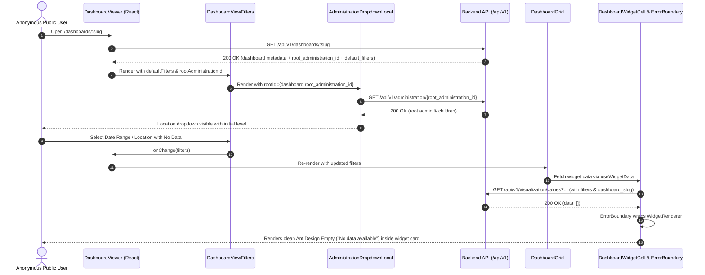

# Feature Design Document: [BUG-VIZ] Filter Issues for Public Dashboard

> **Purpose**: Standard Akvo MIS feature planning document aligned with `doc/templates/FEATURE_DESIGN_TEMPLATE.md`. Complete this document BEFORE implementation begins.
>
> - **Location**: `doc/design/VIZ-395-public-dashboard-filter-issues.md`
> - **Path Standard**: Strictly use **project-root-relative paths** (e.g., `/backend/api/v1/...`, `/frontend/src/pages/...`, `/app/src/...`). NEVER include machine-specific absolute paths or usernames.

---

## Feature: [BUG-VIZ] Filter Issues for Public Dashboard

**Task ID**: VIZ-395 (Issue #395)
**Author**: Akvo Tech Team & Antigravity
**Date**: 2026-09-10
**Status**: Draft

---

## 1. Context & Problem Statement

### 5W1H Analysis

- **Who**: Public visitors (anonymous/unauthenticated users) and authenticated users viewing published dashboards.
- **What**:
  1. **Blank White Screen on Empty Data**: When selecting date ranges with no matching data or when widget rendering encounters an unhandled state, the React application crashes with a blank white screen instead of displaying clean "No data" / error states.
  2. **Missing Location Filter**: Public unauthenticated users cannot see or interact with the location (administration) filter on public dashboards even when administration filtering is enabled in `default_filters`.
- **Where**:
  - `/backend/api/v1/v1_visualization/dashboard_read_views.py` (`DashboardReadViewSet.retrieve`)
  - `/frontend/src/pages/dashboards/DashboardViewer.jsx`
  - `/frontend/src/components/dashboard/DashboardViewFilters.jsx`
  - `/frontend/src/components/filters/AdministrationDropdownLocal.js`
  - `/frontend/src/components/dashboard/DashboardGrid.jsx`
  - `/frontend/src/components/dashboard/widgets/` (`VizBar.jsx`, `VizLine.jsx`, `VizPie.jsx`, `VizScatter.jsx`, `VizMap.jsx`, `VizTable.jsx`, `WidgetRenderer.jsx`, new `WidgetErrorBoundary.jsx`)
  - `/frontend/src/lib/ui-text.js`
- **When**: Triggered immediately upon navigating to `/dashboards/:slug` without authentication, and when changing date range filters to periods with 0 datapoints.
- **Why**:
  - `AdministrationDropdownLocal` early-returns on mount when `!user?.administration?.id`, blocking anonymous visitors from initializing the cascade from the tenant's root administration unit.
  - The frontend lacks React Error Boundaries around widget cells and the dashboard view, causing any single rendering exception (from ECharts, Leaflet, or empty data mapping) to unmount the entire React component tree.
  - Inconsistent and raw empty state handling across visuals (`VizBar`, `CategoryLine`, etc.) rather than standardized, localized Ant Design empty states.
- **How**:
  1. Backend exposes `root_administration_id` in `DashboardReadViewSet.retrieve` (`/api/v1/dashboards/:slug`).
  2. `DashboardViewer` and `DashboardViewFilters` pass `rootId` to `AdministrationDropdownLocal`, enabling anonymous cascading dropdown fetching via the existing `/api/v1/administration/<id>` endpoint.
  3. Introduce `WidgetErrorBoundary` in `DashboardWidgetCell` and `DashboardViewer` to isolate errors and display localized Ant Design `Empty` / `Alert` fallback states with retry controls.
  4. Harden all `Viz*` widget renderers against empty datasets, null category keys, and zero-row series.

```text
Currently:
- Anonymous users viewing a public dashboard see ONLY the date filter, even if administration filter is enabled.
- Selecting a date range with zero data or encountering an unexpected visual state can cause a fatal uncaught React exception resulting in a blank white page.

Goal:
- Public unauthenticated visitors see both the date filter and location hierarchy dropdown filter.
- Public & logged-in visitors see elegant, localized empty states ("No data available for the selected filters") with zero crashes or blank white screens.
```

---

## 2. Requirements

### User Acceptance Criteria (UAC)

- [ ] **UAC-1**: When viewing a public dashboard as an anonymous user, if administration filtering is enabled in `default_filters`, the location filter dropdown cascade is visible and interactive.
- [ ] **UAC-2**: Selecting a location in the public dashboard location filter cascades child units and updates the dashboard filters (`administration_id`), filtering all widgets accordingly.
- [ ] **UAC-3**: Selecting a date range or location where no data exists displays clean, localized empty states ("No data available") inside each widget card without any blank white screen.
- [ ] **UAC-4**: If any visual or charting library encounters an unhandled runtime error, an isolated widget error note with a "Retry" button is rendered within that specific widget card, leaving all other widgets and dashboard header/filter chrome functional.

### Technical Acceptance Criteria (TAC)

- [ ] **TAC-1**: `GET /api/v1/dashboards/:slug` returns `root_administration_id` belonging to the dashboard tenant.
- [ ] **TAC-2**: `AdministrationDropdownLocal` accepts a `rootId` prop and falls back to it when `user?.administration?.id` is not present.
- [ ] **TAC-3**: Implement `WidgetErrorBoundary` component using React class lifecycle (`componentDidCatch` / `getDerivedStateFromError`) to catch rendering faults in `DashboardWidgetCell` and `DashboardViewer`.
- [ ] **TAC-4**: All `Viz*` components (`VizBar`, `VizLine`, `VizPie`, `VizScatter`, `VizKPI`, `VizTable`, `VizMap`) safely handle `data: []`, `data: null`, and missing series keys without throwing TypeError.
- [ ] **TAC-5**: Pass all frontend and backend tests with ≥80% coverage on modified files.

---

## 3. Data Model Changes

No database schema changes or migrations are needed. `Administration` already enforces a unique root administration per tenant (`parent__isnull=True`).

---

## 4. Architecture & Logic Flow

### Sequence Diagram



---

## 5. API Contract Changes

### `GET /api/v1/dashboards/:slug`

**Authentication**: AllowAny (`is_public=True` published dashboards)

#### Response Example (200 OK)

```json
{
  "id": 12,
  "name": "Public Water Monitoring",
  "slug": "public-water-monitoring",
  "description": "Public overview of water points",
  "kind": "widgets",
  "root_form": {
    "id": 6001,
    "name": "Water Point Registration"
  },
  "root_administration_id": 1,
  "published_at": "10-09-2026 10:00:00",
  "default_filters": {
    "date": {
      "enabled": true,
      "date_question": 600105
    },
    "administration": {
      "enabled": true
    }
  },
  "embed_url": null,
  "widgets": [...]
}
```

---

## 6. Frontend Component Architecture

### Component Hierarchy

```text
DashboardViewer
 ├── DashboardViewFilters
 │    ├── RangePicker (Date Filter)
 │    └── AdministrationDropdownLocal (Location Cascade with rootId)
 └── DashboardGrid
      └── DashboardWidgetCell
           └── WidgetErrorBoundary (Catches runtime render exceptions)
                └── WidgetRenderer
                     ├── VizBar (handles [] and missing keys)
                     ├── VizLine (handles [] and empty stack mapping)
                     ├── VizPie (handles [])
                     ├── VizKPI (handles null values)
                     ├── VizScatter (handles [])
                     ├── VizTable (handles empty rows)
                     └── VizMap (handles 0 points)
```

### Key Frontend Changes

1. **`WidgetErrorBoundary.jsx`** (`/frontend/src/components/dashboard/WidgetErrorBoundary.jsx`):
   - Catches render crashes in widget components.
   - Displays localized `dashboardWidgetError` message and "Retry" action.
2. **`AdministrationDropdownLocal.js`** (`/frontend/src/components/filters/AdministrationDropdownLocal.js`):
   - Accepts `rootId` prop.
   - Resolves `effectiveRootId = user?.administration?.id || rootId`.
   - Fetches `administration/${effectiveRootId}` if present, allowing unauthenticated public dashboard visitors to use the location dropdown.
3. **`DashboardViewFilters.jsx`** (`/frontend/src/components/dashboard/DashboardViewFilters.jsx`):
   - Accepts `rootAdministrationId` prop and passes it as `rootId` to `AdministrationDropdownLocal`.
4. **`DashboardViewer.jsx`** (`/frontend/src/pages/dashboards/DashboardViewer.jsx`):
   - Passes `rootAdministrationId={dashboard.root_administration_id}` to `DashboardViewFilters`.
   - Wraps the capture and grid area with a safety boundary.
5. **Widget Renderers (`VizBar.jsx`, `VizLine.jsx`, `VizPie.jsx`, `VizScatter.jsx`, `VizTable.jsx`, `VizMap.jsx`)**:
   - Use Ant Design `Empty` component with `Empty.PRESENTED_IMAGE_SIMPLE` or uniform card empty note.
   - Use localized `text.dashboardWidgetNoData` / `text.dashboardViewEmpty`.
   - Prevent null reference errors when `data` is empty or lacks keys.
6. **`ui-text.js`** (`/frontend/src/lib/ui-text.js`):
   - Add `dashboardWidgetNoData: "No data available"` (in `en`, `fr`, `es`, `id`).

---

## 7. Verification Plan

### Automated Tests

1. **Backend Tests**:
   - `./dc.sh exec backend python manage.py test api.v1.v1_visualization.tests.tests_dashboard_read`
   - `./dc.sh exec backend python manage.py test api.v1.v1_visualization.tests.tests_public_dashboard_access`
2. **Frontend Tests**:
   - `./dc.sh exec frontend npm test -- --watchAll=false src/components/dashboard/__test__/DashboardGrid.test.js`
   - `./dc.sh exec frontend npm test -- --watchAll=false src/components/dashboard/__test__/DashboardViewFilters.test.js`
   - `./dc.sh exec frontend npm test -- --watchAll=false src/components/filters/__test__/AdministrationDropdownLocal.test.js`
   - `./dc.sh exec frontend npm test -- --watchAll=false src/pages/dashboards/__test__/DashboardViewer.test.js`
3. **Frontend Linter & Format**:
   - `./dc.sh exec frontend npm run lint`

### Manual Verification Steps

1. Open a public dashboard in an incognito / unauthenticated browser session.
2. Confirm the location filter is rendered alongside the date filter.
3. Select an administrative region and verify the widgets update according to the selected region.
4. Select a date range known to have 0 data (e.g. year 2099).
5. Verify that each widget displays a clean "No data" / empty state and the page does NOT crash or turn white.

---

## 8. Vibe Coding Task Breakdown & Estimation

| Task ID | Story / Task Description | Vibe Coding (Dev) | Automated Testing | QA & Review | Total Est. | Actual Time |
| :--- | :--- | :---: | :---: | :---: | :---: | :---: |
| **TASK-395.1** | **Backend**: Expose `root_administration_id` on `DashboardReadViewSet.retrieve` | 15m | 15m | 10m | **40m (0.67h)** | - |
| **TASK-395.2** | **Frontend Location Filter**: Support `rootId` in `AdministrationDropdownLocal` & wire through `DashboardViewer` / `DashboardViewFilters` | 20m | 20m | 10m | **50m (0.83h)** | - |
| **TASK-395.3** | **Frontend Error Boundary**: Implement `WidgetErrorBoundary` in `DashboardGrid` and `DashboardViewer` | 20m | 15m | 10m | **45m (0.75h)** | - |
| **TASK-395.4** | **Frontend Visuals Hardening**: Standardize Empty state & null guards across `VizBar`, `VizLine`, `VizPie`, `VizScatter`, `VizMap`, `VizTable` | 25m | 20m | 15m | **60m (1.0h)** | - |
| **TASK-395.5** | **Regression & E2E Verification**: Full suite run, test coverage check, lint & prettier formatting | 10m | 15m | 10m | **35m (0.58h)** | - |
| **TOTAL** | | **90m (1.5h)** | **85m (1.42h)** | **55m (0.92h)** | **230m (3.83h)** | - |

---

## 9. Sign-off & Handoff

- [ ] Technical design aligned with Akvo MIS architecture.
- [ ] No breaking changes to existing dashboard APIs or permissions.
- [ ] Ready for `/1-research` or `/2-implement`.
