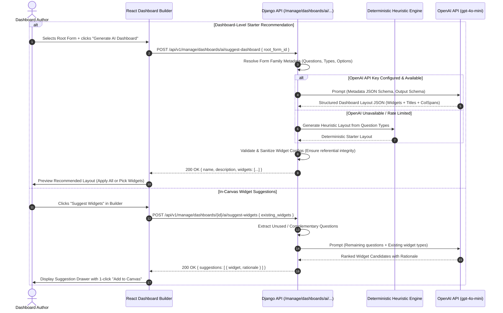

# Feature Design Document: AI Layer for Dashboard Visualisations

**Task ID**: VIZ-AI-001  
**Issue**: [#452](https://github.com/akvo/akvo-mis/issues/452)  
**Branch**: `feature/452-viz-ai-dashboard-visualization-layer`  
**Feature Name**: AI Layer on the Visualisation Feature (Dashboard-Level & In-Canvas Widget Suggestions)  
**Author**: Akvo Engineering Team  
**Date**: 2026-09-22  
**Status**: Draft / Review  
**Task Prefix**: `VIZ-AI-<Sequence>`  

---

## 1. Context & Problem Statement

```
Currently:
- Creating a dashboard requires manual composition: an author must manually pick each widget type, select a form from the form family, select an appropriate question, configure grouping, aggregation, color schemes, and layout spans.
- Domain non-experts often struggle to choose the most effective visualization (e.g. Map for geolocation vs Bar for high-cardinality categorical data vs Line for temporal trends).
- Starting from a blank canvas is intimidating and slow when a user just wants standard insights from a newly created form family.
- Akvo MIS already has OPENAI_API_KEY configured in settings (used in api/v1/v1_chatbot).

Goal:
- Leverage the existing project OPENAI_API_KEY (gpt-4o-mini structured JSON outputs) to power two core capabilities:
  1. Dashboard-Level Recommendation: Given a selected root form (and its monitoring children), automatically recommend a cohesive starter dashboard layout of complementary widgets.
  2. In-Canvas Widget Suggestions: While editing a dashboard, suggest relevant next widgets based on available form questions and already placed widgets.
- Ensure strict multi-tenant data privacy: Send ONLY form/question metadata and schema structures to the LLM (zero raw submission data / PII).
- Provide a robust rule-based deterministic fallback when the API key is unset or external calls fail.
```

---

## 2. 5W1H Requirements Analysis

| Dimension | Specification |
|---|---|
| **Who** | Tenant Admins, Dashboard Authors, and Analysts configuring visualizations in Akvo MIS. |
| **What** | 1) Dashboard-level starter layout generation. 2) Context-aware widget suggestions inside the Dashboard Builder canvas and inspector. |
| **Where** | Backend: `api.v1.v1_visualization` (AI suggestion service & endpoints). Frontend: `frontend/src/pages/dashboards/` (`DashboardBuilder`, `CreateDashboardModal`, `BuilderCanvas`, `BuilderPalette`, `AISuggestionDrawer`). |
| **When** | Triggered on-demand when creating a dashboard ("Auto-generate with AI" option) or while editing ("Suggest Widgets" button on canvas). |
| **Why** | Drastically reduces time-to-insight, lowers cognitive load for non-technical authors, and promotes best-practice visualization patterns. |
| **How** | Backend constructs a lightweight prompt from the form family structure (`serialize_sources`), queries OpenAI (`gpt-4o-mini` with JSON Schema structured output), validates proposed widget configs against `validate_dashboard_payload` rules, and returns ready-to-mount widgets. Fallback engine provides instant rule-based recommendations if OpenAI is unavailable. |

---

## 3. Architecture & Data Flow



---

## 4. Privacy & Multi-Tenancy Boundary Principles 🛡️

> [!IMPORTANT]
> **Zero-PII & Zero-Raw Data Transmission Rule**:
> To guarantee multi-tenant compliance and avoid data leaks:
> 1. **No individual submissions (`Answers`, `FormData`, text responses, GPS coordinates of specific people)** are ever sent to external LLMs.
> 2. **Only schema definitions** are transmitted:
>    - Form names and Form types (Registration, Monitoring).
>    - Question labels, question types (`number`, `option`, `multiple_option`, `date`, `autofield`).
>    - Option choice labels (e.g. `["Functioning", "Needs Repair", "Abandoned"]`).
> 3. All form lookups are strictly tenant-scoped via `Forms.objects.for_user(request.user)` to prevent cross-workspace enumeration.

---

## 5. API Contracts

### 5.1. Dashboard-Level Starter Generation

- **Endpoint**: `POST /api/v1/manage/dashboards/ai/suggest-dashboard`
- **Permission**: `IsAuthenticated` (user must have permission to view the specified `root_form`)
- **Request Payload**:
```json
{
  "root_form_id": 42,
  "user_intent": "Water access monitoring and operational status",
  "theme_preference": "categorical"
}
```
- **Response Payload (200 OK)**:
```json
{
  "suggested_name": "Water Point Operations & Quality Overview",
  "description": "Comprehensive operational overview covering water point functionality, compliance, and geographic distribution.",
  "widgets": [
    {
      "temp_id": "sug-1",
      "type": "kpi",
      "title": "Total Functional Water Points",
      "col_span": 6,
      "color": null,
      "form_id": 42,
      "question_id": 101,
      "config": {
        "value_type": "number",
        "repeat_agg": "sum"
      },
      "rationale": "High-level summary metric of functioning assets."
    },
    {
      "temp_id": "sug-2",
      "type": "pie",
      "title": "Functionality Status Breakdown",
      "col_span": 8,
      "color": null,
      "form_id": 42,
      "question_id": 102,
      "config": {
        "group_by": "option",
        "variant": "doughnut",
        "color_scheme": "categorical"
      },
      "rationale": "Displays proportional distribution across status options."
    },
    {
      "temp_id": "sug-3",
      "type": "line",
      "title": "Monthly Inspection Submissions",
      "col_span": 12,
      "color": null,
      "form_id": 45,
      "question_id": 120,
      "config": {
        "group_by": "month",
        "date_question_id": 120,
        "monitoring": "all"
      },
      "rationale": "Shows temporal trend of monitoring inspection visits."
    },
    {
      "temp_id": "sug-4",
      "type": "map",
      "title": "Water Point Geographic Distribution",
      "col_span": 24,
      "color": null,
      "form_id": 42,
      "question_id": 102,
      "config": {
        "map_mode": "category",
        "color_scheme": "categorical"
      },
      "rationale": "Geographic map pinpoints asset locations colored by functionality."
    }
  ]
}
```

### 5.2. In-Canvas Widget Suggestions

- **Endpoint**: `POST /api/v1/manage/dashboards/{id}/ai/suggest-widgets`
- **Permission**: `IsAuthenticated` (scoped to caller's workspace)
- **Request Payload**:
```json
{
  "existing_widget_types": ["kpi", "pie"],
  "focus_question_ids": [105, 106],
  "prompt_hint": "I want to see repair escalation details"
}
```
- **Response Payload (200 OK)**:
```json
{
  "suggestions": [
    {
      "temp_id": "w-sug-1",
      "type": "bar",
      "title": "Defects by Breakdown Category",
      "col_span": 12,
      "form_id": 45,
      "question_id": 105,
      "config": {
        "group_by": "option",
        "stack_by": null,
        "monitoring": "latest"
      },
      "rationale": "Identifies the most frequent failure causes across monitoring reports."
    },
    {
      "temp_id": "w-sug-2",
      "type": "table",
      "title": "Urgent Maintenance Escalation List",
      "col_span": 24,
      "form_id": 45,
      "question_id": null,
      "config": {
        "columns": [
          {"source": "parent_name", "title": "Facility Name"},
          {"source": "latest_date", "title": "Last Inspection"},
          {"source": "answer", "question_id": 105, "title": "Reported Issue"}
        ],
        "criteria": [
          {"type": "option_equals", "question_id": 102, "value": "Defective"}
        ]
      },
      "rationale": "Actionable table highlighting sites requiring maintenance intervention."
    }
  ]
}
```

---

## 6. Engineering Deliberation & Architectural Principles

### 6.1. System Architecture & Data Integrity
- **Schema & Boundaries**: The suggestion endpoints return transient JSON payloads conforming directly to the frontend's `DashboardWidget` shape. When the user accepts a suggestion, the frontend adds it into its standard state array (`widgets`) and writes it through the existing `PUT /manage/dashboards/{id}` endpoint. No database schema migration or orphaned model is required.
- **Referential Integrity**: The backend suggestion engine validates that every `question_id` and `form_id` proposed by the AI belongs strictly to the active dashboard's form family (`serialize_sources`). Any hallucinations (non-existent question IDs or foreign forms) are filtered out before returning to the client.

### 6.2. LLM Integration & Deterministic Fallbacks
- **OpenAI Key Reuse**: Utilizes the project's existing `settings.OPENAI_API_KEY` (configured in `mis/settings.py`) with `gpt-4o-mini` Structured JSON Outputs.
- **Deterministic Heuristic Engine**: If `OPENAI_API_KEY` is unset or an external network error occurs, the backend falls back to an internal heuristic engine that maps question types directly to chart types:
  - `option` with ≤ 5 choices -> `pie` / `doughnut`
  - `option` with > 5 choices -> `bar`
  - `number` -> `kpi` (Sum/Avg) or `scatter` (if 2 numeric questions exist)
  - `date` -> `line` trend
  - Form with geolocation -> `map`
  - Multiple criteria/status -> `table`
- **UI Ergonomics**: In `DashboardBuilder.jsx`, an "AI Assistant" button in the palette opens a slide-over drawer showing suggested widgets with live preview chips and an "Add to Canvas" action. In `CreateDashboardModal.jsx`, an "AI Auto-Generate" toggle pre-populates the canvas immediately upon creation.

### 6.3. Quality & Contract Validation
- **Contract Enforcement**: Every generated suggestion must pass `validate_dashboard_payload` without error. If `PUT /manage/dashboards/{id}` would reject a widget, the AI engine must never suggest it.
- **Testing Scope**:
  - Unit tests for the AI prompt builder and JSON schema deserializer.
  - Tests for hallucination pruning (e.g. LLM returns non-existent question ID -> discarded).
  - Tests for the deterministic rule engine fallback.
  - Frontend component tests for the suggestion drawer and 1-click insert.
  - Minimum 85% test coverage across the new module.

### 6.4. Security, Multi-Tenancy & Data Privacy
- **Tenant Isolation**: `Forms.objects.for_user(request.user)` is used during root form resolution. A user from Tenant A cannot trigger AI suggestions using a `root_form_id` belonging to Tenant B.
- **Prompt Injection & Sanitization**: User-supplied `user_intent` or `prompt_hint` is sanitized and constrained to ≤ 250 characters. System instructions strictly instruct the LLM to output only JSON conforming to the OpenAPI widget schema without executable code or script tags.

---

## 7. Type & Schema Definitions

### 7.1. Widget Types Mapping

| Widget Type | Backend Value | Ideal Data Source Question Types | Primary Config Keys |
|---|---|---|---|
| `kpi` | `1` | `number`, `autofield`, or form record count | `value_type`, `repeat_agg` |
| `bar` | `2` | `option`, `multiple_option`, `autofield` | `group_by`, `stack_by`, `color_scheme` |
| `line` | `3` | `date` + `number` or `date` + count | `group_by`, `date_question_id`, `category_question_id` |
| `pie` | `4` | `option` (low-medium cardinality) | `group_by`, `variant` (`pie`/`doughnut`) |
| `table` | `5` | Multi-question escalation/overview | `columns`, `criteria` |
| `map` | `6` | Form with coordinates + categorical/numeric question | `map_mode`, `color_scheme` |
| `scatter` | `8` | Two `number` / `autofield` questions | `x_question_id`, `y_question_id` |

---

## 8. Detailed Task Breakdown (`VIZ-AI-<Sequence>`)

Following the **Vibe Coding Estimation Standard**, tasks are split into Vibe Coding (Dev), Automated Testing (TEA), and QA & Review:

| Task ID | Task Description | Touchpoints | Vibe Coding (Dev) | Automated Testing | QA & Review | Total Est. |
|---|---|---|:---:|:---:|:---:|:---:|
| **VIZ-AI-001** | Feature Specification & Architecture Plan (This Document) | `doc/design/VIZ-AI-001-ai-dashboard-visualization-layer.md` | 30m | 15m | 15m | **60m (1.0h)** |
| **VIZ-AI-002** | Form Family Metadata Extractor & Prompt Engineering Service | `backend/api/v1/v1_visualization/ai_prompts.py`, `ai_service.py` | 45m | 30m | 15m | **90m (1.5h)** |
| **VIZ-AI-003** | Deterministic Heuristic Recommendation Engine (Offline Fallback) | `backend/api/v1/v1_visualization/ai_heuristics.py` | 40m | 30m | 20m | **90m (1.5h)** |
| **VIZ-AI-004** | Dashboard-Level AI Suggestion Endpoint (`suggest-dashboard`) | `backend/api/v1/v1_visualization/dashboard_builder_views.py`, `serializers.py` | 45m | 35m | 20m | **100m (1.6h)** |
| **VIZ-AI-005** | In-Canvas Widget Suggestion Endpoint (`suggest-widgets`) | `backend/api/v1/v1_visualization/dashboard_builder_views.py`, `urls.py` | 40m | 30m | 20m | **90m (1.5h)** |
| **VIZ-AI-006** | Frontend API Client & State Hooks for Suggestions | `frontend/src/util/dashboardApi.js`, `frontend/src/util/dashboardAi.js` | 30m | 25m | 15m | **70m (1.2h)** |
| **VIZ-AI-007** | Dashboard Creator Modal AI Starter Option ("Auto-generate with AI") | `frontend/src/pages/dashboards/CreateDashboardModal.jsx` | 40m | 30m | 15m | **85m (1.4h)** |
| **VIZ-AI-008** | In-Canvas AI Suggestion Drawer & Floating Assistant in Dashboard Builder | `frontend/src/pages/dashboards/BuilderPalette.jsx`, `BuilderInspector.jsx`, `AISuggestionDrawer.jsx` | 60m | 40m | 20m | **120m (2.0h)** |
| **VIZ-AI-009** | End-to-End Test Suite, Multi-Tenancy Boundary Audit & Documentation | `backend/.../tests/test_ai_visualization.py`, `frontend/.../__test__/AISuggestion.test.jsx`, `doc/` | 30m | 45m | 25m | **100m (1.6h)** |
| **TOTAL** | **Full Feature Delivery** | **Backend + Frontend + Docs** | **6.0h** | **4.7h** | **2.7h** | **13.4h** |

---

## 9. Verification & Acceptance Criteria

### Automated Testing
- Backend Django test suite: `./dc.sh exec backend python manage.py test api.v1.v1_visualization.tests.test_ai_visualization`
- Backend Lint check: `./dc.sh exec backend flake8 api/v1/v1_visualization/`
- Frontend Jest test suite: `./dc.sh exec frontend npm test -- --testPathPattern=dashboard`
- Frontend Lint & Format: `./dc.sh exec frontend npm run lint`

### Manual Smoke Verification
1. Open Control Center -> Dashboards -> Create Dashboard.
2. Select a registration form (e.g. Water Point Registration) and click "Auto-generate Starter Dashboard with AI".
3. Verify that 4-6 valid widgets (KPIs, pie, bar, map) populate the draft canvas with valid question bindings.
4. In the Dashboard Builder, click the "AI Suggestions" button in the palette.
5. Verify suggested widgets appear with titles, explanations, and a 1-click "Add to Canvas" action.
6. Save and publish the dashboard, verifying all charts compute and render correctly.
