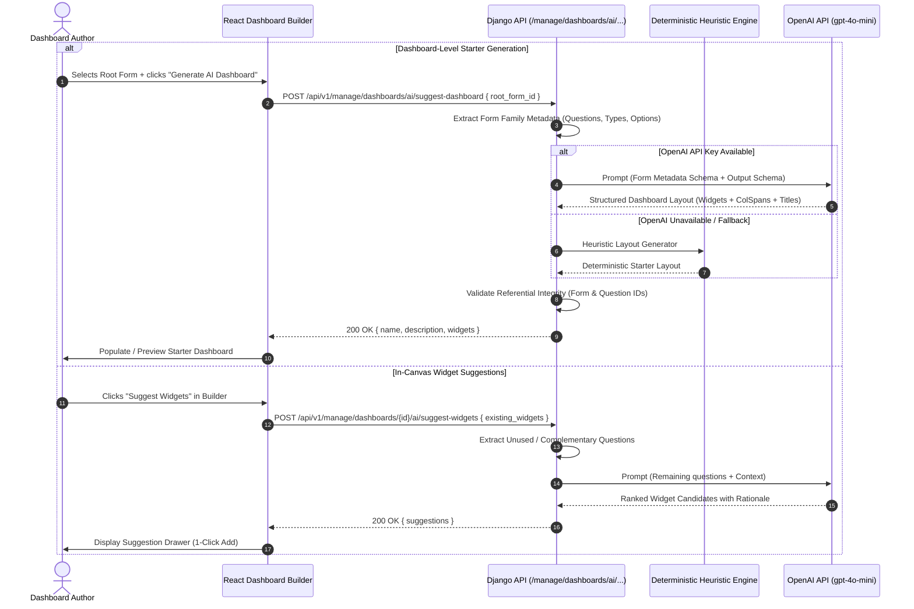

# Feature Design Document: AI Layer for Visualisations (Architecture & Roadmap)

**Task ID**: VIZ-AI-001  
**Issue**: [#452](https://github.com/akvo/akvo-mis/issues/452)  
**Branch**: `feature/452-viz-ai-dashboard-visualization-layer`  
**Feature Name**: AI Layer on the Visualisation Feature  
**Author**: Akvo Engineering Team  
**Date**: 2026-09-22  
**Status**: Approved  
**Task Prefix**: `VIZ-AI-<Sequence>`  

---

## 1. Context & Problem Statement

```
Currently:
- Creating a dashboard in Akvo MIS requires manual composition: authors must manually select each widget type, form source, question binding, aggregation mode, grouping, color scheme, and grid column spans.
- Domain non-experts often struggle to choose the most effective visualization (e.g. Map for geolocation vs Bar for high-cardinality categorical data vs Line for temporal trends).
- Starting from a blank canvas is intimidating and slow when an author simply wants standard insights from a newly registered form family.
- Akvo MIS already has OPENAI_API_KEY configured in settings (used by api/v1/v1_chatbot).

Goal:
- Provide an AI Layer for the Dashboard Visualisation system that accelerates dashboard authoring across two core capabilities:
  1. Dashboard-Level Recommendation: Recommending a cohesive starter layout of complementary widgets based on a selected form family.
  2. In-Canvas Widget Suggestions: Recommending relevant next widgets while editing a dashboard, based on available form questions and already placed widgets.
- Enforce strict multi-tenant data privacy: Send ONLY form/question metadata and schema structures to the LLM (zero raw submission data / PII).
- Provide a robust rule-based deterministic fallback when the API key is unset or external calls are unavailable.
- Structure implementation into progressive task sequences, each with its own detailed design spec.
```

---

## 2. Core Capabilities

### 2.1. Capability A: Dashboard-Level Starter Recommendation
When an author initiates a new dashboard for a selected Root Form (and its monitoring children), the AI layer inspects the form family structure and produces a comprehensive starter dashboard layout consisting of:
- High-level metric summary KPIs.
- Categorical and status distribution charts (Pie/Bar).
- Temporal monitoring trends over time (Line).
- Geographic distribution maps (where coordinate questions exist).
- Recommended layout spans (`col_span`) and descriptive titles.

### 2.2. Capability B: In-Canvas Widget Suggestions
While actively editing a dashboard in the Dashboard Builder:
- The author can request context-aware widget recommendations.
- The AI layer evaluates remaining/unvisualized questions in the form family alongside existing widgets.
- Suggestions are presented in an interactive drawer with clear rationales, allowing authors to preview and add widgets directly onto the canvas with one click.

---

## 3. High-Level Architecture & Data Flow



---

## 4. Privacy & Multi-Tenancy Boundary Principles 🛡️

> [!IMPORTANT]
> **Zero-PII / Zero-Raw Data Transmission Rule**:
> 1. **No Submission Data / PII**: Individual submissions (`Answers`, `FormData`, free-text responses, specific GPS coordinates of respondents) are **never** transmitted to external LLMs.
> 2. **Structural Schema Only**: Prompts receive exclusively structural metadata:
>    - Form names and Form types (`registration`, `monitoring`).
>    - Question labels and types (`number`, `option`, `multiple_option`, `date`, `autofield`).
>    - Option choice labels (e.g. `["Functioning", "Needs Repair", "Decommissioned"]`).
> 3. **Tenant Isolation**: All form and dashboard resolutions are strictly scoped through `Forms.objects.for_user(request.user)` and `Dashboard.objects.for_user(request.user)`.

---

## 5. Technology Strategy

- **Primary Engine**: OpenAI `gpt-4o-mini` with JSON Schema Structured Outputs, utilizing the existing project `settings.OPENAI_API_KEY`.
- **Deterministic Heuristic Fallback**: An internal rule-based recommendation engine that generates valid chart configurations from question types if external AI services are unreachable or unconfigured.
- **Payload Compatibility**: Suggestions are transient payloads conforming directly to `DashboardWidget` models and are committed through standard dashboard save endpoints (`PUT /manage/dashboards/{id}`).

---

## 6. Implementation Roadmap & Task Sequence (Max 3 Tasks)

The total estimated time for each task comprehensively includes **core implementation, automated test suites (TEA), manual testing/smoke verification during development, and code review**.

```
VIZ-AI-001 (Architecture & Roadmap Specification)
 ├── VIZ-AI-002: Backend AI Recommendation Engine & Suggestion Endpoints
 └── VIZ-AI-003: Frontend Dashboard Builder AI Integration & Verification
```

### Consolidated Task Breakdown:

| Task ID | Task Scope | Primary Touchpoints | Dev (Vibe Coding) | Testing (Auto + Manual) | Review & Polish | Total Est. | Detailed Spec File |
|---|---|---|:---:|:---:|:---:|:---:|---|
| **VIZ-AI-001** | **Architecture & Roadmap Specification**<br>High-level system design, data boundaries, privacy rules, and task consolidation. | `doc/design/VIZ-AI-001-ai-dashboard-visualization-layer.md` | 30m | 15m | 15m | **1h** | Current Document |
| **VIZ-AI-002** | **Backend AI Recommendation Engine & Suggestion Endpoints**<br>Form family metadata extractor, OpenAI `gpt-4o-mini` structured prompt service, deterministic heuristic offline engine, `suggest-dashboard` & `suggest-widgets` endpoints, referential integrity filters, unit & integration test suite. | `backend/api/v1/v1_visualization/ai_prompts.py`<br>`backend/api/v1/v1_visualization/ai_service.py`<br>`backend/api/v1/v1_visualization/ai_heuristics.py`<br>`backend/api/v1/v1_visualization/dashboard_builder_views.py`<br>`backend/api/v1/v1_visualization/tests/test_ai_visualization.py` | 4.0h | 2.5h | 1.5h | **8h** | `doc/design/VIZ-AI-002-backend-ai-recommendation-engine.md` |
| **VIZ-AI-003** | **Frontend Dashboard Builder AI Integration & Verification**<br>Dashboard AI client helper, Create Dashboard Modal AI starter generation, In-Canvas AI Suggestion Drawer, 1-click canvas insertion, error boundaries & fallbacks, Jest tests, manual smoke testing across forms, and docs sync. | `frontend/src/util/dashboardAi.js`<br>`frontend/src/pages/dashboards/CreateDashboardModal.jsx`<br>`frontend/src/pages/dashboards/AISuggestionDrawer.jsx`<br>`frontend/src/pages/dashboards/DashboardBuilder.jsx`<br>`frontend/src/pages/dashboards/BuilderPalette.jsx`<br>`frontend/src/pages/dashboards/__test__/` | 3.5h | 2.0h | 1.5h | **7h** | `doc/design/VIZ-AI-003-frontend-dashboard-ai-integration.md` |
| **TOTAL** | **Full Feature Delivery** | **Backend + Frontend + Docs** | **8.0h** | **4.75h** | **3.25h** | **16h** | |
