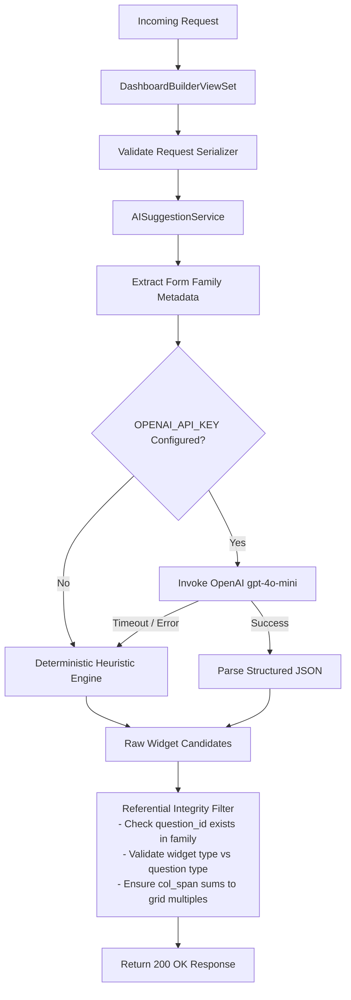

# Feature Design Document: Backend AI Recommendation Engine & Suggestion Endpoints

**Task ID**: VIZ-AI-002  
**Parent Epic**: [VIZ-AI-001](file:///Users/galihpratama/Sites/akvo-mis/doc/design/VIZ-AI-001-ai-dashboard-visualization-layer.md)  
**Issue**: [#452](https://github.com/akvo/akvo-mis/issues/452)  
**Branch**: `feature/452-viz-ai-dashboard-visualization-layer`  
**Feature Name**: Backend AI Recommendation Service & APIs  
**Author**: Akvo Engineering Team  
**Date**: 2026-09-22  
**Status**: Draft / Review  
**Estimated Effort**: **8h** (Dev: 4.0h | Testing: 2.5h | Review: 1.5h)  

---

## 1. Context & Problem Statement

```
Currently:
- The dashboard builder backend provides CRUD endpoints (/manage/dashboards) and sources (/sources) for manual widget assembly.
- Authors must manually decide which questions to visualize, which chart types best fit the data, and how to configure groupings, aggregations, and layout column spans.
- There is no backend service that inspects a form family to generate automated visualization recommendations or suggest complementary widgets.

Goal:
- Implement a robust backend AI suggestion engine that delivers two endpoints:
  1. POST /api/v1/manage/dashboards/ai/suggest-dashboard (dashboard-level starter layout).
  2. POST /api/v1/manage/dashboards/{id}/ai/suggest-widgets (in-canvas contextual widget suggestions).
- Integrate with OpenAI (gpt-4o-mini) using the existing project settings.OPENAI_API_KEY with JSON Schema structured outputs.
- Build a fast, deterministic rule-based heuristic engine as an offline fallback.
- Enforce strict referential integrity validation so non-existent question/form IDs (hallucinations) are automatically filtered out.
- Guarantee zero-PII data transmission (only send structural form/question schema).
```

---

## 2. 5W1H Requirements Analysis

| Dimension | Specification |
|---|---|
| **Who** | Dashboard authors requesting automated starter layouts or contextual widget ideas. |
| **What** | Backend recommendation engine (`ai_prompts.py`, `ai_heuristics.py`, `ai_service.py`), DRF serializers, and endpoints. |
| **Where** | `backend/api/v1/v1_visualization/` |
| **When** | Triggered via HTTP POST requests from the frontend Dashboard Builder. |
| **Why** | Centralizes AI logic on the backend, guarantees schema validity, eliminates client-side API key exposure, and handles offline fallbacks transparently. |
| **How** | Extracts form metadata, formats a compact prompt, queries OpenAI `gpt-4o-mini` with structured JSON output (or falls back to heuristics on timeout/error), validates candidate widgets against form family sources, and returns normalized widget objects. |

---

## 3. Requirements & Acceptance Criteria

### 3.1. User Acceptance Criteria (UAC)
- [ ] **Starter Layout API**: An authenticated user can submit `{ root_form: <id> }` and receive a cohesive starter dashboard layout of 4-6 valid widgets with generated titles and rationales.
- [ ] **Contextual Suggestions API**: An authenticated user can submit `{ existing_widget_types: [...] }` to an existing dashboard and receive ranked widget recommendations prioritized for unvisualized questions.
- [ ] **Insight Rationales**: Every suggested widget provides a clear, 1-sentence analytical rationale explaining the value of the chart.
- [ ] **Appropriate Visual Encoding**:
  - Site counts & numeric metrics -> KPIs (Sum/Average).
  - Categorical questions (<= 5 choices) -> Pie / Donut.
  - Categorical questions (> 5 choices) -> Bar charts.
  - Temporal date questions on monitoring forms -> Line trend charts.
  - Geolocation questions -> Maps.
  - Monitoring records -> Escalation overview Tables.
- [ ] **Seamless Offline Heuristic Mode**: If OpenAI is unconfigured or unavailable, requests return valid rule-based heuristic layouts with zero error status codes (200 OK).

### 3.2. Technical Acceptance Criteria (TAC)
- [ ] **Endpoint Contracts**:
  - `POST /api/v1/manage/dashboards/ai/suggest-dashboard` accepts `root_form` (int) and optional `user_intent` (str, <=250 chars), returning `{ suggested_name, description, widgets }`.
  - `POST /api/v1/manage/dashboards/{id}/ai/suggest-widgets` accepts `existing_widget_types` (list) and optional `prompt_hint` (str, <=250 chars), returning `{ suggestions }`.
- [ ] **Zero-PII Payload**: Prompt construction queries only `Forms` and `Questions` schema; zero `Answers`, `FormData`, or free-text answers are accessed.
- [ ] **Tenant Scoping & Security**: Root form and dashboard resolution must enforce `Forms.objects.for_user(request.user)` and `Dashboard.objects.for_user(request.user)`. Cross-tenant requests return `404 Not Found`.
- [ ] **Referential Integrity Filter**: Prunes any model hallucinations where `form` does not belong to the active form family or `question` does not belong to `form`.
- [ ] **Domain Measure Constraint**: Enforces `measure = "current_state"` strictly for `FormTypes.monitoring`, and `measure = null` for registration forms.
- [ ] **Table Form Binding**: Table suggestions bind strictly to monitoring forms.
- [ ] **OpenAI & Fallback Timeout**: External OpenAI calls timeout after 5 seconds, automatically falling back to `ai_heuristics.py`.
- [ ] **Automated Test Gate**: Minimum 85% test coverage in `test_ai_visualization.py` covering OpenAI mocks, rate limit fallbacks, hallucination filtering, and tenant isolation.

---

## 4. Architecture & Module Design

```
backend/api/v1/v1_visualization/
├── ai_prompts.py          # Prompt templates & Pydantic / JSON Schema output definitions
├── ai_heuristics.py       # Deterministic rule engine mapping question types to charts
├── ai_service.py          # Orchestration service (OpenAI client + fallback + validation)
├── dashboard_builder_serializers.py # DRF request/response serializers
├── dashboard_builder_views.py       # ViewSet actions (suggest_dashboard, suggest_widgets)
├── urls.py                # Route definitions
└── tests/
    └── test_ai_visualization.py     # Unit, integration & multi-tenancy tests
```

### Data Flow Diagram



---

## 5. Detailed Component Specifications

### 5.1. Metadata Extraction (`ai_service.py`)
Extracts structural schema from the active form family without querying any submission rows:
```python
def extract_family_metadata(root_form, user) -> dict:
    """
    Returns a compact metadata dict containing form names, hierarchy,
    and question definitions (id, label, type, option choices).
    No submission answers or PII are accessed.
    """
```

### 5.2. Prompt Engineering & JSON Schema (`ai_prompts.py`)
- **System Instructions**: Instructs the model that it is an expert data visualization architect for Akvo MIS.
- **Output Schema**: Conforms directly to `DashboardWidgetSerializer` and `validate_dashboard_payload`:
  - `suggested_name`: string (<= 255 chars)
  - `description`: string
  - `widgets`: array of objects:
    - `type`: `"kpi"` | `"bar"` | `"line"` | `"pie"` | `"table"` | `"map"` | `"scatter"`
    - `title`: string (<= 255 chars)
    - `col_span`: integer (6, 8, 12, 24)
    - `color`: string (<= 32 chars) | null
    - `form`: integer (ID of root_form or its monitoring child)
    - `question`: integer | null (ID of question belonging to form)
    - `config`: object (exact keys conforming to `builderConstants.js` / `dashboard_functions.py`)
    - `rationale`: string (1-sentence explanation of why this chart is insightful)

### 5.3. Deterministic Heuristic Engine (`ai_heuristics.py`)
Provides deterministic recommendations when OpenAI is unavailable, respecting all frontend widget defaults:
- **KPI Generation**:
  - Site count KPI: `form: root_form.id, question: null, config: { value_type: "number" }`
  - Numeric KPI: `form: form.id, question: q.id, config: { value_type: "number", repeat_agg: "sum" | "average" }`
- **Categorical Distribution**:
  - `option` / `multiple_option` (<= 5 options) -> `pie` with `config: { group_by: "option", variant: "doughnut", color_scheme: "categorical" }`
  - `option` / `multiple_option` (> 5 options) -> `bar` with `config: { group_by: "option", stack_by: null, color_scheme: "categorical" }`
- **Temporal Trends**:
  - `date` question on monitoring form -> `line` with `config: { group_by: "month", date_question_id: q.id, color_scheme: "categorical" }`
- **Geographic Map**:
  - Form containing coordinates and a categorical question -> `map` with `config: { map_mode: "category", color_scheme: "categorical" }`
- **Table Overview**:
  - Monitoring form -> `table` with `question: null, config: { columns: [...], criteria: [] }`

### 5.4. Referential Integrity & Sanitization Filter (`ai_service.py`)
Ensures model hallucinations are strictly caught before returning:
1. `form` must match `root_form` or one of its child monitoring forms in `Forms.objects.for_user(user)`.
2. `question` (if present) must belong to the specified `form` and have a type in `SUPPORTED_QUESTION_TYPES`.
3. `type` must be a valid member of `WidgetTypes`.
4. `config` fields (e.g. `group_by`, `stack_by`, `date_question_id`) must refer to valid questions and allowed enum values in `constants.py`.

---

## 6. API Endpoints

### 6.1. `POST /api/v1/manage/dashboards/ai/suggest-dashboard`
- **Request**:
  ```json
  {
    "root_form": 42,
    "user_intent": "Monitor water supply functionality and maintenance trends"
  }
  ```
- **Response (200 OK)**:
  ```json
  {
    "suggested_name": "Water Point Operations & Functionality Overview",
    "description": "Recommended starter layout visualizing operational status, failure causes, and inspection trends.",
    "widgets": [
      {
        "type": "kpi",
        "title": "Total Registered Points",
        "col_span": 6,
        "color": null,
        "form": 42,
        "question": null,
        "config": {
          "value_type": "number"
        },
        "rationale": "High-level inventory count."
      },
      {
        "type": "pie",
        "title": "Functionality Status",
        "col_span": 8,
        "color": null,
        "form": 42,
        "question": 102,
        "config": {
          "group_by": "option",
          "variant": "doughnut",
          "color_scheme": "categorical"
        },
        "rationale": "Proportional distribution of functional vs defective points."
      },
      {
        "type": "line",
        "title": "Monthly Monitoring Submissions",
        "col_span": 12,
        "color": null,
        "form": 45,
        "question": 120,
        "config": {
          "group_by": "month",
          "date_question_id": 120,
          "color_scheme": "categorical"
        },
        "rationale": "Tracking monitoring activity frequency over time."
      }
    ]
  }
  ```

### 6.2. `POST /api/v1/manage/dashboards/{id}/ai/suggest-widgets`
- **Request**:
  ```json
  {
    "existing_widget_types": ["kpi", "pie"],
    "prompt_hint": "I want a breakdown of water quality tests"
  }
  ```
- **Response (200 OK)**:
  ```json
  {
    "suggestions": [
      {
        "type": "bar",
        "title": "Water Quality Compliance Breakdown",
        "col_span": 12,
        "color": null,
        "form": 45,
        "question": 108,
        "config": {
          "group_by": "option",
          "stack_by": null,
          "color_scheme": "categorical"
        },
        "rationale": "Compares test results across compliance classifications."
      }
    ]
  }
  ```

---

## 7. Dashboard Visualization Schema & Frontend Config Parity Matrix

To ensure 100% compatibility with `frontend/src/pages/dashboards/builderConstants.js`, `BuilderInspector.jsx`, and backend `validate_dashboard_payload`, all generated widgets adhere to the canonical schema:

| Widget Type | `form` Requirement | `question` Requirement | Valid `config` Keys & Constraints |
|---|---|---|---|
| `kpi` | Root or Monitoring Form | `number`, `autofield`, or `null` (count) | `value_type`: `"number"` \| `"percentage"`<br>`repeat_agg`: `"sum"` \| `"average"` \| `"max"` \| `"min"` \| `"last"` (monitoring only)<br>`color_scheme`: `"categorical"` |
| `bar` | Root or Monitoring Form | `option`, `multiple_option`, `number`, `autofield` | `group_by`: `"option"` \| `"month"` \| `"date"` \| `"parent_id"`<br>`stack_by`: `null` \| `"option"` \| `"parent_id"` \| `"administration"`<br>`stack_question`: question ID (if `stack_by: "option"`)<br>`color_scheme`: `"categorical"` |
| `line` | Root or Monitoring Form | `date` or `number` | `group_by`: `"month"` \| `"date"`<br>`date_question_id`: `date` question ID<br>`category_question_id`: `option` question ID (optional breakdown)<br>`admin_level`: `1` (optional)<br>`color_scheme`: `"categorical"` |
| `pie` | Root or Monitoring Form | `option`, `multiple_option`, `autofield` | `group_by`: `"option"`<br>`variant`: `"pie"` \| `"doughnut"`<br>`color_scheme`: `"categorical"` |
| `scatter` | Root or Monitoring Form | `number` or `autofield` (x-axis) | `x_question_id`: question ID<br>`y_question_id`: question ID (`number` or `autofield`)<br>`color_scheme`: `"categorical"` |
| `map` | Form with coordinates | `option`, `multiple_option`, `number`, `autofield` | `map_mode`: `"category"` (for option) \| `"quantity"` (for number)<br>`color_scheme`: `"categorical"` |
| `table` | Monitoring Form | `null` | `columns`: `[{ key, source, title, question }]`<br>`criteria`: `[{ type, question, value }]` |
| `section_title` | `null` | `null` | `text`: string |

---

## 8. Verification & Test Plan

### Automated Test Cases (`backend/api/v1/v1_visualization/tests/test_ai_visualization.py`):
1. `test_heuristic_starter_generation`: Verifies deterministic layout produced for standard registration + monitoring forms.
2. `test_heuristic_widget_suggestions`: Verifies unvisualized questions are prioritized in suggestions.
3. `test_openai_service_structured_output_mock`: Mocks OpenAI API response and verifies JSON schema deserialization.
4. `test_openai_fallback_on_api_error`: Verifies graceful fallback to heuristics when OpenAI raises rate limit or timeout errors.
5. `test_hallucination_filtering`: Verifies non-existent question/form IDs injected into LLM output are pruned.
6. `test_tenant_isolation`: Confirms that requesting suggestions for a `root_form_id` belonging to another tenant returns 404/403.
7. `test_api_endpoints_permissions`: Confirms unauthenticated requests receive 401 Unauthorized.

### Execution Command:
```bash
./dc.sh exec backend python manage.py test api.v1.v1_visualization.tests.test_ai_visualization
./dc.sh exec backend flake8 api/v1/v1_visualization/
```

---

## 9. Task Breakdown & Estimation

| Sub-task | Scope | Dev (Vibe) | Testing (Auto+Manual) | Review | Total |
|---|---|:---:|:---:|:---:|:---:|
| **VIZ-AI-002.1** | Metadata extractor & OpenAI prompt schemas (`ai_prompts.py`) | 45m | 30m | 15m | **1.5h** |
| **VIZ-AI-002.2** | Deterministic Heuristic Recommendation Engine (`ai_heuristics.py`) | 45m | 30m | 15m | **1.5h** |
| **VIZ-AI-002.3** | Orchestration Service & Referential Integrity Validator (`ai_service.py`) | 60m | 35m | 25m | **2.0h** |
| **VIZ-AI-002.4** | ViewSet Actions, URLs, Serializers & Multi-tenancy Scoping | 45m | 30m | 15m | **1.5h** |
| **VIZ-AI-002.5** | Comprehensive Test Suite & Manual Endpoint Verification | 45m | 25m | 20m | **1.5h** |
| **TOTAL** | **Full Backend AI Engine** | **4.0h** | **2.5h** | **1.5h** | **8.0h** |
