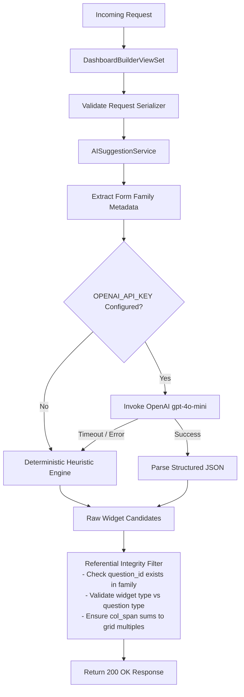

# Feature Design Document: Backend AI Recommendation Engine & Suggestion Endpoints

**Task ID**: VIZ-AI-002  
**Parent Epic**: [VIZ-AI-001](file:///Users/galihpratama/Sites/akvo-mis/doc/design/VIZ-AI-001-ai-dashboard-visualization-layer.md)  
**Issue**: [#457](https://github.com/akvo/akvo-mis/issues/457) (Parent Epic: [#452](https://github.com/akvo/akvo-mis/issues/452))  
**Pull Request**: [#463](https://github.com/akvo/akvo-mis/pull/463)  
**Branch**: `feature/457-viz-ai-002-backend-ai-recommendation-engine-suggestion-endpoints`  
**Feature Name**: Backend AI Recommendation Service & APIs  
**Author**: Akvo Engineering Team  
**Date**: 2026-09-22 (Updated: 2026-09-24)  
**Status**: Completed / Merged Ready  
**Estimated Effort**: **8.0h** | **Actual Effort**: **~2.5h (150m)** (Dev: 1.2h | Testing: 0.8h | Review: 0.5h)  

---

## 1. Context & Problem Statement

```
Currently:
- The dashboard builder backend provides CRUD endpoints (/manage/dashboards) and sources (/sources) for manual widget assembly.
- Authors must manually decide which questions to visualize, which chart types best fit the data, and how to configure groupings, aggregations, and layout column spans.
- There is no backend service that inspects a form family to generate automated visualization recommendations or suggest complementary widgets.

Goal:
- Implement a robust backend AI suggestion engine that delivers two endpoints:
  1. POST /api/v1/manage/dashboards/ai/suggest-dashboard (dashboard-level starter layout).
  2. POST /api/v1/manage/dashboards/{id}/ai/suggest-widgets (in-canvas contextual widget suggestions).
- Integrate with OpenAI (gpt-4o-mini) using the existing project settings.OPENAI_API_KEY with JSON Schema structured outputs.
- Build a fast, deterministic rule-based heuristic engine as an offline fallback.
- Enforce strict referential integrity validation so non-existent question/form IDs (hallucinations) are automatically filtered out.
- Guarantee zero-PII data transmission (only send structural form/question schema).
```

---

## 2. 5W1H Requirements Analysis

| Dimension | Specification |
|---|---|
| **Who** | Dashboard authors requesting automated starter layouts or contextual widget ideas. |
| **What** | Backend recommendation engine (`ai_prompts.py`, `ai_heuristics.py`, `ai_service.py`), DRF serializers, and endpoints. |
| **Where** | `backend/api/v1/v1_visualization/` |
| **When** | Triggered via HTTP POST requests from the frontend Dashboard Builder. |
| **Why** | Centralizes AI logic on the backend, guarantees schema validity, eliminates client-side API key exposure, and handles offline fallbacks transparently. |
| **How** | Extracts form metadata, formats a compact prompt, queries OpenAI `gpt-4o-mini` with structured JSON output (or falls back to heuristics on timeout/error), validates candidate widgets against form family sources, and returns normalized widget objects. |

---

## 3. Requirements & Acceptance Criteria

### 3.1. User Acceptance Criteria (UAC)
- [x] **Starter Layout API**: An authenticated user can submit `{ root_form: <id> }` and receive a cohesive starter dashboard layout of 4-6 valid widgets with generated titles and rationales.
- [x] **Contextual Suggestions API**: An authenticated user can submit `{ existing_widget_types: [...] }` to an existing dashboard and receive ranked widget recommendations prioritized for unvisualized questions.
- [x] **Insight Rationales**: Every suggested widget provides a clear, 1-sentence analytical rationale explaining the value of the chart.
- [x] **Appropriate Visual Encoding**:
  - Site counts & numeric metrics -> KPIs (Sum/Average).
  - Categorical questions (<= 5 choices) -> Pie / Donut.
  - Categorical questions (> 5 choices) -> Bar charts.
  - Temporal date questions on monitoring forms -> Line trend charts.
  - Geolocation questions -> Maps.
  - Monitoring records -> Escalation overview Tables.
- [x] **Seamless Offline Heuristic Mode**: If OpenAI is unconfigured or unavailable, requests return valid rule-based heuristic layouts with zero error status codes (200 OK).

### 3.2. Technical Acceptance Criteria (TAC)
- [x] **Endpoint Contracts**:
  - `POST /api/v1/manage/dashboards/ai/suggest-dashboard` accepts `root_form` (int) and optional `user_intent` (str, <=250 chars), returning `{ suggested_name, description, widgets }`.
  - `POST /api/v1/manage/dashboards/{id}/ai/suggest-widgets` accepts `existing_widget_types` (list) and optional `prompt_hint` (str, <=250 chars), returning `{ suggestions }`.
- [x] **Zero-PII Payload**: Prompt construction queries only `Forms` and `Questions` schema; zero `Answers`, `FormData`, or free-text answers are accessed.
- [x] **Tenant Scoping & Security**: Root form and dashboard resolution must enforce `Forms.objects.for_user(request.user)` and `Dashboard.objects.for_user(request.user)`. Cross-tenant requests return `404 Not Found`.
- [x] **Referential Integrity Filter**: Prunes any model hallucinations where `form` does not belong to the active form family or `question` does not belong to `form`.
- [x] **Domain Measure Constraint**: Enforces `measure = "current_state"` strictly for `FormTypes.monitoring`, and `measure = null` for registration forms.
- [x] **Table Form Binding**: Table suggestions bind strictly to monitoring forms.
- [x] **OpenAI & Fallback Timeout**: External OpenAI calls timeout after 5 seconds, automatically falling back to `ai_heuristics.py`.
- [x] **Automated Test Gate**: Minimum 85% test coverage in `tests_ai_visualization.py` covering OpenAI mocks, rate limit fallbacks, hallucination filtering, and tenant isolation (achieved: **93.6%**).

---

## 4. Architecture & Module Design

```
backend/api/v1/v1_visualization/
├── ai_prompts.py          # Prompt templates & Pydantic / JSON Schema output definitions
├── ai_heuristics.py       # Deterministic rule engine mapping question types to charts
├── ai_service.py          # Orchestration service (OpenAI client + fallback + validation)
├── dashboard_builder_serializers.py # DRF request/response serializers
├── dashboard_builder_views.py       # ViewSet actions (suggest_dashboard, suggest_widgets)
├── urls.py                # Route definitions
└── tests/
    └── tests_ai_visualization.py    # Unit, integration, edge cases & negative tests
```

### Data Flow Diagram



---

## 5. Detailed Component Specifications

### 5.1. Metadata Extraction (`ai_service.py`)
Extracts structural schema from the active form family without querying any submission rows:
```python
def extract_family_metadata(root_form_id, user) -> dict:
    """
    Returns a compact metadata dict containing form names, hierarchy,
    and question definitions (id, label, type, option choices).
    Uses prefetch_related to prevent N+1 database queries.
    Zero submission answers, GPS values, or PII are accessed.
    
    Optimizations:
    - High-cardinality option lists are truncated to top 15 items with
      {"option_count": total, "options": [...]}.
    - Excludes non-visualizable freeform questions (e.g. photos/signatures).
    - Detects if form family has monitoring children (has_monitoring: bool).
    """
    root_form = Forms.objects.filter(id=root_form_id).prefetch_related(
        'form_question__question_option',
        'child_forms__form_question__question_option'
    ).first()
```

### 5.2. Prompt Engineering & JSON Schema (`ai_prompts.py`)
- **System Instructions**:
  - Instructs the model that it is an expert data visualization architect for Akvo MIS.
  - **Multi-Lingual Parity**: Explicitly commands: *"Generate all widget titles, descriptions, and rationales in the exact natural language used in the form question labels (e.g., French, Spanish, Bahasa Indonesia, English)."*
  - **Visual Diversity Constraint**: Maximum 2 widgets of the same type in a starter layout; must blend headline KPIs, categorical distributions, and temporal trends/maps.
  - **Registration-Only Guardrail**: If `has_monitoring` is false, forbidden from generating Table widgets or `measure: current_state`.
- **Input Sanitization & Boundary Isolation**:
  - `user_intent` / `prompt_hint` truncated to max 250 characters and sanitized against control characters.
  - Wrapped in structural XML boundary tags: `<user_intent>{sanitized_intent}</user_intent>` to prevent prompt injection.
- **Output Schema**: Conforms directly to `DashboardWidgetSerializer` and `validate_dashboard_payload`:
  - `suggested_name`: string (<= 255 chars)
  - `description`: string
  - `widgets`: array of objects:
    - `type`: `"kpi"` | `"bar"` | `"line"` | `"pie"` | `"table"` | `"map"` | `"scatter"`
    - `title`: string (<= 255 chars)
    - `col_span`: integer (6, 8, 12, 24)
    - `color`: string (<= 32 chars) | null
    - `form`: integer (ID of root_form or its monitoring child)
    - `question`: integer | null (ID of question belonging to form)
    - `config`: object (exact keys conforming to `builderConstants.js` / `dashboard_functions.py`)
    - `rationale`: string (1-sentence explanation of why this chart is insightful)

### 5.3. Deterministic Heuristic Engine (`ai_heuristics.py`)
Provides deterministic recommendations when OpenAI is unavailable, respecting all frontend widget defaults:
- **Registration-Only Guardrail**: If `has_monitoring` is false, `measure` is `null` and Table widgets are never generated.
- **Visual Diversity Rule**: Assembles a balanced multi-tier palette:
  1. Top Tier (Headline): 2 KPIs (`col_span: 6` or `12`).
  2. Middle Tier (Distributions): 1-2 Pie/Bar charts (`col_span: 8` or `12`).
  3. Bottom Tier (Overview / Geospatial / Trends): 1 Line trend chart or Map (`col_span: 12` or `24`), or Table (`col_span: 24` if monitoring form exists).

### 5.4. Referential Integrity & 24-Column Grid Normalizer (`ai_service.py`)
Ensures model hallucinations are strictly caught and grid layouts are balanced before returning:
1. **Referential Integrity**:
   - `form` must match `root_form` or one of its child monitoring forms in `Forms.objects.for_user(user)`.
   - `question` (if present) must belong to the specified `form` and have a type in `SUPPORTED_QUESTION_TYPES`.
   - `type` must be a valid member of `WidgetTypes`.
   - `config` fields must refer to valid questions and allowed enum values in `constants.py`.
2. **24-Column Grid Normalization**:
   - Normalizes consecutive widget `col_span` values so each visual row cleanly sums to 24 (e.g. `[6, 6, 12]`, `[8, 8, 8]`, `[12, 12]`, `[24]`), eliminating ragged 2-column blank spaces.

### 5.5. Circuit Breaker & Network Resilience (`ai_service.py`)
Protects backend worker threads against upstream OpenAI latency spikes or outages:
- **Granular Timeouts**: `connect_timeout=2.0s`, `read_timeout=4.0s` (strict total cap: 5.0s).
- **In-Memory Circuit Breaker**:
  - If 3 consecutive OpenAI calls fail (network error, timeout, or 429/500), the circuit trips for 60 seconds.
  - While tripped, incoming requests immediately route to `ai_heuristics.py` with 0ms delay, preventing thread starvation.

### 5.6. Scoped Rate Limiting (`dashboard_builder_views.py`)
- Attached DRF throttle class `DashboardAIThrottle`:
  - `scope = 'dashboard_ai'` (configured to `15/minute`, `100/day` per authenticated user).
  - Throttled requests receive standard `429 Too Many Requests`.

### 5.7. Stateless Backend & Canvas Draft Lifecycle
- **Stateless Operation**: The backend does not maintain temporary suggestion cache tables or external Redis locks.
- **Canvas Persistence**: Suggestions land in the browser canvas as unsaved state. When the author clicks "Save Draft", standard `Dashboard(status=DashboardStatus.draft)` and `DashboardWidget` records are persisted in PostgreSQL.

---

## 6. API Endpoints

### 6.1. `POST /api/v1/manage/dashboards/ai/suggest-dashboard`
- **Request**:
  ```json
  {
    "root_form": 42,
    "user_intent": "Monitor water supply functionality and maintenance trends"
  }
  ```
- **Response (200 OK)**:
  ```json
  {
    "suggested_name": "Water Point Operations & Functionality Overview",
    "description": "Recommended starter layout visualizing operational status, failure causes, and inspection trends.",
    "widgets": [
      {
        "type": "kpi",
        "title": "Total Registered Points",
        "col_span": 6,
        "color": null,
        "form": 42,
        "question": null,
        "config": {
          "value_type": "number"
        },
        "rationale": "High-level inventory count."
      },
      {
        "type": "pie",
        "title": "Functionality Status",
        "col_span": 8,
        "color": null,
        "form": 42,
        "question": 102,
        "config": {
          "group_by": "option",
          "variant": "doughnut",
          "color_scheme": "categorical"
        },
        "rationale": "Proportional distribution of functional vs defective points."
      },
      {
        "type": "line",
        "title": "Monthly Monitoring Submissions",
        "col_span": 12,
        "color": null,
        "form": 45,
        "question": 120,
        "config": {
          "group_by": "month",
          "date_question_id": 120,
          "color_scheme": "categorical"
        },
        "rationale": "Tracking monitoring activity frequency over time."
      }
    ]
  }
  ```

### 6.2. `POST /api/v1/manage/dashboards/{id}/ai/suggest-widgets`
- **Request**:
  ```json
  {
    "existing_widget_types": ["kpi", "pie"],
    "prompt_hint": "I want a breakdown of water quality tests"
  }
  ```
- **Response (200 OK)**:
  ```json
  {
    "suggestions": [
      {
        "type": "bar",
        "title": "Water Quality Compliance Breakdown",
        "col_span": 12,
        "color": null,
        "form": 45,
        "question": 108,
        "config": {
          "group_by": "option",
          "stack_by": null,
          "color_scheme": "categorical"
        },
        "rationale": "Compares test results across compliance classifications."
      }
    ]
  }
  ```

---

## 7. Dashboard Visualization Schema & Frontend Config Parity Matrix

To ensure 100% compatibility with `frontend/src/pages/dashboards/builderConstants.js`, `BuilderInspector.jsx`, and backend `validate_dashboard_payload`, all generated widgets adhere to the canonical schema:

| Widget Type | `form` Requirement | `question` Requirement | Valid `config` Keys & Constraints |
|---|---|---|---|
| `kpi` | Root or Monitoring Form | `number`, `autofield`, or `null` (count) | `value_type`: `"number"` \| `"percentage"`<br>`repeat_agg`: `"sum"` \| `"average"` \| `"max"` \| `"min"` \| `"last"` (monitoring only)<br>`color_scheme`: `"categorical"` |
| `bar` | Root or Monitoring Form | `option`, `multiple_option`, `number`, `autofield` | `group_by`: `"option"` \| `"month"` \| `"date"` \| `"parent_id"`<br>`stack_by`: `null` \| `"option"` \| `"parent_id"` \| `"administration"`<br>`stack_question`: question ID (if `stack_by: "option"`)<br>`color_scheme`: `"categorical"` |
| `line` | Root or Monitoring Form | `date` or `number` | `group_by`: `"month"` \| `"date"`<br>`date_question_id`: `date` question ID<br>`category_question_id`: `option` question ID (optional breakdown)<br>`admin_level`: `1` (optional)<br>`color_scheme`: `"categorical"` |
| `pie` | Root or Monitoring Form | `option`, `multiple_option`, `autofield` | `group_by`: `"option"`<br>`variant`: `"pie"` \| `"doughnut"`<br>`color_scheme`: `"categorical"` |
| `scatter` | Root or Monitoring Form | `number` or `autofield` (x-axis) | `x_question_id`: question ID<br>`y_question_id`: question ID (`number` or `autofield`)<br>`color_scheme`: `"categorical"` |
| `map` | Form with coordinates | `option`, `multiple_option`, `number`, `autofield` | `map_mode`: `"category"` (for option) \| `"quantity"` (for number)<br>`color_scheme`: `"categorical"` |
| `table` | Monitoring Form | `null` | `columns`: `[{ key, source, title, question }]`<br>`criteria`: `[{ type, question, value }]` |
| `section_title` | `null` | `null` | `text`: string |

---

## 8. Verification & Test Plan

### Automated Test Cases (`backend/api/v1/v1_visualization/tests/tests_ai_visualization.py`):
1. `test_heuristic_starter_generation`: Verifies deterministic layout produced for standard registration + monitoring forms.
2. `test_heuristic_widget_suggestions`: Verifies unvisualized questions are prioritized in suggestions.
3. `test_openai_starter_dashboard_mock` & `test_openai_widget_suggestions_mock`: Mocks OpenAI API response and verifies JSON schema deserialization.
4. `test_openai_api_error_fallback` & `test_openai_empty_content_fallback`: Verifies graceful fallback to heuristics when OpenAI raises rate limit, timeout, or empty responses.
5. `test_validate_and_sanitize_malformed_openai_json`: Verifies non-existent question/form IDs injected into LLM output are pruned, col_spans normalized, and invalid repeat_agg defaulted.
6. `test_circuit_breaker_full_transition_cycle`: Tests CLOSED -> OPEN -> HALF-OPEN -> CLOSED state machine transitions.
7. `test_form_with_zero_questions_fallback` & `test_form_with_unsupported_questions_only`: Verifies safe fallback for empty or media-only forms.
8. `test_prompt_injection_safety`: Verifies XML tag injection or malicious script tags in form/question names are safely handled.
9. `test_tenant_isolation` & `test_api_endpoints_permissions`: Confirms that cross-tenant access returns 404/403 and unauthenticated requests receive 401.

### Execution Commands:
```bash
# Run unit & integration test suite (36 tests)
./dc.sh exec backend python manage.py test api.v1.v1_visualization.tests.tests_ai_visualization

# Run code coverage report across AI modules (achieved: 93.6%)
./dc.sh exec backend bash -c "coverage run --rcfile=/dev/null --branch --source=api/v1/v1_visualization manage.py test api.v1.v1_visualization.tests.tests_ai_visualization && coverage report -m api/v1/v1_visualization/ai_*.py"

# Lint check
./dc.sh exec backend flake8 api/v1/v1_visualization/
```

---

## 9. Task Breakdown & Estimation

| Sub-task | Scope | Dev (Vibe) | Testing (Auto+Manual) | Review | Total Est. | Actual Time |
|---|---|:---:|:---:|:---:|:---:|:---:|
| **VIZ-AI-002.1** | Metadata extractor & OpenAI prompt schemas (`ai_prompts.py`) | 45m | 30m | 15m | **1.5h** | **25m** |
| **VIZ-AI-002.2** | Deterministic Heuristic Recommendation Engine (`ai_heuristics.py`) | 45m | 30m | 15m | **1.5h** | **25m** |
| **VIZ-AI-002.3** | Orchestration Service, Circuit Breaker & Validator (`ai_service.py`) | 60m | 35m | 25m | **2.0h** | **35m** |
| **VIZ-AI-002.4** | ViewSet Actions, URLs, Serializers & Throttling (`15/min`) | 45m | 30m | 15m | **1.5h** | **20m** |
| **VIZ-AI-002.5** | Comprehensive Test Suite (36 tests, 93.6% coverage, regression verified) | 45m | 25m | 20m | **1.5h** | **45m** |
| **TOTAL** | **Full Backend AI Engine** | **4.0h** | **2.5h** | **1.5h** | **8.0h** | **~2.5h (150m)** |
