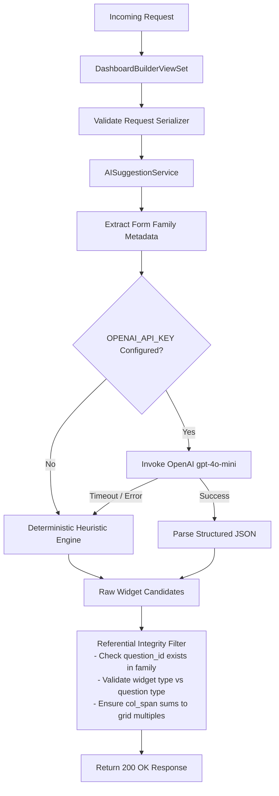

# Feature Design Document: Backend AI Recommendation Engine & Suggestion Endpoints

**Task ID**: VIZ-AI-002  
**Parent Epic**: [VIZ-AI-001](file:///Users/galihpratama/Sites/akvo-mis/doc/design/VIZ-AI-001-ai-dashboard-visualization-layer.md)  
**Issue**: [#452](https://github.com/akvo/akvo-mis/issues/452)  
**Branch**: `feature/452-viz-ai-dashboard-visualization-layer`  
**Feature Name**: Backend AI Recommendation Service & APIs  
**Author**: Akvo Engineering Team  
**Date**: 2026-09-22  
**Status**: Draft / Review  
**Estimated Effort**: **8h** (Dev: 4.0h | Testing: 2.5h | Review: 1.5h)  

---

## 1. Context & Problem Statement

```
Currently:
- The dashboard builder backend provides CRUD endpoints (/manage/dashboards) and sources (/sources) for manual widget assembly.
- Authors must manually decide which questions to visualize, which chart types best fit the data, and how to configure groupings, aggregations, and layout column spans.
- There is no backend service that inspects a form family to generate automated visualization recommendations or suggest complementary widgets.

Goal:
- Implement a robust backend AI suggestion engine that delivers two endpoints:
  1. POST /api/v1/manage/dashboards/ai/suggest-dashboard (dashboard-level starter layout).
  2. POST /api/v1/manage/dashboards/{id}/ai/suggest-widgets (in-canvas contextual widget suggestions).
- Integrate with OpenAI (gpt-4o-mini) using the existing project settings.OPENAI_API_KEY with JSON Schema structured outputs.
- Build a fast, deterministic rule-based heuristic engine as an offline fallback.
- Enforce strict referential integrity validation so non-existent question/form IDs (hallucinations) are automatically filtered out.
- Guarantee zero-PII data transmission (only send structural form/question schema).
```

---

## 2. 5W1H Requirements Analysis

| Dimension | Specification |
|---|---|
| **Who** | Dashboard authors requesting automated starter layouts or contextual widget ideas. |
| **What** | Backend recommendation engine (`ai_prompts.py`, `ai_heuristics.py`, `ai_service.py`), DRF serializers, and endpoints. |
| **Where** | `backend/api/v1/v1_visualization/` |
| **When** | Triggered via HTTP POST requests from the frontend Dashboard Builder. |
| **Why** | Centralizes AI logic on the backend, guarantees schema validity, eliminates client-side API key exposure, and handles offline fallbacks transparently. |
| **How** | Extracts form metadata, formats a compact prompt, queries OpenAI `gpt-4o-mini` with structured JSON output (or falls back to heuristics on timeout/error), validates candidate widgets against form family sources, and returns normalized widget objects. |

---

## 3. Architecture & Module Design

```
backend/api/v1/v1_visualization/
├── ai_prompts.py          # Prompt templates & Pydantic / JSON Schema output definitions
├── ai_heuristics.py       # Deterministic rule engine mapping question types to charts
├── ai_service.py          # Orchestration service (OpenAI client + fallback + validation)
├── dashboard_builder_serializers.py # DRF request/response serializers
├── dashboard_builder_views.py       # ViewSet actions (suggest_dashboard, suggest_widgets)
├── urls.py                # Route definitions
└── tests/
    └── test_ai_visualization.py     # Unit, integration & multi-tenancy tests
```

### Data Flow Diagram



---

## 4. Detailed Component Specifications

### 4.1. Metadata Extraction (`ai_service.py`)
Extracts structural schema from the active form family without querying any submission rows:
```python
def extract_family_metadata(root_form, user) -> dict:
    """
    Returns a compact metadata dict containing form names, hierarchy,
    and question definitions (id, label, type, option choices).
    No submission answers or PII are accessed.
    """
```

### 4.2. Prompt Engineering & JSON Schema (`ai_prompts.py`)
- **System Instructions**: Instructs the model that it is an expert data visualization architect for Akvo MIS.
- **Output Schema**:
  - `suggested_name`: string
  - `description`: string
  - `widgets`: array of objects matching the frontend `DashboardWidget` shape:
    - `type`: `kpi` | `bar` | `line` | `pie` | `table` | `map` | `scatter`
    - `title`: string
    - `col_span`: integer (6, 8, 12, 24)
    - `form_id`: integer
    - `question_id`: integer | null
    - `config`: object (group_by, repeat_agg, variant, etc.)
    - `rationale`: string (1-sentence explanation of the insight)

### 4.3. Deterministic Heuristic Engine (`ai_heuristics.py`)
Provides deterministic recommendations when OpenAI is unavailable:
- **KPI Generation**: Creates KPI count of registered sites, plus Average/Sum KPIs for numeric questions.
- **Categorical Charts**:
  - `option` question with ≤ 5 choices -> `pie` (variant: `doughnut`, `group_by: "option"`).
  - `option` question with > 5 choices -> `bar` (`group_by: "option"`).
- **Temporal Trends**:
  - `date` question on monitoring form -> `line` (`group_by: "month"`).
- **Geographic Map**:
  - If form contains geolocation and an option question -> `map` (`map_mode: "category"`).
- **Table Overview**:
  - If monitoring form has multiple status/inspection questions -> `table` with standard columns.

### 4.4. Referential Integrity & Sanitization Filter (`ai_service.py`)
Ensures model hallucinations are strictly caught before returning:
1. `form_id` must match `root_form` or a valid child monitoring form.
2. `question_id` (if present) must exist on the specified form.
3. `type` must be a valid member of `WidgetTypes`.
4. Stacking and grouping questions must match supported types (`STACK_QUESTION_TYPES`, `SUPPORTED_GROUP_QUESTION_TYPES`).

---

## 5. API Endpoints

### 5.1. `POST /api/v1/manage/dashboards/ai/suggest-dashboard`
- **Request**:
  ```json
  {
    "root_form_id": 42,
    "user_intent": "Monitor water supply functionality and maintenance trends"
  }
  ```
- **Response (200 OK)**:
  ```json
  {
    "suggested_name": "Water Point Operations & Functionality Overview",
    "description": "Recommended starter layout visualizing operational status, failure causes, and inspection trends.",
    "widgets": [
      {
        "type": "kpi",
        "title": "Total Registered Points",
        "col_span": 6,
        "form_id": 42,
        "question_id": null,
        "config": {"value_type": "number"},
        "rationale": "High-level inventory count."
      },
      {
        "type": "pie",
        "title": "Functionality Status",
        "col_span": 8,
        "form_id": 42,
        "question_id": 102,
        "config": {"group_by": "option", "variant": "doughnut"},
        "rationale": "Proportional distribution of functional vs defective points."
      },
      {
        "type": "line",
        "title": "Monthly Monitoring Submissions",
        "col_span": 12,
        "form_id": 45,
        "question_id": 120,
        "config": {"group_by": "month", "date_question_id": 120},
        "rationale": "Tracking monitoring activity frequency over time."
      }
    ]
  }
  ```

### 5.2. `POST /api/v1/manage/dashboards/{id}/ai/suggest-widgets`
- **Request**:
  ```json
  {
    "existing_widget_types": ["kpi", "pie"],
    "prompt_hint": "I want a breakdown of water quality tests"
  }
  ```
- **Response (200 OK)**:
  ```json
  {
    "suggestions": [
      {
        "type": "bar",
        "title": "Water Quality Compliance Breakdown",
        "col_span": 12,
        "form_id": 45,
        "question_id": 108,
        "config": {"group_by": "option", "color_scheme": "categorical"},
        "rationale": "Compares test results across compliance classifications."
      }
    ]
  }
  ```

---

## 6. Verification & Test Plan

### Automated Test Cases (`backend/api/v1/v1_visualization/tests/test_ai_visualization.py`):
1. `test_heuristic_starter_generation`: Verifies deterministic layout produced for standard registration + monitoring forms.
2. `test_heuristic_widget_suggestions`: Verifies unvisualized questions are prioritized in suggestions.
3. `test_openai_service_structured_output_mock`: Mocks OpenAI API response and verifies JSON schema deserialization.
4. `test_openai_fallback_on_api_error`: Verifies graceful fallback to heuristics when OpenAI raises rate limit or timeout errors.
5. `test_hallucination_filtering`: Verifies non-existent question/form IDs injected into LLM output are pruned.
6. `test_tenant_isolation`: Confirms that requesting suggestions for a `root_form_id` belonging to another tenant returns 404/403.
7. `test_api_endpoints_permissions`: Confirms unauthenticated requests receive 401 Unauthorized.

### Execution Command:
```bash
./dc.sh exec backend python manage.py test api.v1.v1_visualization.tests.test_ai_visualization
./dc.sh exec backend flake8 api/v1/v1_visualization/
```

---

## 7. Task Breakdown & Estimation

| Sub-task | Scope | Dev (Vibe) | Testing (Auto+Manual) | Review | Total |
|---|---|:---:|:---:|:---:|:---:|
| **VIZ-AI-002.1** | Metadata extractor & OpenAI prompt schemas (`ai_prompts.py`) | 45m | 30m | 15m | **1.5h** |
| **VIZ-AI-002.2** | Deterministic Heuristic Recommendation Engine (`ai_heuristics.py`) | 45m | 30m | 15m | **1.5h** |
| **VIZ-AI-002.3** | Orchestration Service & Referential Integrity Validator (`ai_service.py`) | 60m | 35m | 25m | **2.0h** |
| **VIZ-AI-002.4** | ViewSet Actions, URLs, Serializers & Multi-tenancy Scoping | 45m | 30m | 15m | **1.5h** |
| **VIZ-AI-002.5** | Comprehensive Test Suite & Manual Endpoint Verification | 45m | 25m | 20m | **1.5h** |
| **TOTAL** | **Full Backend AI Engine** | **4.0h** | **2.5h** | **1.5h** | **8.0h** |
