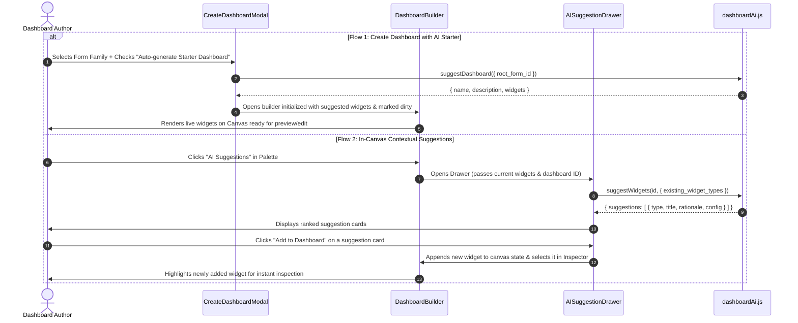

# Feature Design Document: Frontend Dashboard Builder AI Integration & Verification

**Task ID**: VIZ-AI-003  
**Parent Epic**: [VIZ-AI-001](file:///Users/galihpratama/Sites/akvo-mis/doc/design/VIZ-AI-001-ai-dashboard-visualization-layer.md)  
**Issue**: [#452](https://github.com/akvo/akvo-mis/issues/452)  
**Branch**: `feature/452-viz-ai-dashboard-visualization-layer`  
**Feature Name**: Frontend Dashboard Builder AI Experience & UI Integration  
**Author**: Akvo Engineering Team  
**Date**: 2026-09-22  
**Status**: Draft / Review  
**Estimated Effort**: **7h** (Dev: 3.5h | Testing: 2.0h | Review: 1.5h)  

---

## 1. Context & Problem Statement

```
Currently:
- The Create Dashboard modal only allows entering Name, Description, and choosing Root Form or Embed.
- Once created, authors land on a blank BuilderCanvas. They must open the BuilderPalette, manually pick a widget type, and configure every single field in BuilderInspector from scratch.
- There is no guided assistance or contextual suggestion mechanism inside the frontend builder.

Goal:
- Integrate the AI recommendation capabilities into the frontend UI:
  1. Create Dashboard Modal: Add an "Auto-generate Starter Dashboard with AI" toggle that seeds the draft with recommended widgets upon creation.
  2. In-Canvas AI Suggestion Drawer: Add an "AI Suggestions" action in BuilderPalette / toolbar to open a slide-over drawer displaying contextual widget recommendations with 1-click insertion.
- Provide smooth UX with loading skeletons, error boundaries, empty states, and fallback alerts.
- Ensure all inserted widgets immediately bind to valid form/question IDs and can be edited in BuilderInspector without breaking state.
```

---

## 2. 5W1H Requirements Analysis

| Dimension | Specification |
|---|---|
| **Who** | Dashboard authors creating or editing dashboards in the Akvo MIS web interface. |
| **What** | Frontend AI API client, Create Modal starter toggle, In-Canvas AI Suggestion Drawer, and canvas state management. |
| **Where** | `frontend/src/pages/dashboards/` and `frontend/src/util/` |
| **When** | Triggered when author opts to auto-generate a dashboard on creation, or clicks "AI Suggestions" inside Dashboard Builder. |
| **Why** | Accelerates dashboard assembly, helps non-technical authors visualize data immediately, and lowers the barrier to entry. |
| **How** | Invokes backend AI endpoints via `dashboardAi.js`, displays animated suggestions with rationales, maps returned widget shapes directly to React state (`widgets`), and recalculates order / col_span layout. |

---

## 3. UI/UX Workflows & Component Hierarchy

```
frontend/src/
├── util/
│   ├── dashboardAi.js           # API methods (suggestDashboard, suggestWidgets)
│   └── __test__/dashboardAi.test.js
└── pages/dashboards/
    ├── CreateDashboardModal.jsx # Updated with AI auto-generation toggle
    ├── BuilderPalette.jsx       # Updated with "AI Suggestions" trigger button
    ├── AISuggestionDrawer.jsx   # Slide-over drawer with suggestion cards & 1-click add
    ├── DashboardBuilder.jsx     # Integration & widget state management
    ├── builder.scss             # Styles for AI badges, cards, and drawer
    └── __test__/
        ├── AISuggestionDrawer.test.jsx
        └── CreateDashboardModalAI.test.jsx
```

### User Interaction Flows



---

## 4. Detailed Component Design

### 4.1. `dashboardAi.js` API Helper
```javascript
import api from "./api";

export const dashboardAi = {
  suggestDashboard: (payload) =>
    api.post("/manage/dashboards/ai/suggest-dashboard", payload),

  suggestWidgets: (dashboardId, payload) =>
    api.post(`/manage/dashboards/${dashboardId}/ai/suggest-widgets`, payload),
};
```

### 4.2. `CreateDashboardModal.jsx` Updates
- When `kind === "widgets"` and a `root_form` is selected, an Ant Design `Switch` or checkbox is displayed:
  `[⚡ Auto-generate starter dashboard with AI]`
- When enabled, the modal calls `dashboardAi.suggestDashboard({ root_form_id })`.
- Upon success, the dashboard is created via `dashboardApi.create` with the suggested widgets pre-populated in the initial save payload.

### 4.3. `AISuggestionDrawer.jsx` (New Component)
- Ant Design `Drawer` placed on the right side of the screen.
- Header: "AI Widget Recommendations" with a badge indicating "Powered by OpenAI / Smart Heuristics".
- Content:
  - Optional natural language search/hint input (e.g. "Suggest water quality charts").
  - List of suggestion cards showing:
    - Widget Type Icon & Badge (`KPI`, `Bar Chart`, `Pie / Donut`, `Map`, `Table`).
    - Title & Question binding name.
    - AI Rationale callout (e.g. *"Highlights failure causes across monitoring reports"*).
    - "Add to Dashboard" primary button.
- Empty & Error States:
  - Friendly message if all questions in the form family are already visualized.
  - Non-blocking error notification if the network request fails.

### 4.4. State Management in `DashboardBuilder.jsx`
- Adding a suggestion:
  - Generates a unique temporary ID (`temp_id: --nextTempId`).
  - Sets `order` to `widgets.length`.
  - Merges into `widgets` state and sets `dirty = true`.
  - Automatically selects `selectedId = newWidget.id` so `BuilderInspector` immediately opens for fine-tuning.

---

## 5. Verification & Testing Strategy

### Automated Jest Tests:
1. `dashboardAi.test.js`: Verifies correct API endpoints, error handling, and timeout behavior.
2. `CreateDashboardModalAI.test.jsx`: Tests toggle interaction, loading state while fetching suggestions, and successful creation.
3. `AISuggestionDrawer.test.jsx`:
   - Renders suggestion list with correct badges and rationales.
   - Clicking "Add to Dashboard" triggers `onAddWidget` callback with expected payload.
   - Handles empty states and API errors gracefully.

### Manual Smoke Verification Checklist:
- [ ] **Modal Starter**: Create a new dashboard with "Auto-generate" enabled for a form family with Registration + Monitoring forms. Verify 4-6 widgets populate the canvas.
- [ ] **Canvas Rendering**: Verify all generated widgets compute live values without crashing `WidgetErrorBoundary`.
- [ ] **In-Canvas Drawer**: Open the suggestion drawer, click "Add to Dashboard" on a Bar chart suggestion, and verify it appends to the canvas and selects in the inspector.
- [ ] **Save & Publish**: Save the dashboard and publish it. Verify viewer mode renders all charts correctly.
- [ ] **Offline Heuristic Mode**: Disconnect network or unset OpenAI key in backend, and verify suggestions still work using the deterministic heuristic engine.

### Execution Commands:
```bash
./dc.sh exec frontend npm test -- --testPathPattern=dashboard
./dc.sh exec frontend npm run lint
```

---

## 6. Task Breakdown & Estimation

| Sub-task | Scope | Dev (Vibe) | Testing (Auto+Manual) | Review | Total |
|---|---|:---:|:---:|:---:|:---:|
| **VIZ-AI-003.1** | Frontend API client helper (`util/dashboardAi.js`) & unit tests | 30m | 20m | 10m | **1.0h** |
| **VIZ-AI-003.2** | Create Dashboard Modal AI starter toggle & creation flow | 45m | 30m | 15m | **1.5h** |
| **VIZ-AI-003.3** | In-Canvas AI Suggestion Drawer component & card styling | 60m | 35m | 25m | **2.0h** |
| **VIZ-AI-003.4** | Dashboard Builder state integration, layout placement & inspector binding | 45m | 25m | 20m | **1.5h** |
| **VIZ-AI-003.5** | End-to-End Jest component test suite & cross-form manual verification | 30m | 40m | 20m | **1.5h** |
| **TOTAL** | **Full Frontend AI Experience** | **3.5h** | **2.0h** | **1.5h** | **7.0h** |
