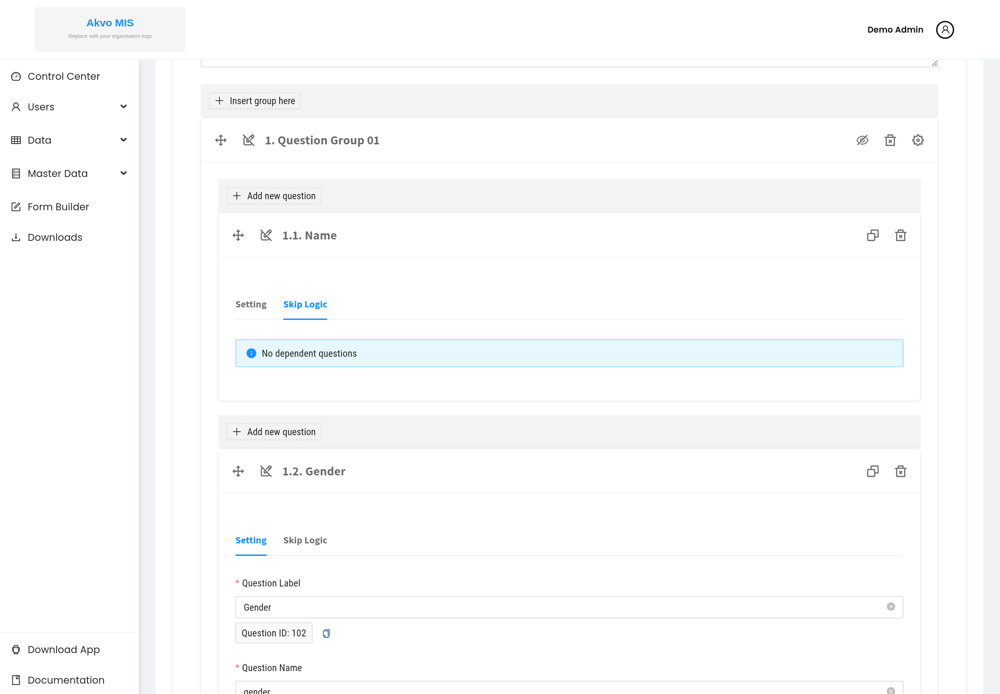

.. raw:: html

    

.. role:: bolditalic
.. role:: heading

:heading:`Configuring Dependencies`

A :bolditalic:`dependency` (also called :bolditalic:`skip logic`) makes a
question appear only when another question has a particular answer. This keeps
forms short and relevant: respondents see a follow-up question only when it
applies.

For example, ask "What was the problem?" only when "Is the water point still
functional?" is answered "No".

.. contents::
   :local:
   :depth: 1

How dependencies work
---------------------

A dependency is configured on the :bolditalic:`question that should be
conditionally shown` (the dependent question), not on the question that triggers
it. You point the dependent question at a :bolditalic:`source question` and
specify which answer reveals it. Until the source has that answer, the dependent
question is hidden and — even if marked required — is not enforced.

Option and multiple-option questions are the natural sources for a dependency,
because they have a fixed list of answers to match against.

Setting up a dependency
-----------------------

Using the :ref:`Water Point Monitoring example <worked-example-2>`:

1. In the form editor, open the question you want to show conditionally
   (``issue_types``) and select its :bolditalic:`Skip Logic` tab.

2. Add a dependency on the source question ``still_functional`` and set the
   matching value to :bolditalic:`No`.
3. Repeat for ``repair_cost`` so it, too, only appears when
   ``still_functional`` is :bolditalic:`No`.

A question with no skip logic shows :bolditalic:`"No dependent questions"` on
this tab — that is the normal state for questions that are always visible.

Previewing the result
---------------------

Switch to the :bolditalic:`Preview` tab and try it: ``issue_types`` and
``repair_cost`` stay hidden until you set ``still_functional`` to
:bolditalic:`No`, at which point they appear.

.. image:: ../assets/form-builder-dependency-result.png
   :alt: Previewing a form to test its skip logic
   :width: 100%

Always test skip logic in Preview before publishing — it is much faster than
discovering a wrong condition after field teams have started collecting data.

Tips and gotchas
----------------

- :bolditalic:`Match the exact option.` The dependency value must match one of
  the source question's options. If you later rename an option, revisit any
  dependency that referenced the old value.
- :bolditalic:`Required only when visible.` A required dependent question is
  enforced only while it is shown. Hidden dependent questions never block
  submission.
- :bolditalic:`Avoid circular dependencies.` Do not make two questions depend on
  each other; neither would ever appear.
- :bolditalic:`Keep chains shallow.` Long chains of dependencies are hard to
  test and maintain — prefer a few clear conditions over deeply nested ones.

.. note::
   **Keeping this page in sync.** Dependency behaviour is part of the Form
   Builder data model described in ``doc/design/FB-001``. Update this page if
   the skip-logic interface changes.
