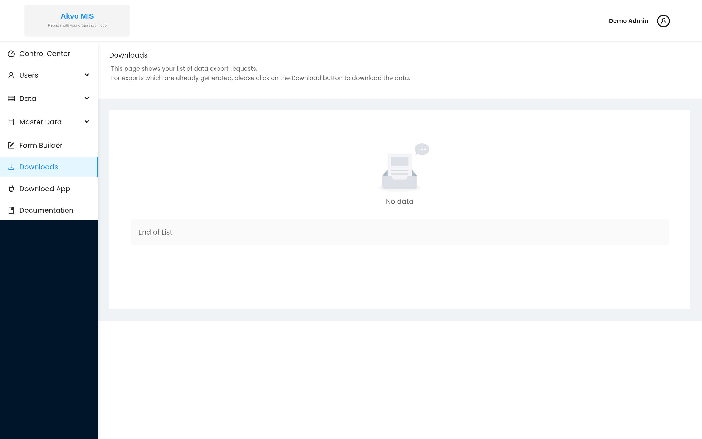

.. raw:: html

    

.. role:: bolditalic
.. role:: heading

:heading:`Downloads`

Exporting data
--------------

The :bolditalic:`Downloads` page (open :bolditalic:`Downloads` from the
control-center sidebar) lists your data export requests. When you request an
export of a questionnaire's data — for example from the Manage Data page — it is
generated in the background and appears here; once it is ready, click the
:bolditalic:`Download` button on its row to download the file.

Download this documentation as PDF
----------------------------------

.. figure:: ../assets/download.png
   :target: /_/downloads/en/latest/pdf/
   :alt: Download this documentation as a PDF

   Click the image to download a PDF copy of this documentation.

.. note::
   The PDF link works on the hosted ReadTheDocs site, which provides the
   ``/_/downloads/en/latest/pdf/`` endpoint. It is not available in a local
   ``sphinx-build`` preview.
