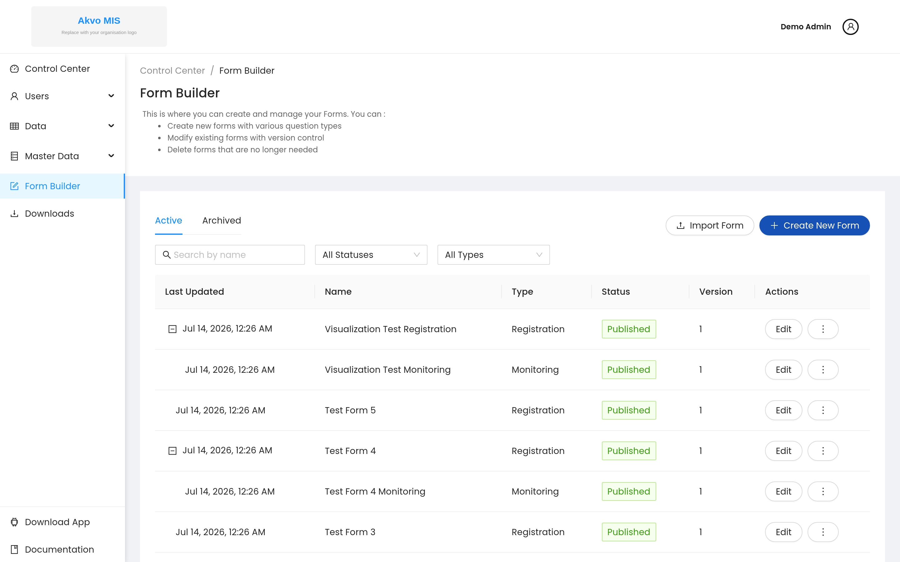
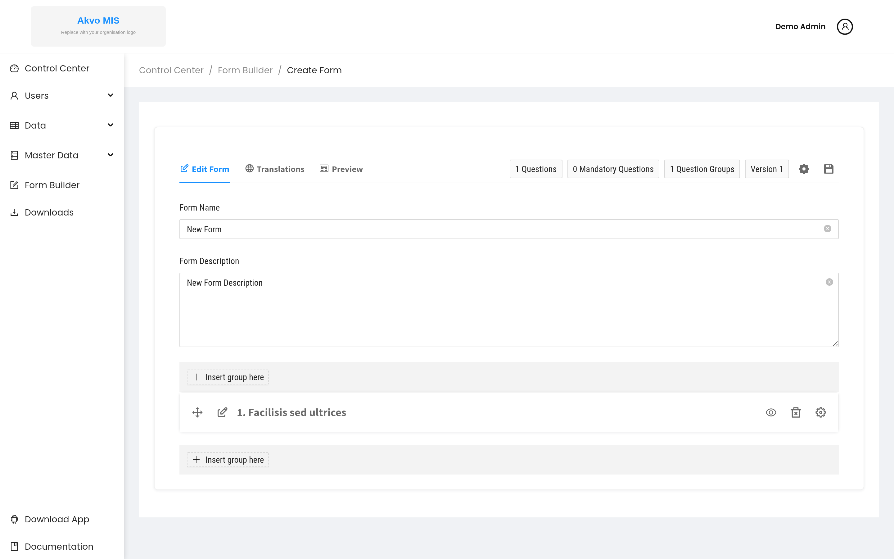
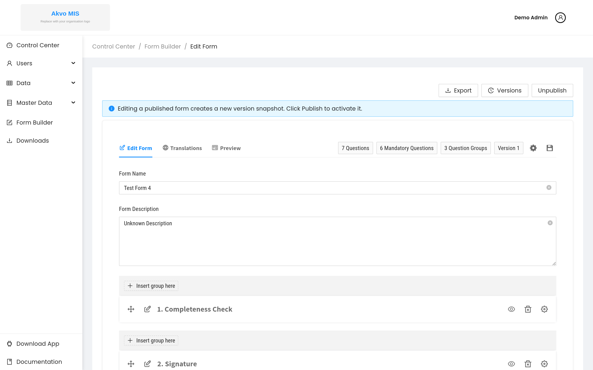
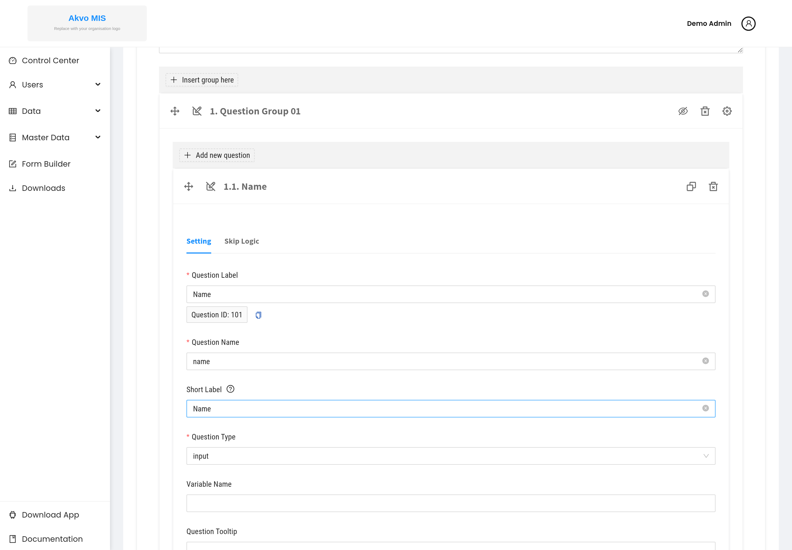
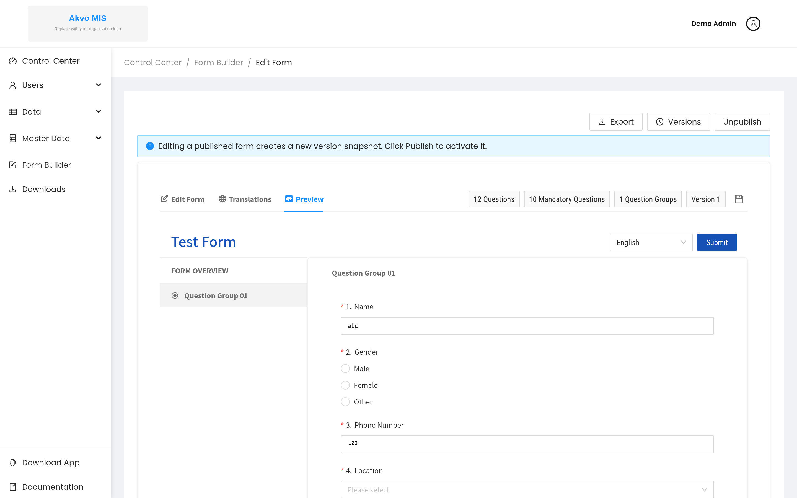
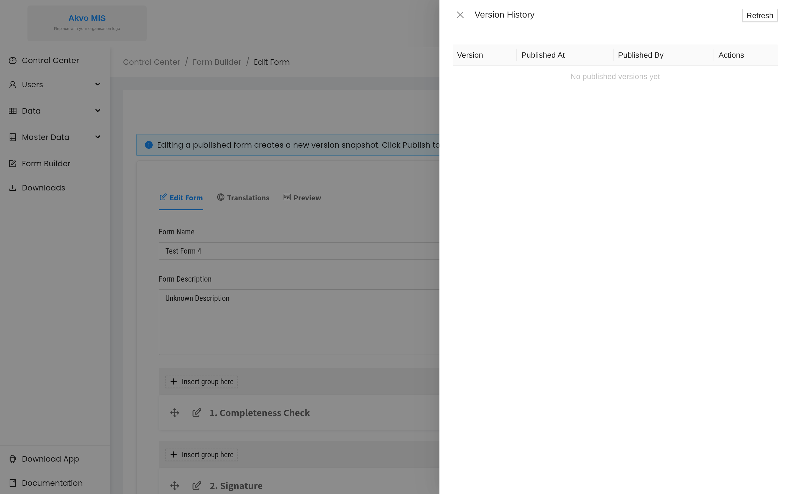
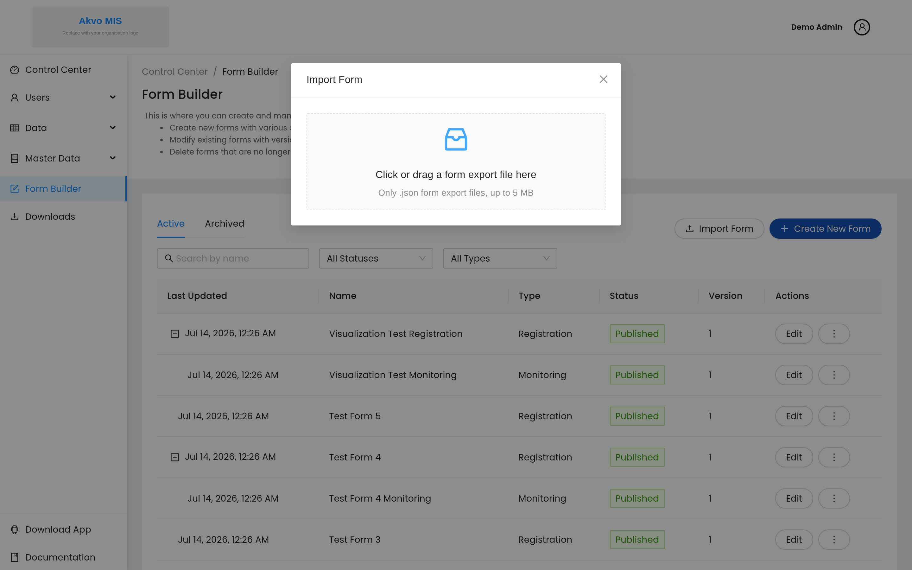

.. raw:: html

    

.. role:: bolditalic

============
Form Builder
============

The Form Builder lets authorised users design and publish their own
questionnaires — no developer involvement required. A form you build here
becomes available for data entry in both the web app and the mobile app, and
flows through the same approval, export and dashboard features as any other
form.

This page walks through the whole lifecycle: who can use the Form Builder,
creating a form, adding question groups and questions, saving and publishing,
versioning, and importing or exporting a form. Two worked examples at the end
show the pieces working together.

.. contents::
   :local:
   :depth: 1

Who can use the Form Builder
----------------------------

Access to the Form Builder is controlled by the :bolditalic:`Form Builder`
feature permission, which is split into five capabilities:

- :bolditalic:`Form View` — open the Form Builder and view forms.
- :bolditalic:`Form Create` — create new forms.
- :bolditalic:`Form Edit` — modify existing forms.
- :bolditalic:`Form Publish` — publish a form so it becomes available for data entry.
- :bolditalic:`Form Delete` — delete or archive forms.

A role without any of these capabilities will not see the :bolditalic:`Form
Builder` entry in the control-center sidebar. Roles and their capabilities are
managed under :bolditalic:`Users` → :bolditalic:`Manage Roles` (see the
Administration section).

Opening the Form Builder
------------------------

From the control-center sidebar, click :bolditalic:`Form Builder`. The list
shows every form, with its type (Registration or Monitoring), publication
status, current version and quick actions. Use the :bolditalic:`Active` and
:bolditalic:`Archived` tabs, the search box, and the status/type filters to
find a form.

Creating a form
---------------

1. Click :bolditalic:`Create New Form` (top right of the list).
2. The form editor opens with an empty form containing one starter question
   group.

The editor has three tabs:

- :bolditalic:`Edit Form` — build the form (groups and questions).
- :bolditalic:`Translations` — add translated labels for other languages.
- :bolditalic:`Preview` — see the form exactly as a respondent will.

The counters at the top right (questions, mandatory questions, question groups,
version) update as you build, giving you a quick sense of the form's size.

Give the form a :bolditalic:`Form Name` and an optional
:bolditalic:`Form Description`. The name is what data-entry users and approvers
will see.

Adding question groups and questions
------------------------------------

Questions are organised into :bolditalic:`question groups`. A form is a stack of
groups, each holding related questions:

Use :bolditalic:`Insert group here` to add a group above or below an existing
one, and the group's gear icon to configure it — including making it
:bolditalic:`repeatable` (respondents can add multiple instances, for example
one per water point).

Inside a group, click :bolditalic:`Add new question` to add a question, then
configure it on the :bolditalic:`Setting` tab:

- :bolditalic:`Question Label` — the text the respondent sees.
- :bolditalic:`Question Name` (variable name) — a short, stable identifier used
  in exports and calculations. Keep it consistent and avoid renaming it later.
- :bolditalic:`Question Type` — the kind of answer (text, number, option, and
  so on). See :doc:`questionTypes` for every type and its limitations.
- :bolditalic:`Question Tooltip` — optional help text shown to the respondent.
- Required and other rules, depending on the type.

The :bolditalic:`Skip Logic` tab is where you make a question appear only under
certain conditions — see :doc:`dependencies`.

Previewing the form
-------------------

Switch to the :bolditalic:`Preview` tab at any time to fill in the form as a
respondent would. This is the fastest way to check labels, option lists,
required fields and skip logic before publishing.

Saving and publishing
---------------------

Your work is kept as a :bolditalic:`draft` until you publish. Publishing makes
the form (or the new version) available for data entry on web and mobile.

When you edit a form that is already published, the editor shows the banner
:bolditalic:`"Editing a published form creates a new version snapshot. Click
Publish to activate it."` — your changes are staged as a new version and do not
affect live data entry until you publish them. Use :bolditalic:`Unpublish` to
take a form out of data entry without deleting it.

Versioning
----------

Every publish creates a numbered version. Click :bolditalic:`Versions` to open
the version history, where you can review when each version was published and by
whom.

Because published forms are versioned, you can safely improve a form over time:
existing submissions stay tied to the version they were collected under, while
new submissions use the latest published version.

Importing and exporting forms
-----------------------------

You can move a form between deployments (or keep a backup) using export and
import:

- :bolditalic:`Export` (in the form editor) downloads the form definition as a
  ``.json`` or ``.xlsx`` (XLSForm) file.
- :bolditalic:`Import Form` (on the form list) opens a dialog where you upload a
  previously exported ``.json`` file or an XLSForm (``.xlsx`` / ``.xls``) to create the form.

.. note::
   **XLSForm Compatibility.** Akvo MIS supports core XLSForm question types,
   choices, multi-language translations, min/max numerical constraints, and
   skip-logic dependencies. Advanced XLSForm constructs (e.g. calculated fields,
   dynamic repeat count limits, group-level relevance, or complex custom XPath
   functions) are not natively evaluated. When importing external forms (such as
   from KoboToolbox or ODK), review the preflight warnings and verify the form
   structure in the Form Editor after import.

.. _worked-example-1:

Worked example 1 — Household Water Survey
-----------------------------------------

This example builds a simple registration form. Follow the steps in your own
Form Builder to reproduce it.

1. Click :bolditalic:`Create New Form` and set :bolditalic:`Form Name` to
   ``Household Water Survey``.
2. Rename the first group to :bolditalic:`Respondent & Location` and add these
   questions (:bolditalic:`Add new question` for each):

   - ``respondent_name`` — :bolditalic:`Input`, required.
   - ``survey_date`` — :bolditalic:`Date`, required.
   - ``gps_location`` — :bolditalic:`Geo`.
   - ``household_size`` — :bolditalic:`Number`, required.
   - ``main_water_source`` — :bolditalic:`Option` with the choices *Piped*,
     *Well*, *Borehole*, *Rainwater*, *Surface*.

3. Add a second group :bolditalic:`Water Points`, open its gear icon and mark it
   :bolditalic:`repeatable` so a household can list several water points. Add:

   - ``point_type`` — :bolditalic:`Option`: *Tap*, *Handpump*, *Kiosk*.
   - ``is_functional`` — :bolditalic:`Option`: *Yes*, *No*.
   - ``point_photo`` — :bolditalic:`Image`.

4. Check the form on the :bolditalic:`Preview` tab, then
   :bolditalic:`Publish` it.

.. _worked-example-2:

Worked example 2 — Water Point Monitoring
-----------------------------------------

This example builds a monitoring form that is linked to the registration form
above, and shows a dependency (skip logic) in action.

1. Create a form named ``Water Point Monitoring`` as a
   :bolditalic:`Monitoring` form whose parent is ``Household Water Survey``. A
   monitoring form reuses the registered data point and records repeat visits.
2. In a group :bolditalic:`Monitoring Visit`, add:

   - ``visit_date`` — :bolditalic:`Date`, required.
   - ``still_functional`` — :bolditalic:`Option`: *Yes*, *No*, required.
   - ``issue_types`` — :bolditalic:`Multiple Option`: *Leak*, *No water*,
     *Contamination*, *Vandalism*. On its :bolditalic:`Skip Logic` tab, make it
     depend on ``still_functional`` = *No* (see :doc:`dependencies`).
   - ``repair_cost`` — :bolditalic:`Number`, with the same dependency on
     ``still_functional`` = *No*.
   - ``visit_notes`` — :bolditalic:`Text`.
   - ``evidence_file`` — :bolditalic:`Attachment`.
   - ``surveyor_signature`` — :bolditalic:`Signature`.

3. On the :bolditalic:`Preview` tab, confirm that ``issue_types`` and
   ``repair_cost`` stay hidden until ``still_functional`` is set to *No*, then
   :bolditalic:`Publish`.

.. note::
   **Keeping this page in sync.** The set of creatable question types is defined
   by ``QUESTION_TYPES`` in ``frontend/src/lib/constants.js``, and the Form
   Builder behaviour is specified in the design documents
   ``doc/design/FB-001`` through ``FB-007``. Update this page when those change.
