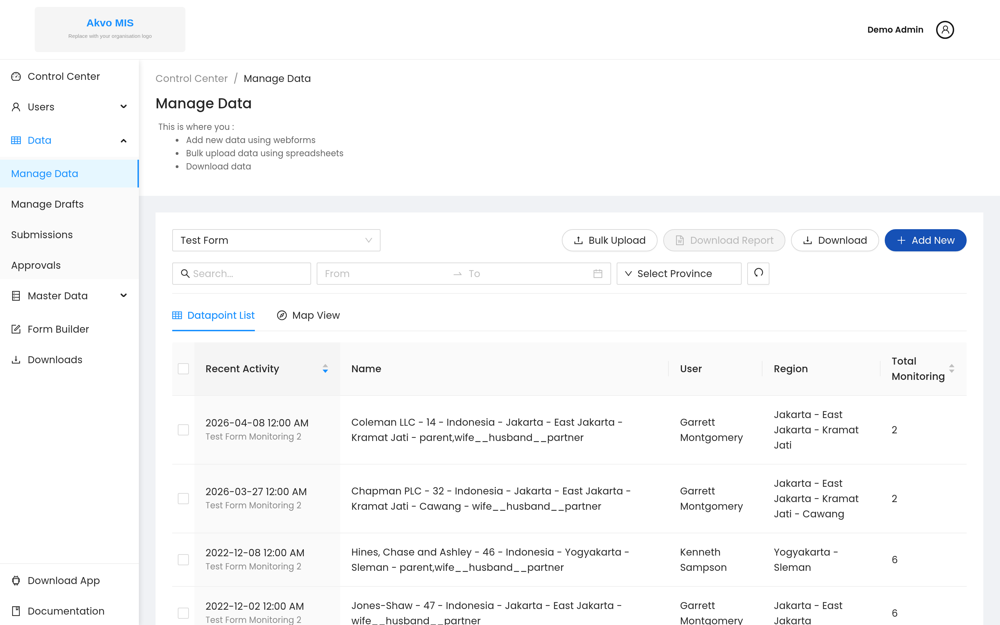
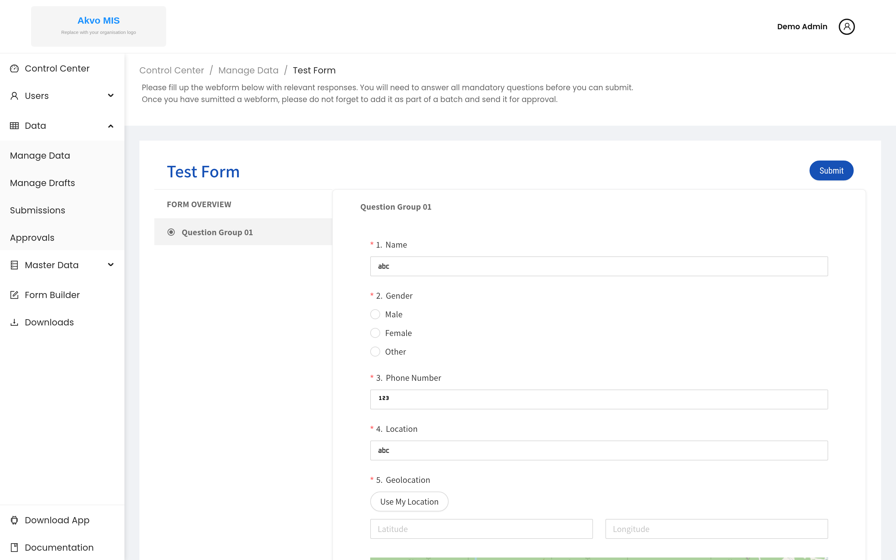
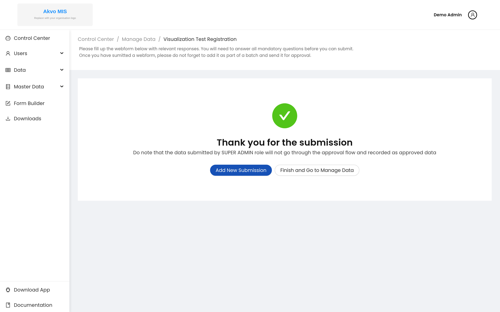
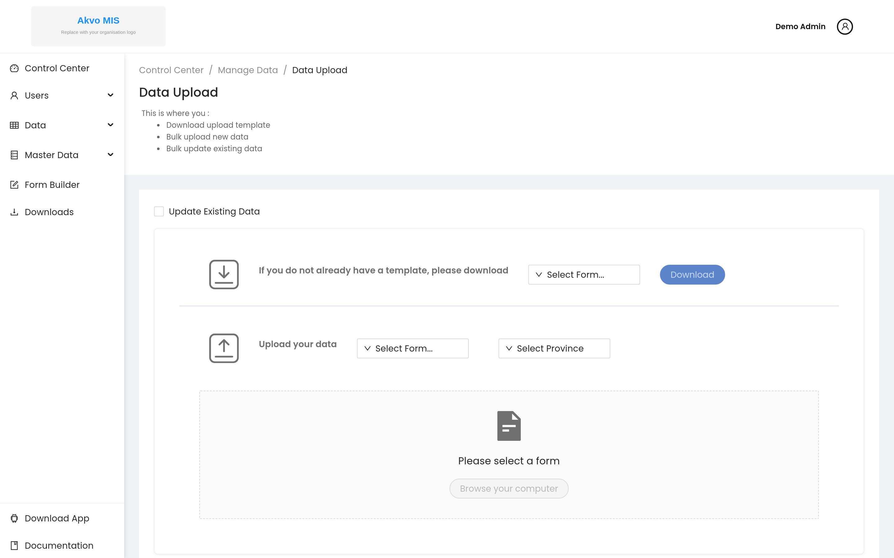

.. raw:: html

    

.. role:: heading

:heading:`Input Channels`

.. role:: bolditalic
  :class: bolditalic

.. _webforms:

Webforms
---------

1. From the submissions section of the control centre, select the questionnaire you would like to enter data against and click the :bolditalic:`ADD NEW` button to open the webform.

2. Fill all the mandatory fields (check the left pane of the webform to ensure all the sections are checked and keep an eye on the progress bar at the bottom) and then click the :bolditalic:`SUBMIT` button to upload your data.

3. Once you submit your form, you will be redirected to a page with the option to either add a new submission or to proceed to batch your data to send it for approval.

Bulk Upload
------------

Instead of entering submissions one at a time, you can upload many at once from
a spreadsheet. Open :bolditalic:`Data` → :bolditalic:`Data Upload` from the
control-center sidebar.

1. :bolditalic:`Download the template.` Under *"If you do not already have a
   template"*, select the questionnaire and click :bolditalic:`Download` to get
   a spreadsheet with the correct columns for that form.
2. :bolditalic:`Fill in the template` on your computer, one submission per row.
3. :bolditalic:`Upload your data.` Select the questionnaire and administrative
   area, then choose your file. To update existing submissions rather than add
   new ones, tick :bolditalic:`Update Existing Data` first.
