.. raw:: html

    

.. role:: heading

:heading:`Mobile App`

.. role:: bolditalic
  :class: bolditalic

This chapter is a step-by-step guide for **enumerators** — the field staff who collect
data on an Android phone or tablet — and for the supervisors who set them up. Follow the
sections in order the first time. After that you will mostly repeat
:ref:`Registration<mobile_registration>`, :ref:`Monitoring<mobile_monitoring>` and
:ref:`Syncing<mobile_sync>` every working day.

.. _mobile_forms_concept:

Registration and Monitoring
---------------------------

The whole app is built around one idea: **you register a thing once, then you visit it
again and again over time.**

**A registration form** creates a brand-new *datapoint*. A datapoint is the thing you
collect data about — a water scheme, a school, a household, a borehole. Registration is
the first-ever questionnaire filled in for that thing, and it asks for the permanent
facts: name, GPS location, owner, type, year built.

**A monitoring form** adds a new visit to a datapoint that **already exists**. It asks
the questions that change over time: is it working today, what is the water quality
reading, how many people used it, is the pump broken.

A monitoring form is always attached to a registration datapoint. You cannot fill one in
on its own — you first choose *which* registered thing you are visiting, and then the
form opens.

.. list-table::
   :header-rows: 1
   :widths: 20 40 40

   * -
     - Registration
     - Monitoring
   * - Purpose
     - Create a new datapoint
     - Record a new visit to an existing datapoint
   * - How often
     - Once per thing, ever
     - Many times — monthly, quarterly, yearly
   * - Where you start it
     - Home screen → the form → :bolditalic:`New Submission`
     - Home screen → the registration form → tap the datapoint → :bolditalic:`Monitoring Forms`
   * - Needs an existing datapoint?
     - No
     - Yes — it must already be on the phone
   * - Typical questions
     - Name, GPS, type, owner
     - Condition today, readings, number of users, photos

**A worked example.** In January you visit *Nasinu Borehole 4* for the first time. It is
not in the system, so you fill in the **registration form**. In April you go back and
fill in a **monitoring form** on that same borehole. In July, another monitoring form.
One registration, many monitoring visits.

.. important::
    A monitoring form needs the registration datapoint to be **on the phone**. It gets
    there either because you registered it yourself on this device, or because you
    pressed :bolditalic:`Sync Datapoint` and the app downloaded it from the server. This
    is the most common reason a new enumerator cannot find the datapoint they want to
    monitor: they have not synced yet. See :ref:`Syncing Datapoints<mobile_sync>`.

Installing the app
------------------

You need an Android device, an internet connection, your passcode, and the web address of
your MIS server. Your supervisor will give you the address.

1. On the device, open a web browser and go to your MIS address followed by **/app**, for
   example ``https://your-server.example.org/app``. This is not a page — it immediately
   downloads the installer file (an ``.apk``).
2. Tap the downloaded file to install it.
3. Android will warn you that the app is not from the Play Store and ask you to **allow
   installation from this source**. Switch the permission on, go back, and tap
   :bolditalic:`Install`.
4. Tap :bolditalic:`Open`, or find the new icon in your app drawer.

.. note::
    If ``/app`` shows an error instead of downloading, the installer has not been uploaded
    to your server yet. Tell your administrator — nobody can install the app until that is
    done.

Getting your passcode
---------------------

You do not log in with an email and password. You log in with a **passcode**.

The passcode is more than a password: it carries your whole work assignment — **which
forms** you may fill in, and **which administrative areas** your data is filed under.
That is why it is also called a *mobile assignment*.

**Ask your supervisor** for "my mobile assignment passcode". It is about 8 characters
long. Tell them which forms and which area you need, because they set that up at the same
time.

**Or create it yourself**, if you can log in to the web platform and your account may
manage mobile assignments. The full supervisor-side procedure — including how to expand a
row to read and copy the passcode — is documented under
:ref:`Mobile Assignment<mobile_assignment>`.

Two things are worth knowing when you create one:

* You do not choose the passcode. The system generates it when you save, and it stays
  visible on the assignment afterwards.
* When you tick a **monitoring form**, its **registration form** is ticked automatically.
  Monitoring cannot exist without registration.

.. warning::
    Keep your passcode private. Anyone who has it can submit data as you, from any device.

.. _mobileauth:

Authentication
--------------

Authentication is the first step to accessing the mobile application. This app uses an
authentication method with a passcode :code:`passcode` obtained from the
:ref:`mobile assignment<mobile_assignment>`.

1. Press the :bolditalic:`Get started` button to begin using the application.

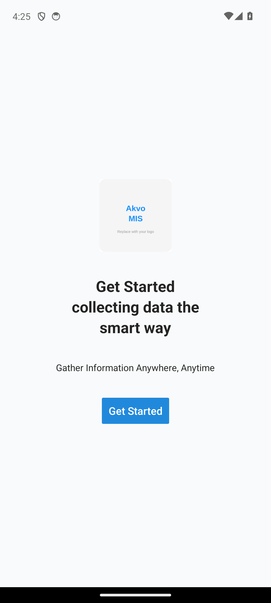

If a box labelled :bolditalic:`Input Server URL` appears, type the address of your MIS
server before continuing. If no box appears, the address is already built into the app.

2. Enter the passcode correctly. If you are unsure, click **the eye icon to view the
   passcode**. The screen reminds you that **the passcode is case sensitive**. Then click
   the **Login button** once you are confident.

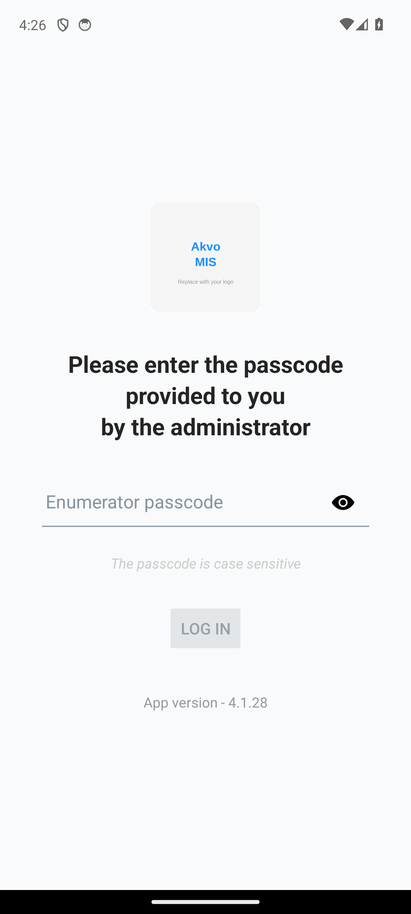

.. note::
    The **app version** is shown at the bottom of this screen. Have it ready when you
    report a problem.

3. If successful, you will be redirected to the application's main menu.

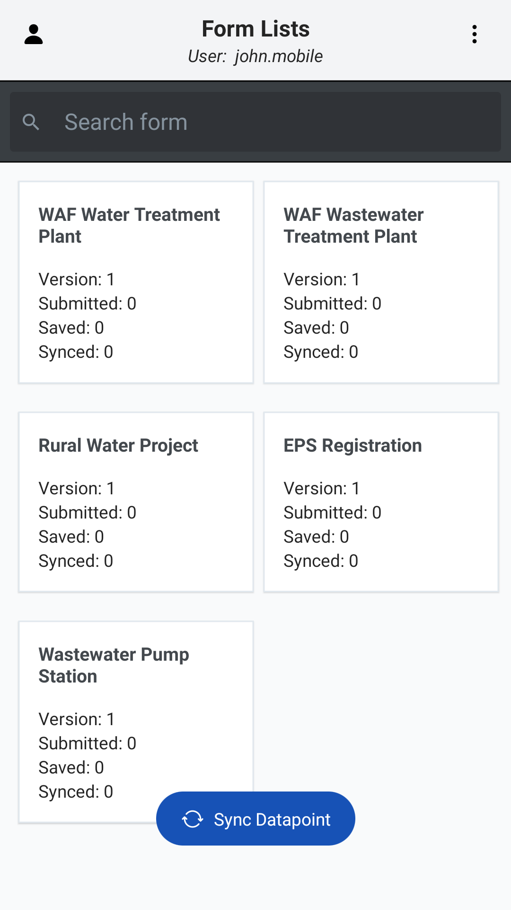

**What the app does at this moment** (you need internet here): it checks the passcode
against the server, downloads every form in your assignment, downloads the lookup lists
those forms need — administrative areas, organisations and entity lists — and stores all
of it inside the phone. From this point on the app works with no signal.

If you see *"Invalid enumerator passcode"*, the code is wrong or was deleted. If you see
*"No connection"*, you are offline — the **first** login must be done online.

.. _mobile_dashboard:

Home overview
-------------

The home screen is called **Form Lists**. Each form is shown as a card carrying the form
**Version** and three running counts:

* **Submitted** — completed on this phone.
* **Saved** — unfinished drafts.
* **Synced** — already delivered to the server.

Besides that, you can also do three things here:

1. Easily search for the questionnaire you want.

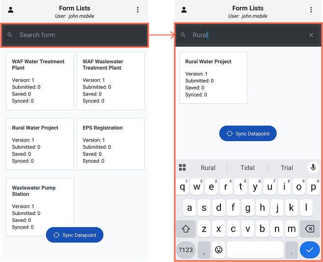

2. Go to the users page to get more information about the current user.

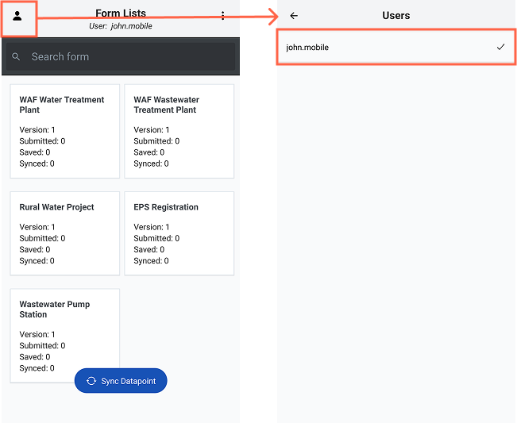

3. Go to the settings page to customize as needed.

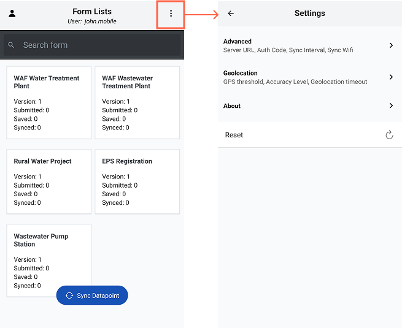

At the very bottom, a coloured bar appears while the app is working:

.. list-table::
   :header-rows: 1
   :widths: 35 65

   * - Bar
     - Meaning
   * - Red — *"You're offline…"*
     - No internet. You can still collect data; it will sync later.
   * - Blue — *"Uploading submissions…"*
     - Your completed forms are being sent to the server.
   * - Blue — *"Downloading datapoints… 40%"*
     - Existing datapoints are being pulled from the server.
   * - Green — *"Done!"*
     - Sync finished successfully. Disappears after a few seconds.
   * - Red — *"Unable to sync. Please try again."*
     - Something failed. See :ref:`Troubleshooting<mobile_troubleshooting>`.

.. _mobile_sync:

Syncing Datapoints
------------------

.. note::
    This will ensure that your app has the most up-to-date information and data from the
    server.

Syncing datapoints is a feature that pulls data from the server to the mobile app. During
this process, you will get the following:

* Re-fetching forms
* Re-downloading administration, organisations and entities data
* Getting all registration submissions

.. important::
    **Do this while you still have internet, before you travel.** Without it, the
    :bolditalic:`Monitoring Forms` list will be empty for any datapoint you did not create
    yourself, and you will not be able to do your monitoring visits.

To sync data with the server, follow these steps:

1. Click the :bolditalic:`Sync Datapoints` button. Wait until the process is finished.
   While it runs, the button itself changes to **Syncing…** and cannot be tapped again.

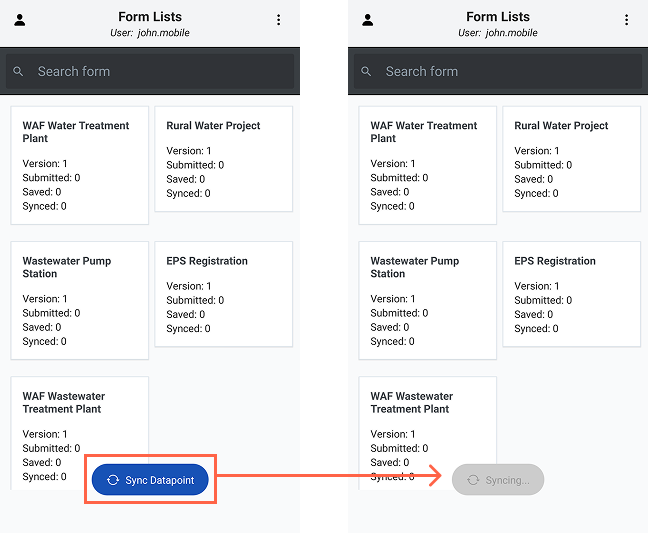

The first sync can take a while, because every existing datapoint in your area is
downloaded. Later syncs are much faster — only what changed since your last sync is
fetched.

Submission
----------

.. _mobile_registration:

============
Registration
============

A registration submission is the initial datapoint submission that undergoes an approval
process and is created by users with aligned administrative access rights.

1. On the home screen, tap the **registration form** you need.
2. You now see the submissions already made with that form. If nothing has been collected
   yet it says *"No data collected yet — Click New Submission to begin"*. Check the list
   first: **if the thing you are about to register is already there, do not register it
   again** — do a :ref:`monitoring submission<mobile_monitoring>` instead.
3. Tap the :bolditalic:`New Submission` button, fill in the questionnaire, and tap
   :bolditalic:`Submit`.

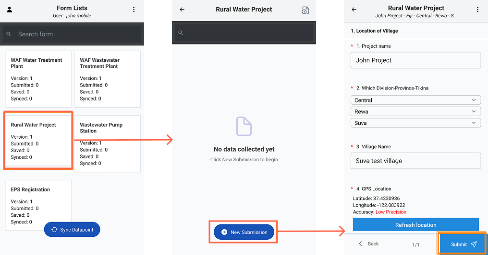

While filling in the form:

* Questions marked with a red asterisk (**\***) are required.
* Use :bolditalic:`Next` and :bolditalic:`Back` to move between sections. The counter in
  the middle (for example **5/8**) shows which section you are on.
* For a GPS question, tap :bolditalic:`Use current location` and wait for the reading to
  settle. If it reports *Accuracy: Low Precision*, go outdoors and wait a few seconds
  longer.
* For a photo question, tap :bolditalic:`Use Camera` or pick from the gallery. The photo
  stays on the phone until you sync.

.. _mobile_monitoring:

==========
Monitoring
==========

A monitoring submission can be made when datapoints from the server are available after
synchronization. This submission also undergoes an approval process similar to
registration submissions.

1. On the home screen, tap the **registration form** the datapoint belongs to. (Yes — you
   start from the *registration* form. That is where the datapoints live.)
2. Find the datapoint you are visiting. The search box at the top searches by datapoint
   name.
3. Tap the datapoint. A screen opens with two sections: :bolditalic:`Datapoint → View
   details`, to confirm you have the right place, and :bolditalic:`Monitoring Forms`.
4. Tap the monitoring form you need, then :bolditalic:`New Submission`.

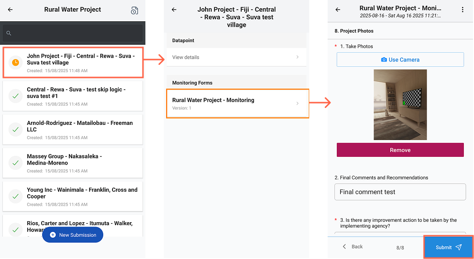

Some answers are **pre-filled** from the registration — name, location, and other fields
that do not change. Check them, correct them if reality has changed, fill in the rest, and
tap :bolditalic:`Submit`.

.. note::
    **The datapoint is not in the list?** Three usual reasons: you have not
    :ref:`synced<mobile_sync>`; the datapoint is outside the area assigned to your
    passcode; or it was never registered — in which case do a registration first.

==============================
Save, Exit and Sync Submission
==============================

During the form-filling process, the mobile app also assists the user in exiting the
questionnaire with the following options:

* Select :bolditalic:`Exit without saving` to exit the questionnaire without saving the
  current progress. A dialog asks *"Are you sure want to exit form submission?"* — confirm
  with **Exit** or go back with **Cancel**.

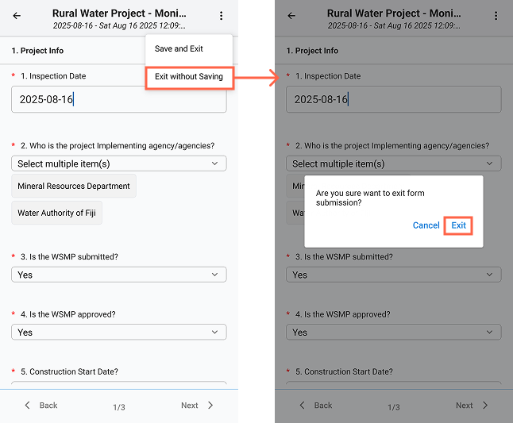

* Select :bolditalic:`Save as Draft` to save the current progress. To continue filling out
  the form, reopen the related questionnaire and tap the **document-with-clock icon** in
  the top-right corner to switch the list from *submitted* to *saved drafts*, then tap the
  draft. Drafts carry a yellow **Draft** badge, and a small red dot on that icon means
  drafts are waiting. Tap the **✕** in the same corner to return to the submitted list.

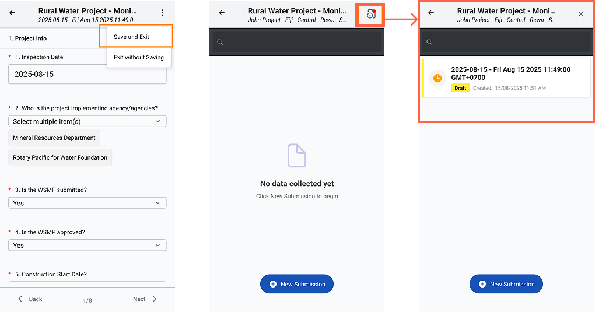

.. note::
    In older versions of the app this option is labelled :bolditalic:`Save and Exit`, as in
    the screenshots. It does the same thing. Drafts are not counted as collected data and
    do not enter the approval process until you finish them and tap
    :bolditalic:`Submit`.

To ensure all question groups are answered, click the page number in the middle:

* **Blue**: indicates all questions have been answered and validated.
* **Gray**: indicates some questions are incomplete.

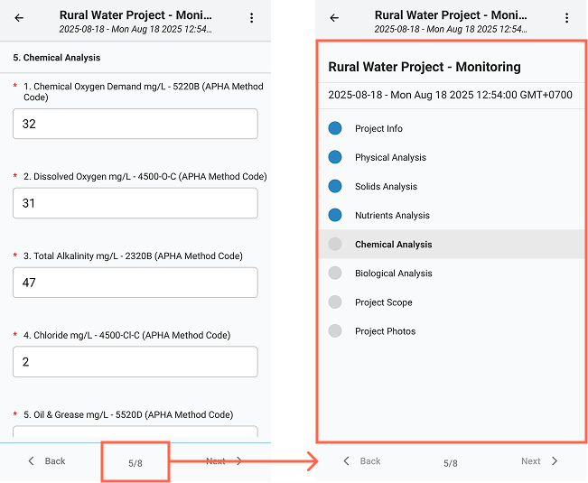

Generally, completed and submitted forms will automatically sync according to the applied
sync interval settings. A submission waiting to be sent carries an **orange clock icon**;
once it reaches the server the icon becomes a **green tick** and a green **Done!** bar
appears at the bottom. The submission can then be viewed again from the submission list,
as shown in the image below.

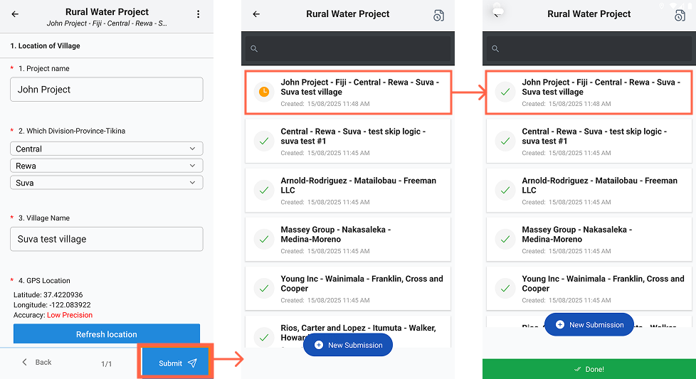

If automatic synchronization fails for any reason, or you simply want to send your work
now, go back to the home screen and press :bolditalic:`Sync Datapoint`.

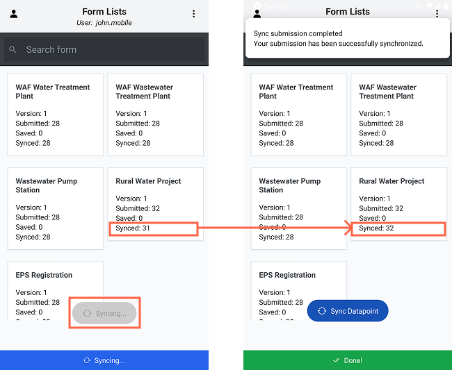

.. _mobile_sync_detail:

What happens when you press Sync
--------------------------------

Everything you collect stays **on the phone** until it is synced. Syncing is the moment
your work reaches the office. It happens in two ways:

* **Automatically**, in the background on a timer — by default about once an hour,
  adjustable in :ref:`Settings<mobile_settings>`. If *Sync Wifi* is on, it waits for
  Wi-Fi.
* **Manually**, when you tap :bolditalic:`Sync Datapoint` on the home screen. That is the
  only manual sync button; there is nothing to press inside a form.

Sync goes **both ways** — it pushes your work up and pulls other people's work down.

**1. Your completed submissions are uploaded.** The bar reads *"Uploading submissions…"*.
The app takes your submitted-but-not-yet-synced forms in batches and, for each one,
uploads the photos, attachments and signatures first, then sends the answers with those
file locations swapped in. On success the submission is marked with a green tick and the
local copies of the uploaded photos are deleted to free up storage.

.. note::
    Each submission carries a unique key, so if the connection drops and the app retries,
    the server recognises the repeat and stores the submission **once**, not twice. If one
    submission fails it goes back in the queue and is retried on the next sync — the
    others still go through. Nothing is silently discarded.

**2. Drafts are synced.** The bar reads *"Syncing drafts…"*. Unfinished drafts are backed
up to the server so they are not lost if the phone is damaged. They are stored as drafts,
not as real data.

**3. Your forms and lookup lists are refreshed.** The app re-checks your passcode with the
server, downloads new or updated forms, removes forms that were taken off your assignment,
and re-downloads the administrative, organisation and entity lists so your dropdowns stay
current.

**4. Existing datapoints are downloaded.** The bar reads *"Downloading datapoints… 60%"*.
The app fetches the registration datapoints for your assigned area — **these are the
datapoints you will be able to monitor**. Only what is new or changed since your last sync
is downloaded.

.. note::
    Two safety rules apply to the download. A datapoint on your phone that has unsent
    changes is **never** overwritten by the server copy — your unsynced work always wins.
    And an interrupted download **resumes** where it stopped instead of starting over.

**5. Finish.** The bar turns green — *"Done!"* — a notification confirms the sync, and the
**Synced** count on each form card goes up.

If the bar turns red (*"Unable to sync. Please try again."*), nothing has been deleted.
The failed items stay in the queue and are retried on the next automatic or manual sync.

Where your data goes on the server
----------------------------------

Once a submission reaches the server:

* It is filed under the administrative area attached to your passcode (or the area chosen
  in the form, if the form asks for one), and recorded under your name as submitter.
* If the form has an :doc:`approval workflow<approval>`, the submission becomes
  **pending**. A supervisor approves it, or rejects it with a comment. Only once approved
  does it become official data.
* If the form has no approvers, it becomes data straight away.

.. warning::
    Your phone is **not** told the approval result. On the device, a green tick means
    *"delivered to the server"* — not *"approved"*. If a submission is rejected, your
    supervisor will contact you directly.

Approved data appears on the web platform under :doc:`Data Management<dataManagement>`,
feeds the dashboards, and can be exported to Excel from the Downloads page.

.. _mobile_settings:

Settings
--------

Open **Settings** from the ⋮ menu in the top-right of the home screen.

=================
Advanced Settings
=================

These settings allow you to customize your sync preferences with the following options:

* **Server URL**: The address of your MIS server. Shown for reference; not editable here.
* **Passcode**: The passcode this device is logged in with. Useful if you have forgotten
  it — treat this screen as sensitive.
* **Sync Interval**: The duration needed to sync submitted submissions to the server,
  measured in seconds.
* **Sync Wifi**: A switch to enable syncing of submitted submissions to the server only
  when using a Wi-Fi network.

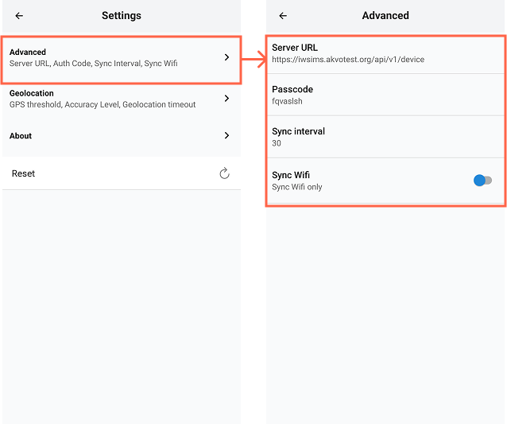

====================
Geolocation Settings
====================

.. note::
    Adjust these settings according to your specific needs to balance between accuracy and
    performance.

These settings allow you to customize your geolocation preferences with the following
options:

* **Threshold**: The maximum acceptable GPS error distance, in metres.
* **Accuracy Level**: The desired level of GPS accuracy. Higher accuracy reduces the risk
  of errors but may increase the time required to obtain a GPS fix.
* **Geolocation Timeout**: The maximum amount of time allowed to obtain a GPS value, in
  seconds.

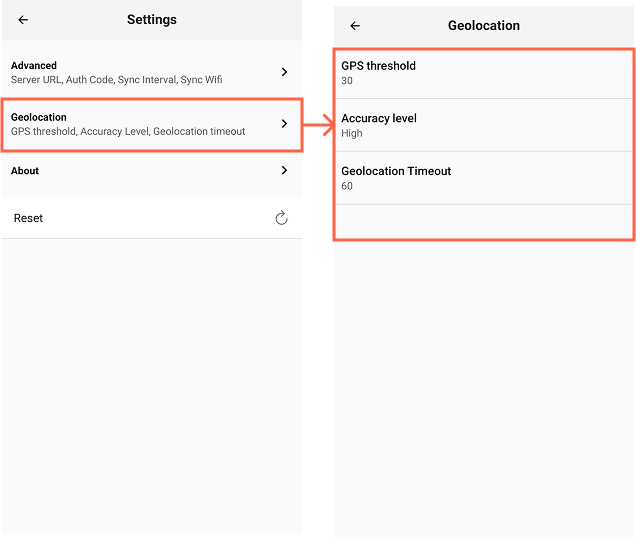

=====================
Image Quality
=====================

* **Compression Level**: How much photos are shrunk before upload. Higher compression means
  smaller files and faster syncing over a weak connection, at the cost of detail.

========
Language
========

Switch the application interface language between English and French.

======================
Reset (Clear All Data)
======================

.. warning::
    Please note that this process cannot be undone, and all locally stored data will be lost. Make sure to sync any important data with the server before performing a reset.

This action will clear all data from the application, and you will need to sign in again to access your data.

To reset the application, follow these steps:

1. Click the :bolditalic:`Reset` button.
2. Confirm the reset process by clicking the **Yes** button.

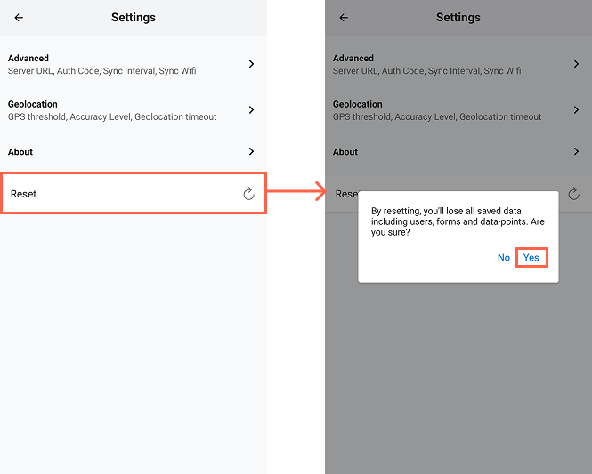

==============
Update the App
==============

.. note::
    By regularly updating your app, you ensure optimal performance and access to the latest enhancements.

Keeping your app up-to-date ensures you have the latest features, improvements, and security updates. Follow these steps to update the app to the newest version.

#. In the Settings menu, find and select the About section. This section contains information about the app, including the current version.
#. Click on the **Update application** button. The app will then check the server for the latest version available.
#. If a new version is available, you will see an option to update.
    #. Click the **Update** button to start downloading the latest version of the app.
    #. Wait patiently while the app downloads the new version. The time this takes may vary depending on your internet connection speed.
    #. Once the download is complete, follow the on-screen instructions to install the new version of the app.
#. Otherwise, click the **Cancel** button to close the dialog.

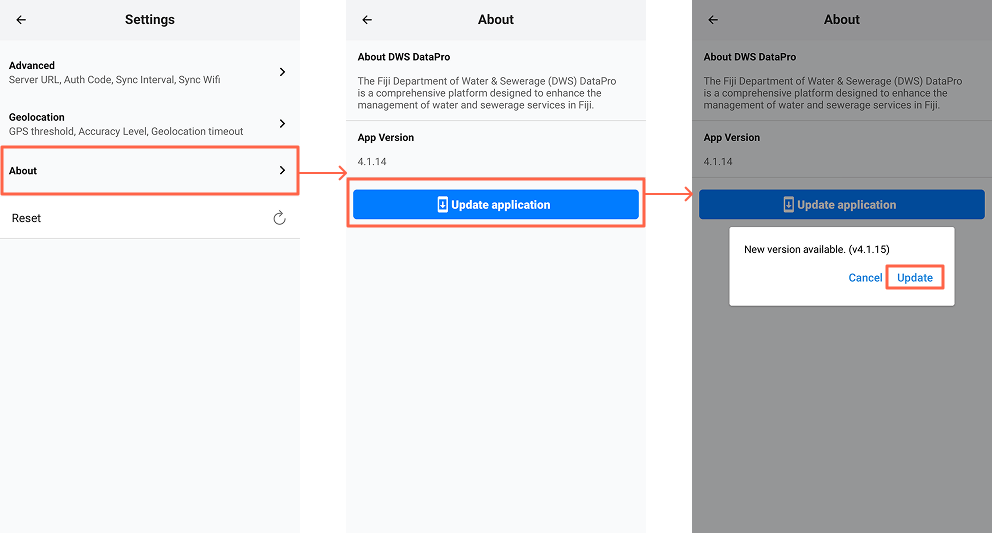

.. important::
    Sync your work **before** updating, and update on Wi-Fi where possible.

.. _mobile_troubleshooting:

Troubleshooting
---------------

.. list-table::
   :header-rows: 1
   :widths: 40 60

   * - Problem
     - What to do
   * - *"Invalid enumerator passcode"* at login
     - Check for typos (tap the eye icon). Confirm the passcode with your supervisor — it
       may have been deleted or replaced.
   * - *"No connection"* at login
     - The **first** login needs internet. Move to a place with signal or Wi-Fi.
   * - ``/app`` does not download anything
     - The installer has not been uploaded to the server. Tell your administrator.
   * - Android blocks the installation
     - Allow *install from unknown sources* for your browser, then tap the downloaded file
       again.
   * - The form I need is not in the list
     - It is not on your assignment. Ask your supervisor to add it, then press
       :bolditalic:`Sync Datapoint`.
   * - :bolditalic:`Monitoring Forms` is empty for a datapoint
     - No monitoring form is assigned to that registration form — ask your supervisor.
   * - The datapoint I want to monitor is missing
     - Press :bolditalic:`Sync Datapoint` while online. If still missing, it is outside
       your assigned area or was never registered.
   * - Submissions still show a clock icon
     - They have not synced yet. Get online and press :bolditalic:`Sync Datapoint`.
   * - Red bar: *"Unable to sync"*
     - Check you really have internet; check whether **Sync Wifi** is on; try again in a
       better signal. If it keeps failing, note the failed count and contact support.
   * - A submission shows **"File missing"**
     - The photo file was deleted from the phone, so it can never upload. Open that
       submission, **retake the photo** or **re-attach the file**, then sync again.
   * - Sync is extremely slow the first time
     - Normal — every existing datapoint in your area is being downloaded. Later syncs
       only fetch changes.
   * - The phone is full
     - Sync. Uploaded photos are removed from the phone automatically once they reach the
       server.

.. warning::
    Never use **Reset** as a fix unless support tells you to. It erases all local users,
    forms and datapoints, including anything not yet synced.
