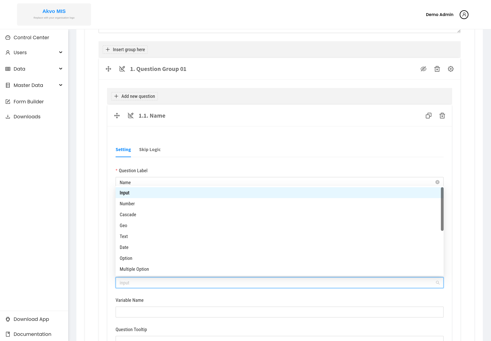

.. raw:: html

    

.. role:: bolditalic

==============
Question Types
==============

When you add a question in the Form Builder, you choose its :bolditalic:`type`
from the :bolditalic:`Question Type` dropdown. The type decides what kind of
answer the question accepts and how it is displayed on web and mobile.

The Form Builder can create the thirteen types below. (The data-entry apps can
*render* a few additional types that the builder cannot create — see
`Limitations`_.)

.. contents::
   :local:
   :depth: 1

Input
-----

A single-line text field. Use it for short free text such as names or reference
codes.

:bolditalic:`Limitations` — beyond "required", the builder does not enforce a
length or format (for example an email or phone pattern). Validate such values
during data review if it matters.

Text
----

A multi-line text area. Use it for longer notes, descriptions or comments.

Number
------

A numeric field. Use it for counts, measurements, amounts or scores. You can set
a minimum and/or maximum as a validation rule.

Date
----

A date picker. Use it for visit dates, dates of birth, and similar.

Image
-----

Photo capture or upload. On mobile the respondent can take a photo directly.
"Image" is the Form Builder's name for the photo question type. The file is
uploaded to the server as part of the submission.

Geo
---

Captures a geographic point (latitude/longitude). On mobile it can read the
device GPS. Use it to record where a data point is located.

Option
------

A single-choice question shown as radio buttons. Configure the list of options.
Use it when exactly one choice applies.

Multiple option
---------------

A multi-choice question shown as checkboxes. Configure the list of options. Use
it when more than one choice can apply.

Cascade
-------

Cascading dropdowns where each selection narrows the next — for example an
administrative hierarchy (country → province → district). A cascade needs a
configured source list.

Entity
------

A dropdown backed by an :bolditalic:`entity` type managed in the platform (for
example schools or water-treatment plants). Use it to link a submission to a
known real-world entity. The entity data must be configured for the options to
appear.

Autofield
---------

A computed field whose value is derived automatically from other answers rather
than entered by the respondent. Use it for calculated scores or derived
identifiers.

:bolditalic:`Limitations` — it is not editable by the respondent; its value
depends entirely on the questions it references, so those must exist and be
answered.

Attachment
----------

A file upload for non-image files (for example a PDF or spreadsheet). The file
is uploaded with the submission.

Signature
---------

Captures a hand-drawn signature, stored as an image. Use it to record sign-off
on a visit or form.

Limitations
-----------

.. note::
   The following types can appear in forms but **cannot be created in the Form
   Builder**: ``table``, ``tree`` and ``administration``. Forms that need those
   types must be defined outside the builder. Note also that ``image`` is the
   builder's name for the photo question type.

.. note::
   **Keeping this page in sync.** The authoritative list of creatable types is
   ``QUESTION_TYPES`` in ``frontend/src/lib/constants.js``. Update this page if
   that constant changes.
