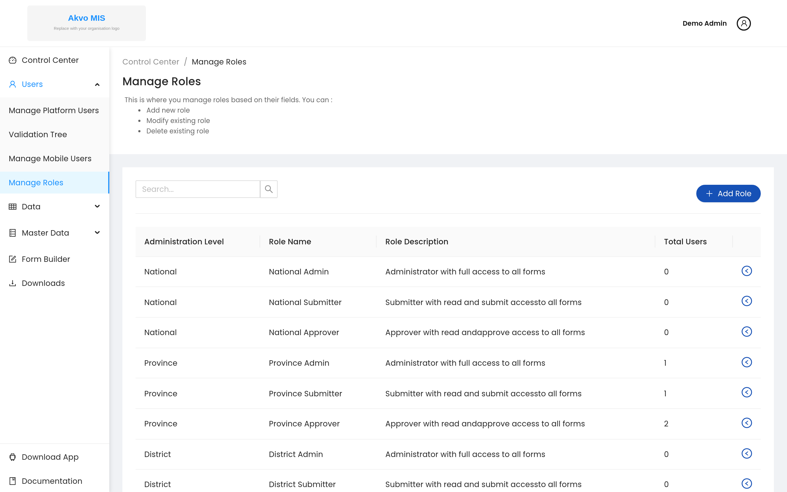
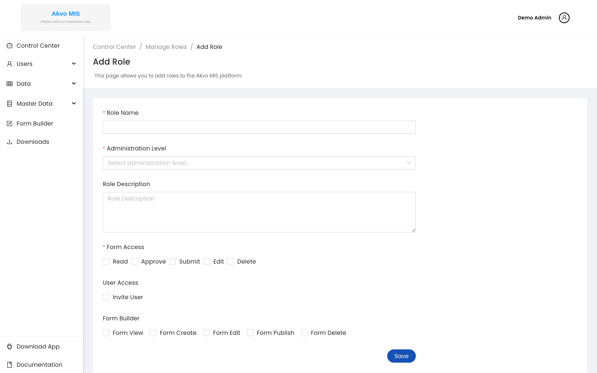
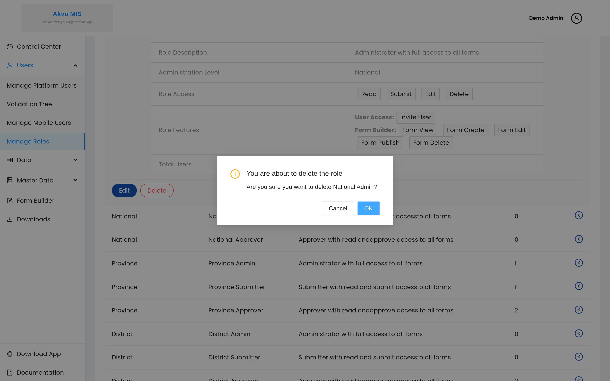
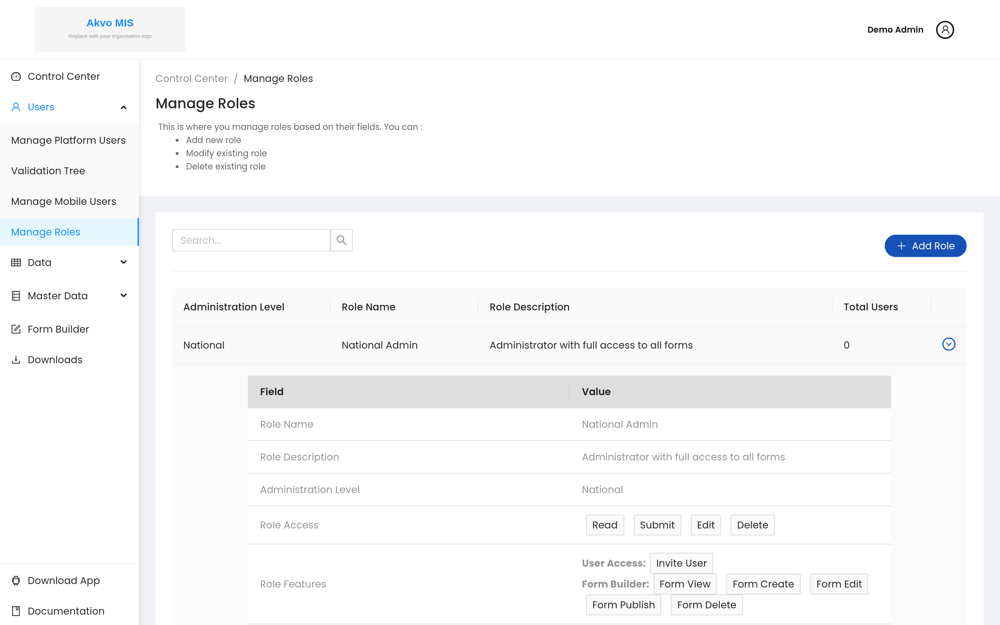
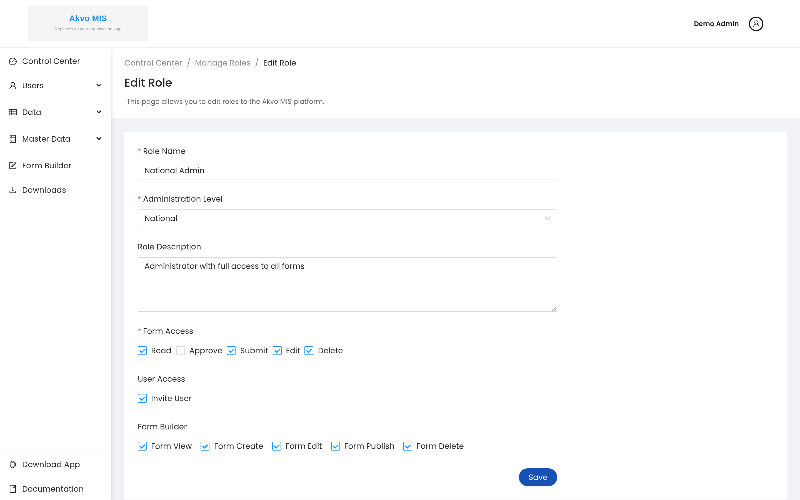
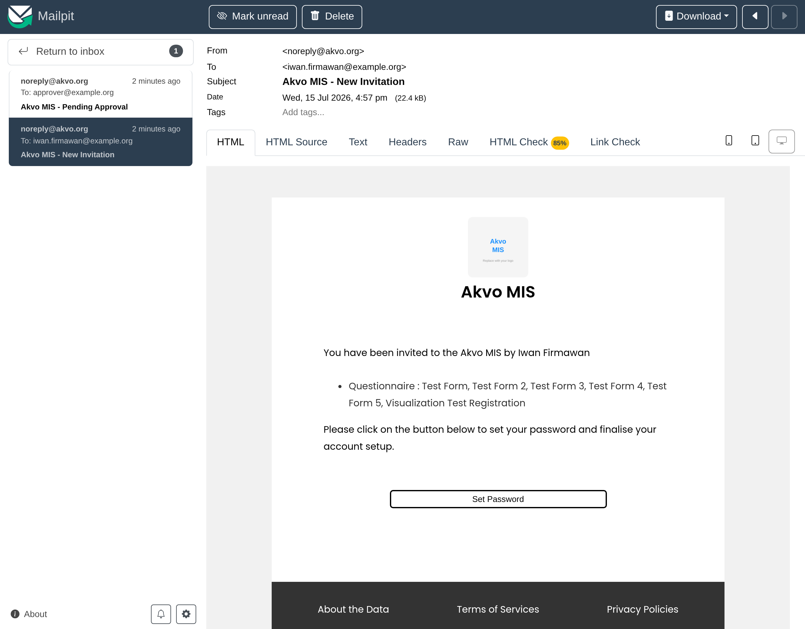
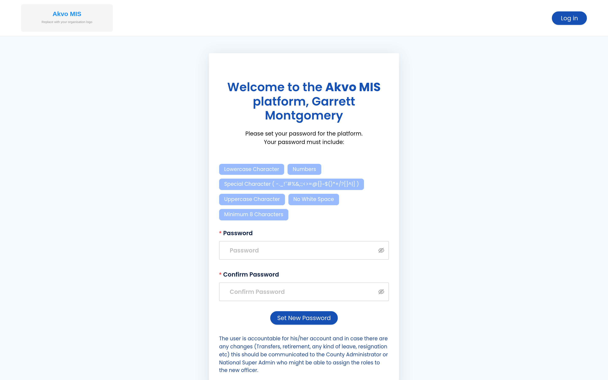

.. raw:: html

    

.. role:: heading

:heading:`Get Started`

User Types & Basic principal
-----------------------------

The Akvo MIS platform uses role-based access control. There are two building
blocks:

- **Super Admin**: a system-wide administrator (the Django ``is_superuser``
  account) with full control over the system, including user management, role
  configuration and system settings.
- **Roles**: every other user is granted one or more roles. A role is tied to an
  administration level (for example National, Province or District) and carries a
  set of granular capabilities — form access (read, submit, approve, edit,
  delete), user access (invite users) and Form Builder access (view, create,
  edit, publish, delete). Permissions are enforced throughout the app based on
  the user's role and administration level.

Because roles are configurable, an "admin" is simply a user whose role grants
administrative capabilities at a given level, rather than a single fixed user
type. See `Roles and Permissions principal`_ below and
:doc:`administration` for managing roles and users.

Create an Super Admin Account via CLI
--------------------------------------

To create a Super Admin account, you need to run the following command in the terminal:

.. code-block:: bash

   python manage.py createsuperuser

Then fill in the required fields such as email, first name, last name, and password. After creating the Super Admin account, you can assign forms to the user using the following command:

.. code-block:: bash

   python manage.py assign_forms <email>

Roles and Permissions principal
--------------------------------

Roles in Akvo MIS define the permissions and access per administration level. Each role can be assigned to users, allowing them to perform specific actions within the system. The roles are designed to ensure that users have the necessary permissions to carry out their tasks while maintaining security and data integrity.

.. _form_access:

Form access
=============

Each role can have different permissions for form access, which include:

- **Read**: Users can view the data in the forms assigned to them.
- **Submit**: Users can submit data through the forms.
- **Approve**: Users can approve submitted data, allowing it to be finalized and processed.
- **Edit**: Users can edit existing data in the forms.
- **Delete**: Users can delete data from the forms.

.. _user_access:

User access
=============

User access in Akvo MIS is managed through roles and permissions. Each user can be assigned one or more roles, which determine their access level and the actions they can perform within the system. The user management interface allows administrators to add, modify, and delete users, as well as assign roles and permissions.

- **Invite Users**: Administrators can invite new users to join the system by sending them an invitation email. The invited user will need to set up their account by creating a password.

   .. note::

      **Per-workspace account scoping.** An email address is scoped per workspace. A person can belong to multiple workspaces with the same email address, with independent passwords and role-based permissions in each workspace. Inviting an address that already belongs to your workspace will be flagged as a duplicate.

.. _manage_roles:

Manage Roles (Add, Delete and Modify Roles)
--------------------------------------------

1. From the Sidebar of the control center, click the  **Manage Roles** to add a new role, modify an existing role or delete an existing role.

2. To add a new role, click the **Add Role** button. Next, on the new page fill all the mandatory fields and then click the **Add Role** button
   to notify your new role.

3. To delete an existing role, expand the toggle button next to the role and click the **Delete** button. Next, confirm you are deleting the role by clicking the DELETE button in the pop-up window.

4. To modify an existing role, expand the toggle button next to the role and click the **Edit** button. Edit the role details in the new page and then click the **Update Role** button.

.. _manage_users:

Manage Users
------------

Platform users (adding, editing and deleting users, and assigning their roles)
are managed from the **Manage Platform Users** menu. To avoid keeping two copies
of the same walkthrough, the full step-by-step is documented once in the
Administration section — see :doc:`administration`.

New users are invited by email and stay in a **pending** state until they set
their password, as described next.

Setting up Account for the First Time
---------------------------------------

Users who have been registered in the MIS platform will receive an invitation email to complete the account setup process. Click the Set Password button to activate your account.

Make sure you are on your platform's URL (the address of your Akvo MIS
deployment). Set a strong password and click Set New Password to login to your
account.

